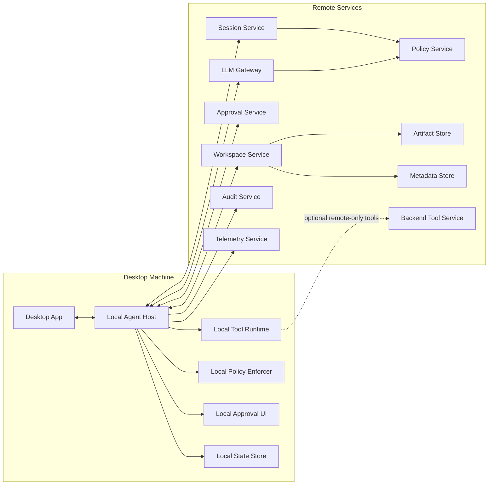
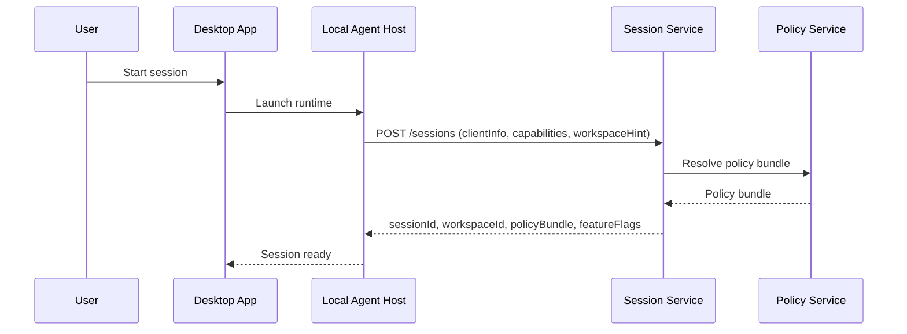
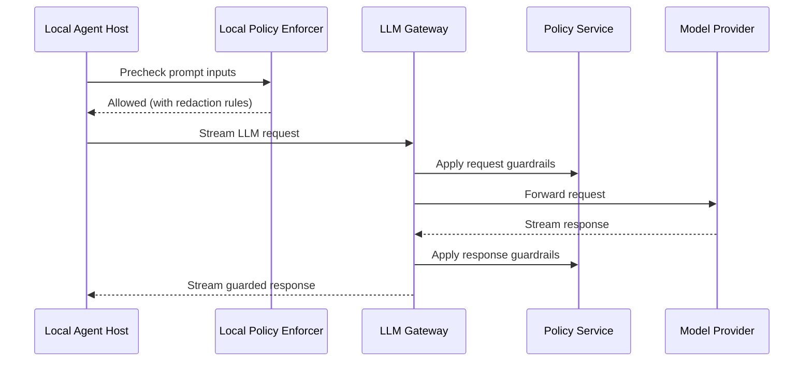
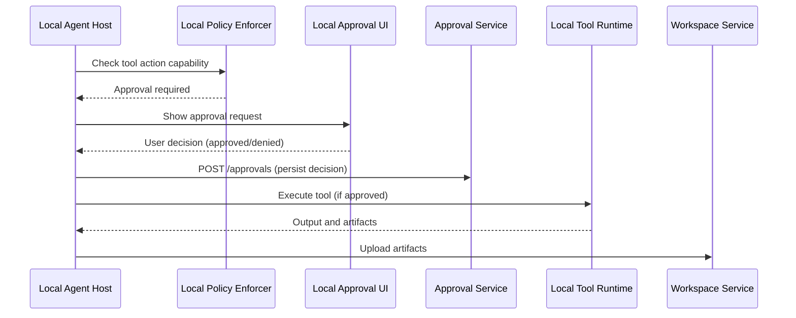
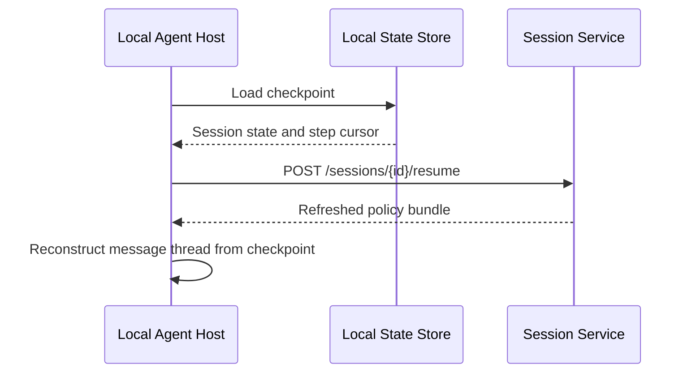
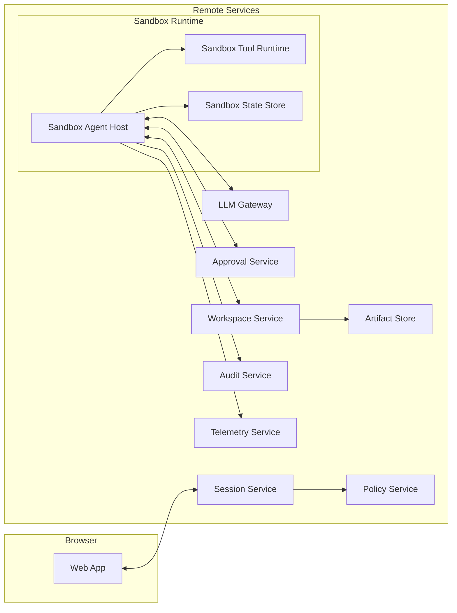

# Local First Agent System Design for Desktop

A desktop-first agent system for Windows and macOS that combines a **local agent runtime** with **centralized governance services**:

- The **Agent Loop runs locally** for fast, responsive file and tool interactions
- All **LLM calls route through a backend LLM Gateway** for centralized guardrails, token budgets, and audit
- **Policy, approvals, workspace history, audit, and telemetry** are centralized backend services

This keeps the user experience local-first while preserving enterprise-grade governance.

---

## 1. Components

### Desktop (runs on the client machine)

| Component | Purpose |
|-----------|---------|
| **Desktop App** | User interface — conversations, approval dialogs, patch preview |
| **Local Agent Host** | Agent loop orchestration — planning, steps, LLM calls, tool routing, checkpointing |
| **Local Tool Runtime** | Executes file, shell, and network tools; MCP client for remote tool servers (Phase 2+) |
| **Local Policy Enforcer** | Enforces capability and path restrictions from the policy bundle |
| **Local Approval UI** | Presents approval requests to the user; captures decisions |
| **Local State Store** | Transient crash-recovery buffer — holds checkpoint of active session only |

### Backend (remote services)

| Component | Purpose |
|-----------|---------|
| **Session Service** | Session creation, resume, compatibility checks, workspace resolution |
| **Policy Service** | Generates policy bundles (capabilities, approval rules, LLM policy) |
| **LLM Gateway** | External service — LLM request/response guardrails, model routing, token enforcement |
| **Approval Service** | Persists approval decisions for audit and compliance (Phase 2+) |
| **Workspace Service** | Stores session history and agent-produced artifacts |
| **Audit Service** | Immutable record of security-relevant events (Phase 3) |
| **Telemetry Service** | Operational traces, metrics, and system health (Phase 3) |
| **Backend Tool Service** | Remote-only tools for capabilities unavailable locally (Phase 3, optional) |

> **LLM Gateway is an external service** — not built by this project. The Local Agent Host connects via a **configurable endpoint URL and auth token** supplied at session init. No `backend-llm-gateway` repo is needed.

### Transport

| Path | Protocol |
|------|----------|
| Desktop App ↔ Local Agent Host | JSON-RPC 2.0 over stdio or local socket |
| Local Agent Host ↔ Backend services | HTTPS REST |
| Local Agent Host ↔ LLM Gateway | HTTP streaming |

WebSocket is deferred — only needed for future server-push scenarios (policy revocation, remote admin stop, multi-device approval).

---

## 2. Architecture Diagram



---

## 3. Domain Model

> Full reference: [domain-model.md](domain-model.md)

### Entity Hierarchy

```
Workspace  (backend namespace — auto-created for every session)
  └── Session  (governance container = one conversation)
        └── Task  (one user prompt → one agent work cycle)
              └── Step  (one LLM call + resulting tool calls)
                    └── Tool calls, LLM calls, Approvals, Artifacts
```

Every event, artifact, and audit record carries the full ID chain: `workspaceId → sessionId → taskId → stepId`.

### Workspace

A workspace is a **backend namespace** for a session's history and artifacts. It does **not** store project source files — those stay on the client. Every session has a workspace, auto-created by the Session Service.

| `workspaceScope` | Source files | Reuse |
|-----------------|-------------|-------|
| `local` | Live on client machine — never uploaded | One workspace per project directory, reused across all sessions |
| `general` | May exist, scoped to this session | Single-use — fresh workspace created for each general chat |
| `cloud` | In a cloud sandbox | TBD (Phase 3+) |

`workspaceScope` is about **where source files live and workspace reuse**. It is distinct from `executionEnvironment` on the session, which is about **where the agent runs**.

**Lifecycle:** User can explicitly delete a workspace (removes all artifacts and history). Auto-purge after 90 days of inactivity (deferred).

### Session

A session is the **governance container** for one continuous working period — what the user sees as a "conversation" in the UI.

- Holds: policy bundle, token budgets, approval rules, feature flags, `executionEnvironment`
- One session = one conversation; multiple tasks = multiple turns of the same conversation
- Ends when the user closes it, the policy bundle expires, or it is explicitly cancelled

| `executionEnvironment` | Meaning |
|-----------------------|---------|
| `desktop` | Agent runs locally via Local Agent Host |
| `cloud_sandbox` | Agent runs in a backend sandbox (Phase 3+) |

**State machine:**

`SESSION_CREATED` → `SESSION_RUNNING` ↔ `WAITING_FOR_LLM` / `WAITING_FOR_TOOL` / `WAITING_FOR_APPROVAL` / `SESSION_PAUSED` → `SESSION_COMPLETED` / `SESSION_FAILED` / `SESSION_CANCELLED`

### Task

A task is a **single agent work cycle** triggered by one user prompt (`StartTask` JSON-RPC call). A session contains many tasks (multi-turn conversation). Tasks can be cancelled without ending the session.

| Concern | Session | Task |
|---------|---------|------|
| Policy and auth | ✓ | |
| LLM endpoint and token | ✓ | |
| Token budget tracking | ✓ (across all tasks) | |
| Checkpointing and resume | ✓ | |
| User prompt and intent | | ✓ |
| Step count limit (`maxSteps`) | | ✓ |
| Cancellable without losing session | | ✓ |

### Step

A step is one iteration of the agent loop: one LLM call followed by zero or more tool calls from the model's response.

### Message Storage

The conversation thread follows a **backend-primary** model:

| Scope | Where | Written | Purpose |
|-------|-------|---------|---------|
| In-flight | Memory in Local Agent Host | Continuously | LLM request construction |
| Per-step crash recovery | Local State Store | After each step | Crash recovery only — transient, cleared on clean session end |
| Per-task history | Workspace Service (`session_history` artifact) | After each task | Canonical store — used for history browsing and session continuation |

History is always read from the Workspace Service, never from the Local State Store. This keeps desktop and web implementations identical.

### Session Resume

Two distinct scenarios:

- **Crash recovery** — Local State Store checkpoint exists. Local Agent Host loads it, reconstructs the in-memory message thread, and re-validates policy with the Session Service. Execution continues from the checkpoint cursor.
- **Continue a past conversation** — Local State Store is cleared (clean end). User starts a new session; Desktop App fetches the `session_history` artifact from the Workspace Service to bootstrap the message thread.

---

## 4. Key Flows

### 4.1 Session Start



The handshake returns everything the Local Agent Host needs: `sessionId`, `workspaceId`, the full policy bundle, and feature flags. LLM Gateway configuration (endpoint and auth token) is read from local environment variables (`LLM_GATEWAY_ENDPOINT`, `LLM_GATEWAY_AUTH_TOKEN`) — not sent by the Session Service.

> Full API: [services/session-service.md](services/session-service.md)

### 4.2 LLM Call



### 4.3 Tool Call With Approval



### 4.4 Crash Recovery Resume



---

## 5. Capability Model

Capabilities are issued in the policy bundle and enforced by **Local Policy Enforcer** and **Local Tool Runtime**.

| Capability | Description | Scope constraints | Approval |
|------------|-------------|-------------------|---------|
| `File.Read` | Read file contents | `allowedPaths`, `blockedPaths`, `maxFileSizeBytes` | Usually no |
| `File.Write` | Create or modify files | `allowedPaths`, `blockedPaths` | Sometimes |
| `File.Delete` | Delete files | `allowedPaths` | Usually yes |
| `Shell.Exec` | Run local commands | `allowedCommands`, `blockedCommands` | Often yes |
| `Network.Http` | Outbound HTTP requests | `allowedDomains` | Sometimes |
| `Workspace.Upload` | Upload artifacts | workspace id, size limits | No |
| `BackendTool.Invoke` | Invoke remote tools | tool name allowlist | Sometimes |
| `LLM.Call` | Call LLM Gateway | model allowlist, token budgets | No |

> Full policy bundle structure and LLM policy fields: [services/policy-service.md](services/policy-service.md)

### Tool Architecture

- **Phase 1 — built-in tools:** File, shell, and network tools run directly inside the Local Tool Runtime, always available.
- **Phase 2+ — MCP extension:** Local Tool Runtime acts as an MCP client. It discovers and connects to remote MCP servers over streamable HTTP, translating their tool manifests to the internal `ToolRequest`/`ToolResult` contract. MCP servers are never invoked directly by the agent loop — capability checks and approval gates always happen in the routing layer first.
- **Skills are deferred** to Phase 4, once recurring tool sequences are well understood from usage patterns.

---

## 6. Protocol Contracts

### 6.1 Local IPC — Desktop App → Local Agent Host

**Transport:** JSON-RPC 2.0 over stdio or local socket

**Methods:** `CreateSession`, `StartTask`, `CancelTask`, `ResumeSession`, `GetSessionState`, `GetPatchPreview`, `ApproveAction`, `Shutdown`

```json
// CreateSession  —  Desktop App → Local Agent Host
// Sent when the user opens a session. Local Agent Host uses this to call the Session Service.
{
  "jsonrpc": "2.0", "id": "req_01", "method": "CreateSession",
  "params": {
    "userId": "user_123", "tenantId": "tenant_abc",
    "executionEnvironment": "desktop",
    "workspaceHint": { "localPaths": ["/Users/suman/projects/demo"] },
    "clientInfo": { "desktopAppVersion": "1.0.0", "localAgentHostVersion": "1.0.0", "osFamily": "macOS" },
    "supportedCapabilities": ["File.Read", "File.Write", "Shell.Exec", "Network.Http", "LLM.Call"]
  }
}
```

```json
// StartTask  —  Desktop App → Local Agent Host
// Sent when the user submits a prompt. Triggers one agent work cycle (task).
{
  "jsonrpc": "2.0", "id": "req_02", "method": "StartTask",
  "params": {
    "sessionId": "sess_789", "taskId": "task_001",
    "prompt": "Refactor the API client and add tests",
    "taskOptions": { "maxSteps": 40, "allowNetwork": true, "approvalMode": "on_risky_actions" }
  }
}
```

```json
// SessionEvent  —  Local Agent Host → Desktop App  (notification, no reply)
// Pushed continuously during task execution so the UI can show live progress.
{
  "jsonrpc": "2.0", "method": "SessionEvent",
  "params": {
    "eventId": "evt_010", "sessionId": "sess_789", "taskId": "task_001",
    "eventType": "step_started", "timestamp": "2026-02-21T15:04:22Z",
    "payload": { "stepId": "step_003", "toolName": "RunCommand" }
  }
}
```

### 6.2 Tool Schemas — Local Agent Host ↔ Local Tool Runtime

**Transport:** In-process function call (same process boundary)

```json
// ToolRequest  —  Local Agent Host → Local Tool Runtime
// Sent by the agent loop when the LLM returns a tool call.
{
  "$id": "ToolRequest",
  "required": ["toolName", "arguments", "sessionId", "taskId", "stepId"],
  "properties": {
    "toolName": { "type": "string" }, "arguments": { "type": "object" },
    "sessionId": { "type": "string" }, "taskId": { "type": "string" },
    "stepId": { "type": "string" }, "capability": { "type": "string" }
  }
}
```

```json
// ToolResult  —  Local Tool Runtime → Local Agent Host
// Returned after tool execution. artifactUris reference content uploaded to Workspace Service.
{
  "$id": "ToolResult",
  "required": ["toolName", "sessionId", "taskId", "stepId", "status"],
  "properties": {
    "toolName": { "type": "string" }, "sessionId": { "type": "string" },
    "taskId": { "type": "string" }, "stepId": { "type": "string" },
    "status": { "enum": ["succeeded", "failed", "denied"] },
    "outputText": { "type": "string" },
    "artifactUris": { "type": "array", "items": { "type": "string" } },
    "error": { "properties": { "code": { "type": "string" }, "message": { "type": "string" } } }
  }
}
```

### 6.3 Event Envelope — Any Component → Audit Service / Telemetry Service

**Transport:** HTTPS REST (`POST /audit/events`, `POST /telemetry/events`)

All audit and telemetry events share one envelope. The `component` field identifies the sender.

```json
// Example: tool_completed event emitted by Local Agent Host after a tool call finishes
{
  "eventId": "evt_123",
  "eventType": "tool_completed",
  "timestamp": "2026-02-21T15:09:00Z",
  "tenantId": "tenant_abc",
  "userId": "user_123",
  "workspaceId": "ws_456",
  "sessionId": "sess_789",
  "taskId": "task_001",
  "component": "LocalAgentHost",
  "boundedContext": "AgentExecution",
  "severity": "info",
  "payload": {}
}
```

**Standard event names:** `session_created`, `session_started`, `step_started`, `step_completed`, `step_limit_approaching`, `text_chunk`, `llm_request_started`, `llm_request_completed`, `tool_requested`, `tool_completed`, `approval_requested`, `approval_resolved`, `policy_expired`, `session_completed`, `session_failed`

**Valid `component` values:** `DesktopApp`, `LocalAgentHost`, `LocalToolRuntime`, `LocalPolicyEnforcer`, `LocalApprovalUI`, `SessionService`, `LLMGateway`, `PolicyService`, `ApprovalService`, `WorkspaceService`, `AuditService`, `TelemetryService`, `BackendToolService`

### 6.4 ConversationMessage Schema — Local Agent Host → Workspace Service

**Transport:** Embedded in the `session_history` artifact uploaded via `POST /workspaces/{id}/artifacts`

Messages are stored in memory during a session and snapshotted to the Workspace Service after each task completes.

```json
{
  "$id": "ConversationMessage",
  "required": ["messageId", "sessionId", "role", "content", "timestamp"],
  "properties": {
    "messageId": { "type": "string" }, "sessionId": { "type": "string" },
    "taskId": { "type": "string" }, "stepId": { "type": "string" },
    "role": { "enum": ["system", "user", "assistant", "tool"] },
    "content": { "type": "string" }, "tokenCount": { "type": "integer" },
    "timestamp": { "type": "string", "format": "date-time" }
  }
}
```

### 6.5 Error Shape — All Components

Used consistently across local IPC responses and all backend HTTP error responses.

```json
{
  "code": "CAPABILITY_DENIED",
  "message": "Shell.Exec is not allowed for this session",
  "retryable": false,
  "details": { "capability": "Shell.Exec", "sessionId": "sess_789" }
}
```

**Error codes:** `INVALID_REQUEST`, `UNAUTHORIZED`, `SESSION_NOT_FOUND`, `SESSION_EXPIRED`, `POLICY_BUNDLE_INVALID`, `POLICY_EXPIRED`, `CAPABILITY_DENIED`, `APPROVAL_REQUIRED`, `APPROVAL_DENIED`, `TOOL_NOT_FOUND`, `TOOL_EXECUTION_FAILED`, `TOOL_EXECUTION_TIMEOUT`, `FILE_NOT_FOUND`, `FILE_TOO_LARGE`, `PERMISSION_DENIED`, `LLM_GUARDRAIL_BLOCKED`, `LLM_BUDGET_EXCEEDED`, `WORKSPACE_UPLOAD_FAILED`, `RATE_LIMITED`, `INTERNAL_ERROR`

---

## 7. Detailed Design Docs

### Desktop Components

Internal design, algorithms, state machines, and module structure:

| Component | Phase | Doc |
|-----------|-------|-----|
| Local Agent Host, Local Policy Enforcer, Local State Store | 1 (MVP) | [components/local-agent-host.md](components/local-agent-host.md) |
| Desktop App, Local Approval UI | 1 (MVP) | [components/desktop-app.md](components/desktop-app.md) |
| Local Tool Runtime | 1 (MVP) | [components/local-tool-runtime.md](components/local-tool-runtime.md) |

### Backend Services

API contracts, data models, and implementation notes:

| Service | Phase | Doc |
|---------|-------|-----|
| Session Service | 1 (MVP) | [services/session-service.md](services/session-service.md) |
| Policy Service | 1 (MVP) | [services/policy-service.md](services/policy-service.md) |
| Workspace Service | 1 (MVP) | [services/workspace-service.md](services/workspace-service.md) |
| Approval Service | 2 | [services/approval-service.md](services/approval-service.md) |
| Audit Service | 3 (future) | [services/audit-service.md](services/audit-service.md) |
| Telemetry Service | 3 (future) | [services/telemetry-service.md](services/telemetry-service.md) |
| Backend Tool Service | 3 (optional) | [services/backend-tool-service.md](services/backend-tool-service.md) |

---

## 8. Technology Stack

### Languages and frameworks

| Layer | Technology | Language |
|-------|-----------|----------|
| Desktop App UI | Electron, React | TypeScript |
| Agent Host | asyncio, httpx, Pydantic | Python |
| Tool Runtime | asyncio, subprocess, pathlib, Pydantic | Python |
| Backend Services | FastAPI, PynamoDB | Python |
| Shared Contracts | JSON Schema (source of truth) | Language-independent |
| Contract Bindings — Python | Pydantic models (generated via `datamodel-code-generator`) | Python |
| Contract Bindings — TypeScript | TypeScript interfaces (generated via `json-schema-to-typescript`) | TypeScript |

### Why these choices

- **Python for all business logic** (backend + agent-runtime): the team is Python-heavy, and using one language for the agent loop, tool execution, policy enforcement, and backend services maximizes code sharing, simplifies code review, and keeps hiring focused. The agent loop is I/O-bound (LLM streaming, file ops, shell commands) — Python's `asyncio` handles this well.
- **TypeScript only for the Electron UI shell**: the Desktop App is a frontend (React components, approval dialogs, patch preview). TypeScript is the natural fit for Electron. No business logic lives here — it delegates everything to the agent-runtime over JSON-RPC.
- **JSON Schema as the contract boundary**: language-independent source of truth. Generates Pydantic models for Python consumers and TypeScript interfaces for the Desktop App. A schema change triggers codegen → publishes updated packages → all consumers import the new version. No manual type duplication, no drift.

### Shared contracts strategy

The `platform/` repo holds the source-of-truth schemas and generates typed bindings for each language:

```
platform/contracts/schemas/tool-request.json     ← source of truth
                                  ↓ codegen
platform/generated/python/models/tool_request.py  ← Pydantic model (pip package)
platform/generated/typescript/ToolRequest.ts       ← TS interface (npm package)
```

Since backend services and agent-runtime are both Python, they share the **same pip package** — one generated Pydantic library covers both. TypeScript generation is only needed for the Desktop App.

### Agent-runtime packaging

The agent-runtime is a Python process. End users never install Python — the runtime is packaged for them:

- **Phase 1:** Ships bundled inside the Electron installer with an embedded Python runtime. The Desktop App spawns the agent-runtime as a child process. No external dependencies.
- **Phase 4:** Compiled to a standalone binary via PyApp or Nuitka for independent download. Self-contained, no Python installation required on the machine.

---

## 9. Infrastructure

### Compute

All backend services run on **AWS ECS** (Elastic Container Service) with Fargate launch type — no EC2 instance management.

| Service | ECS Service | Phase | Notes |
|---------|------------|-------|-------|
| Session Service | `{env}-session` | 1 | Always running — entry point for all sessions |
| Policy Service | `{env}-policy` | 1 | Always running — called by Session Service at session creation |
| Workspace Service | `{env}-workspace` | 1 | Always running — artifact uploads during and after tasks |
| Approval Service | `{env}-approval` | 2 | Always running — receives approval decisions |
| Audit Service | `{env}-audit` | 3 | Always running — append-only event ingest |
| Telemetry Service | `{env}-telemetry` | 3 | Always running — trace and metric ingest |
| Backend Tool Service | `{env}-backend-tools` | 3 | Always running — remote tool execution |

Each service is a **FastAPI application** packaged as a Docker container. One ECS service per backend service — they scale independently.

**Networking:**
- Services sit behind an **Application Load Balancer (ALB)** with path-based routing (`/sessions/*`, `/workspaces/*`, `/approvals/*`, etc.)
- Inter-service calls (e.g., Session Service → Policy Service) go through the ALB or via **ECS Service Connect** for service-to-service discovery
- The Desktop App's agent-runtime connects to the ALB endpoint over HTTPS

**Environments:**
- `dev`, `staging`, `prod` — each is a separate ECS cluster with its own ALB, DynamoDB tables, and S3 buckets
- Environment is passed as a container environment variable and used to prefix all resource names

### Storage

| Store | Technology | Used by |
|-------|-----------|---------|
| **Primary database** | DynamoDB | Session Service, Workspace Service (metadata), Approval Service, Audit Service |
| **Artifact storage** | S3 | Workspace Service (artifact content) |
| **Policy config** | DynamoDB (Phase 3) or config files (Phase 1) | Policy Service |
| **Telemetry** | OpenTelemetry-compatible backend (CloudWatch, Jaeger, etc.) | Telemetry Service |

The Backend Tool Service is stateless — it does not own a database. Tool configurations are passed per-request.

### Repository pattern

Every service isolates its storage behind a repository interface. Service business logic only touches the interface — not the SDK directly. This keeps the storage layer swappable and testable.

```
SessionService
  └── SessionRepository (interface)
        ├── DynamoSessionRepository   ← production and all testing tiers
        └── InMemorySessionRepository ← fast unit tests (no infrastructure needed)
```

### Local testing tiers

| Tier | Infrastructure | When to use |
|------|---------------|-------------|
| Unit tests | In-memory repository | Fast isolated tests of business logic — no infrastructure required |
| Service tests | **DynamoDB Local** | Test the DynamoDB repository implementation against a real DynamoDB emulator |
| Integration tests | **LocalStack** | Test across service boundaries, especially Workspace Service (S3 + DynamoDB together) |

```bash
# DynamoDB Local — for service-level tests
docker run -p 8000:8000 amazon/dynamodb-local

# LocalStack — for integration tests (S3 + DynamoDB)
docker run -p 4566:4566 localstack/localstack
```

Services connect to either endpoint via a single environment variable — the same SDK code runs in all environments:

```
AWS_ENDPOINT_URL=http://localhost:8000   # DynamoDB Local
AWS_ENDPOINT_URL=http://localhost:4566   # LocalStack
AWS_ENDPOINT_URL=https://dynamodb.us-east-1.amazonaws.com  # production (default when unset)
```

### DynamoDB table conventions

All tables follow these conventions:

- **Table names** are environment-prefixed: `{env}-sessions`, `{env}-workspaces`, etc. (`dev`, `staging`, `prod`)
- **All items include** `createdAt` (ISO 8601) and `updatedAt` for auditing
- **TTL** is used wherever data has a natural expiry (sessions, audit events) — the TTL attribute is always named `ttl` (Unix epoch seconds)
- **GSIs** are defined per-service based on the access patterns documented in each service design doc

---

## 10. Implementation Phasing

### Phase 1 — Core desktop agent

Desktop App, Local Agent Host, Local Tool Runtime (built-in file/shell/network tools), Session Service, LLM Gateway integration, Policy Service, Workspace Service

### Phase 2 — Approvals, MCP, and resilience

Local Approval UI, Approval Service, Local State Store checkpoints and session resume, compatibility handshake, MCP client support in Local Tool Runtime (discovery, connection, translation layer, policy bundle allowlist)

### Phase 3 — Governance and extensibility

Audit Service, Telemetry Service, Backend Tool Service (optional), stronger LLM guardrails, policy revocation, optional server push via WebSocket

### Phase 4 — Scale and packaging

Scale hardening, quotas and budgets, performance tuning, skills layer (formalize recurring tool sequences once patterns are understood)

Separate agent-runtime download — Desktop App downloads and manages `cowork-agent-runtime` (Local Agent Host + Local Tool Runtime) as an independently versioned component. This allows agent loop improvements to ship without a full desktop app release. See [Section 12](#12-repo-mapping) for the download architecture.

---

## 11. Risks

| Risk | Mitigation |
|------|-----------|
| Crash or sleep interrupts a long task | Per-step Local State Store checkpoints, idempotent tool contracts, session resume |
| Version skew between local runtime and backend | Compatibility check in Session Service, policy schema versioning, feature flags |
| Windows vs macOS tool behavior diverges | Per-platform adapters in Local Tool Runtime, strict tool schemas |
| Malicious repo content injects into agent context | Provenance tagging, redaction rules in Local Policy Enforcer, LLM Gateway guardrails |
| Remote MCP server exfiltrates data or injects malicious tool output | Capability checks at routing layer (never invoke MCP directly), explicit allowlist in policy bundle, TLS-only connections, endpoint authentication, schema validation at manifest ingress and result egress |
| MCP tool schema mismatch causes silent data loss | Translation layer in Local Tool Runtime validates at both ingress and egress — mismatches fail loudly |

---

## 12. Repo Mapping

### Repos

| Repo | Contains | Language | Bounded Context(s) |
|------|----------|----------|---------------------|
| `cowork-desktop-app` | Desktop App (Electron UI, component downloader) | TypeScript | AgentExecution (UI) |
| `cowork-agent-runtime` | Local Agent Host, Local Tool Runtime | Python | AgentExecution, ToolExecution |
| `cowork-session-service` | Session Service (FastAPI) | Python | SessionCoordination |
| `cowork-policy-service` | Policy Service (FastAPI) | Python | PolicyGuardrails |
| `cowork-workspace-service` | Workspace Service (FastAPI), storage adapters | Python | WorkspaceArtifacts |
| `cowork-approval-service` | Approval Service (FastAPI) | Python | Approval |
| `cowork-observability` | Audit Service, Telemetry Service (FastAPI) | Python | ObservabilityAudit |
| `cowork-backend-tools` | Backend Tool Service (FastAPI, Phase 3, optional) | Python | ToolExecution |
| `cowork-platform` | JSON Schema contracts, generated bindings, SDK | Python + TypeScript | Shared |
| `cowork-infra` | IaC, CI/CD, secrets management, architecture docs | — | Operations |

### Why these boundaries

**`cowork-desktop-app` and `cowork-agent-runtime` are separate** so that agent loop improvements can ship without a new desktop app release. The Desktop App downloads and manages `cowork-agent-runtime` as an independently versioned component — see [Agent-runtime download model](#agent-runtime-download-model) below.

**`cowork-policy-service` is separate from `cowork-session-service`** because they have different change rates and concerns. Policy rules (capability definitions, approval requirements, LLM guardrails) are authored and updated by an admin or platform team independently of session lifecycle code. Keeping them in separate repos lets each evolve and deploy without coupling.

**`cowork-observability`** — Audit Service and Telemetry Service share the same bounded context, are both Phase 3, and are complementary fire-and-forget ingest services operated by the same team.

**`cowork-platform`** — Protocol contracts and the shared SDK evolve together (the SDK is derived from the contracts). Splitting them creates unnecessary synchronisation overhead.

**`cowork-infra`** — Infrastructure code and architecture documentation are both owned by the platform team. Neither contains product business logic.

### Agent-runtime download model

The Desktop App and `cowork-agent-runtime` have **independent version numbers and release cycles**. The Desktop App acts as a host that downloads, verifies, and launches `cowork-agent-runtime` as a managed child process.

```
Desktop App (installed)
  │
  ├── on first launch ──► checks version manifest endpoint
  │                        e.g. https://releases.example.com/agent-runtime/manifest.json
  │
  ├── downloads platform-specific bundle
  │     e.g. agent-runtime-1.4.0-darwin-arm64.tar.gz
  │
  ├── verifies integrity (SHA-256 checksum + OS code signing)
  │
  ├── stores in local app data directory
  │     macOS: ~/Library/Application Support/AppName/agent-runtime/
  │     Windows: %APPDATA%\AppName\agent-runtime\
  │
  └── spawns agent-runtime binary as child process
        communication via JSON-RPC over stdio / local socket
```

**Version compatibility:** The Session Service compatibility check already validates `localAgentHostVersion` against supported version ranges — this remains the central enforcement point. If an incompatible `cowork-agent-runtime` version is detected at session start, the Desktop App is prompted to download a compatible version.

**Update flow:**
- Desktop App checks the version manifest on each launch (or on a background schedule)
- If a newer compatible `cowork-agent-runtime` is available, it downloads it in the background
- The new version is activated on the next session start — running sessions are not interrupted

**Phase 1 exception:** In Phase 1, `cowork-agent-runtime` ships bundled inside the Electron installer with an embedded Python runtime. The separate download model is introduced in Phase 4, where `cowork-agent-runtime` is compiled to a standalone binary via PyApp or Nuitka.

### Folder structure within repos

```
cowork-desktop-app/
  app/            ← Desktop App UI (screens, approval dialogs, patch preview)
  updater/        ← agent-runtime version check, download, verification, launch

cowork-agent-runtime/
  agent_host/     ← Local Agent Host (agent loop, session client, LLM client, JSON-RPC server)
  tool_runtime/   ← Local Tool Runtime (built-in tools, MCP client, platform adapters)
  build/          ← Platform-specific packaging (macOS arm64/x86_64, Windows x64)
  pyproject.toml  ← Python project config

cowork-observability/
  audit/          ← Audit Service (append-only event ingest, DynamoDB)
  telemetry/      ← Telemetry Service (traces, metrics, OpenTelemetry routing)

cowork-platform/
  contracts/
    schemas/      ← JSON Schema files (ToolRequest, ToolResult, PolicyBundle, event envelope, etc.)
    enums/        ← Shared enums (event names, error codes, session states)
    jsonrpc/      ← JSON-RPC method specs
  generated/
    python/       ← Generated Pydantic models (published as pip package)
    typescript/   ← Generated TypeScript interfaces (published as npm package)
  sdk/
    python/       ← Python helpers (event envelope builders, retry, HTTP clients)
    typescript/   ← TypeScript helpers (JSON-RPC client, event listener)

cowork-infra/
  iac/            ← Terraform / CDK (ECS clusters, ALB, DynamoDB tables, S3 buckets, IAM)
  ci/             ← CI/CD templates (Docker build, ECS deploy, schema codegen)
  docs/           ← Architecture design docs, ADRs, runbooks, threat models
```

### Dependency rules

**Allowed:**
- `cowork-desktop-app` → `cowork-platform` (TypeScript npm package — JSON-RPC types, error codes)
- `cowork-agent-runtime` → `cowork-platform` (Python pip package — Pydantic models, helpers)
- `cowork-session-service` → `cowork-platform` (Python pip package)
- `cowork-policy-service` → `cowork-platform` (Python pip package)
- `cowork-workspace-service` → `cowork-platform` (Python pip package)
- `cowork-approval-service` → `cowork-platform` (Python pip package)
- `cowork-observability` → `cowork-platform` (Python pip package)
- `cowork-backend-tools` → `cowork-platform` (Python pip package)
- `cowork-infra` → all repos (deployment only)

**Prohibited:**
- `cowork-desktop-app` must not import `cowork-agent-runtime` directly — communication is via JSON-RPC over stdio/socket only
- Components inside `cowork-agent-runtime` communicate via the tool routing interface — no direct imports across `agent_host/` and `tool_runtime/` package boundaries
- Backend repos must not import each other — HTTP APIs only
- `cowork-platform/contracts` must not import any service or application repo

---

## 13. Web Extension

The same design works for web by running the agent runtime in a backend sandbox instead of the desktop. Only the runtime location changes — state machine, event names, tool schemas, policy model, and workspace model are all identical.

| Desktop | Web |
|---------|-----|
| Local Agent Host | Sandbox Agent Host |
| Local Tool Runtime | Sandbox Tool Runtime |
| Local State Store | Sandbox State Store |


