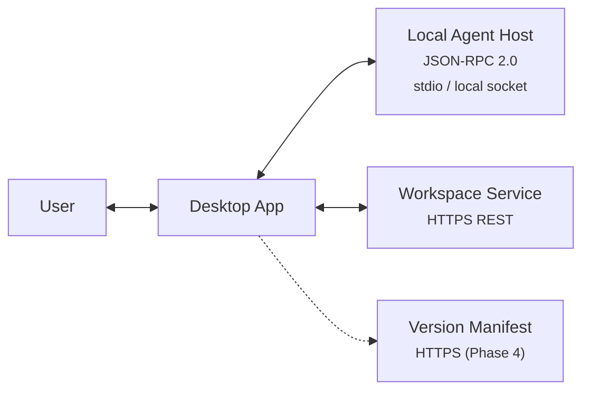
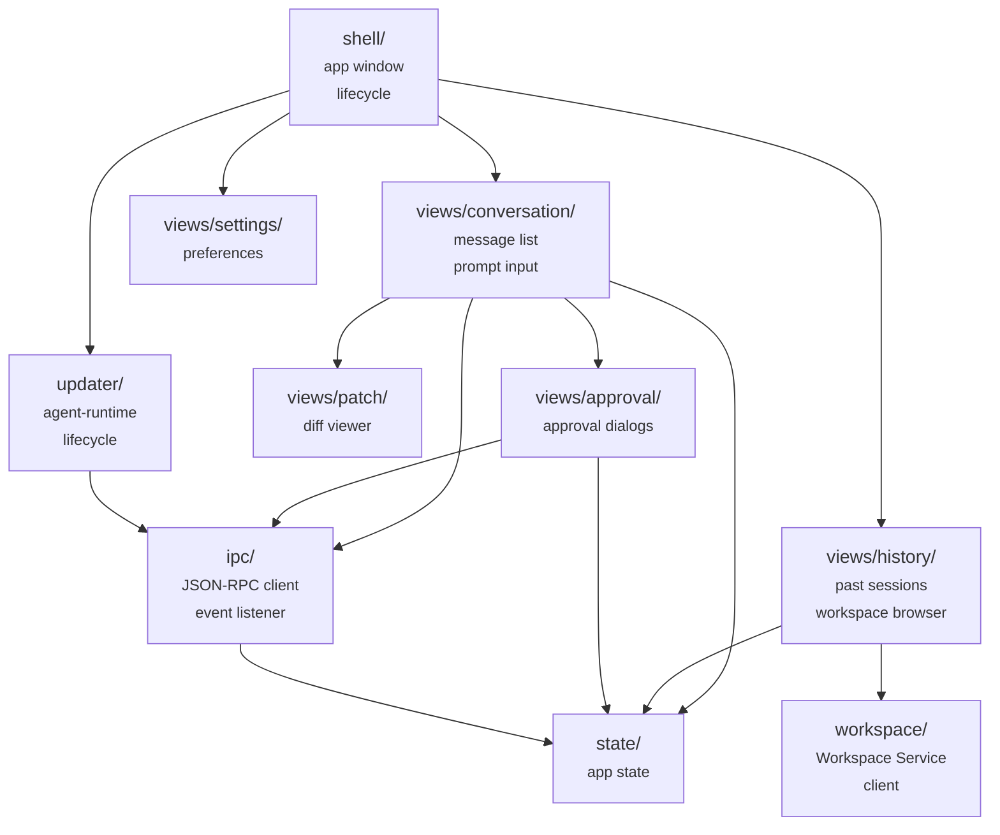
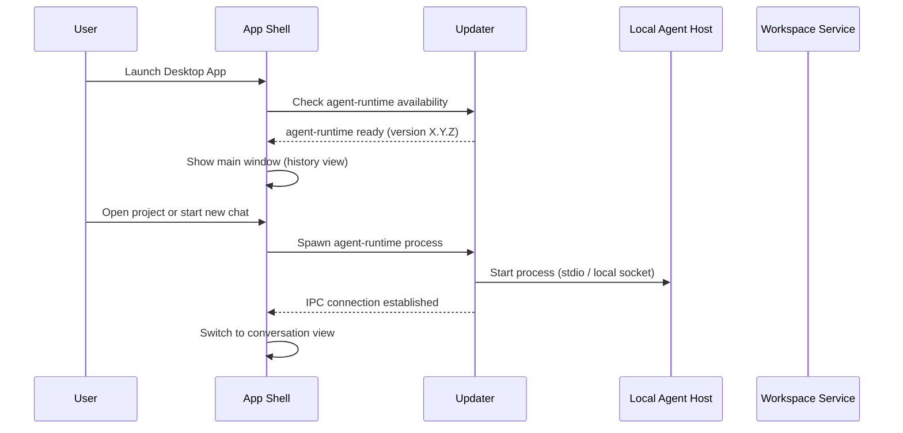
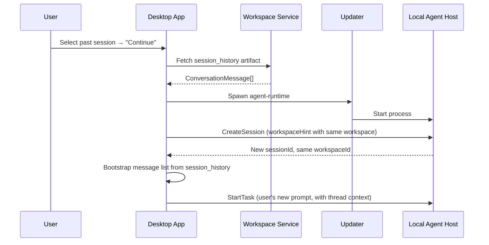
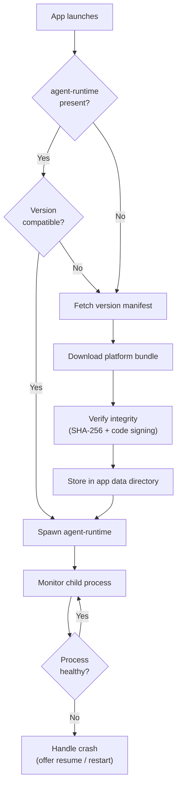

# Desktop App — Component Design

**Repo:** `desktop` (`app/` and `updater/` packages)
**Bounded Context:** AgentExecution (UI)
**Phase:** 1 (MVP)
**Covers:** Desktop App, Local Approval UI

---

The Desktop App is the user-facing application for Windows and macOS. It provides the conversation interface, renders approval dialogs, previews file changes, and manages the `agent-runtime` lifecycle. It communicates with the Local Agent Host exclusively via JSON-RPC 2.0 — it never imports agent-runtime code directly.

This document describes the internal design of the `desktop/` repo. For the agent loop, see [local-agent-host.md](local-agent-host.md). For tool execution, see [local-tool-runtime.md](local-tool-runtime.md).

**Prerequisites:** [architecture.md](../architecture.md) (architecture, protocol contracts), [domain-model.md](../domain-model.md) (session, task, workspace concepts)

---

## 1. Overview

### What this component does

- Presents the conversation UI — message list, prompt input, streaming assistant responses
- Manages the agent-runtime process — spawn, monitor, restart, shutdown
- Sends JSON-RPC requests to the Local Agent Host and handles responses and notifications
- Renders the Local Approval UI — approval dialogs for risky tool actions
- Provides patch preview — shows pending file changes before and after agent actions
- Fetches and displays conversation history from the Workspace Service
- Downloads and manages agent-runtime versions (Phase 4 — bundled in Phase 1)

### What this component does NOT do

- Run the agent loop — that is the Local Agent Host
- Execute tools — that is the Local Tool Runtime
- Enforce policy — that is the Local Policy Enforcer
- Store canonical history — that is the Workspace Service
- Make LLM calls — that is the Local Agent Host via the LLM Gateway

### Key constraints

- **No direct imports from `agent-runtime`** — all communication is via JSON-RPC over stdio or local socket
- **Depends only on `platform`** — for JSON-RPC method names, error codes, and event types
- **Cross-platform** — must work on macOS and Windows with the same codebase

### Component Context



The Desktop App has two external communication paths:
1. **Local Agent Host** — JSON-RPC 2.0 for session and task control during active sessions
2. **Workspace Service** — HTTPS REST for fetching conversation history when browsing past sessions

---

## 2. Internal Module Structure

### Package layout

```
desktop/
  app/
    shell/          — Application window, menu bar, tray icon, lifecycle
    views/
      conversation/ — Active conversation view (message list, prompt input, streaming)
      history/      — Conversation history browser (past sessions, workspace list)
      approval/     — Local Approval UI (approval dialogs, risk display)
      patch/        — Patch preview (file diff viewer, before/after)
      settings/     — User preferences, connection settings
    ipc/            — JSON-RPC client, request/response handling, event listener
    state/          — Application state management (current session, UI state)
    workspace/      — Workspace Service client (fetch history, list sessions)
  updater/
    manifest/       — Version manifest fetching and parsing
    download/       — Agent-runtime download, integrity verification
    launch/         — Process spawning, health monitoring, restart logic
```

### Module dependencies



**Dependency rules:**
- `shell/` is the application entry point — it manages the window and routes to views
- All views read from and write to `state/` for consistent UI state
- Only `ipc/` communicates with the Local Agent Host — views never send JSON-RPC directly
- Only `workspace/` communicates with the Workspace Service — views call workspace methods
- `updater/` manages the agent-runtime process and passes the IPC connection to `ipc/`

---

## 3. Application Lifecycle

### 3.1 Startup Sequence



**Phase 1:** The agent-runtime binary is bundled in the desktop installer. The updater simply locates and spawns it.

**Phase 4:** The updater checks the version manifest, downloads if needed, verifies integrity, then spawns.

### 3.2 Shutdown Sequence

1. User closes the conversation or exits the app
2. Desktop App sends `Shutdown` JSON-RPC request to Local Agent Host
3. Wait for clean shutdown confirmation (Local Agent Host uploads history, cleans state store)
4. If no response within 10 seconds, terminate the agent-runtime process
5. Close the application window

### 3.3 Crash Recovery

If the agent-runtime process exits unexpectedly:

1. Updater detects child process exit
2. Notify the user: "The agent process exited unexpectedly"
3. Offer options:
   - **Resume** — respawn agent-runtime, send `ResumeSession` (uses checkpoint from Local State Store)
   - **Start fresh** — respawn agent-runtime, create a new session (history is in Workspace Service from the last completed task)
   - **Close** — return to history view

---

## 4. Views

### 4.1 Conversation View

The primary view during an active session. Shows the live conversation and agent activity.

**Layout:**

```
┌─────────────────────────────────────────────┐
│  [Project name / General chat]    [Settings] │
├─────────────────────────────────────────────┤
│                                             │
│  [System] Agent initialized for project...  │
│                                             │
│  [User] Refactor the API client and add     │
│         tests                               │
│                                             │
│  [Assistant] I'll start by reading the      │
│  current API client...                      │
│    ┌─ Tool: ReadFile ──────────────────┐    │
│    │ /src/api/client.ts                │    │
│    │ ✓ Completed                       │    │
│    └───────────────────────────────────┘    │
│    ┌─ Tool: WriteFile ─────────────────┐    │
│    │ /src/api/client.ts                │    │
│    │ ⏳ Awaiting approval...           │    │
│    └───────────────────────────────────┘    │
│                                             │
├─────────────────────────────────────────────┤
│  [Step 3/40]              [Cancel task]     │
├─────────────────────────────────────────────┤
│  > Type your message...          [Send]     │
└─────────────────────────────────────────────┘
```

**Behavior:**

| Element | Source | Interaction |
|---------|--------|-------------|
| Message list | `state/` — accumulated from `SessionEvent` notifications | Scroll, select to copy |
| Streaming text | `SessionEvent` with `eventType: "text_chunk"` | Renders incrementally as chunks arrive |
| Tool call cards | `SessionEvent` with `eventType: "tool_requested"` / `"tool_completed"` | Shows tool name, arguments, status, expand for output |
| Step counter | `SessionEvent` with `eventType: "step_started"` | Shows `stepCount / maxSteps` |
| Step limit warning | `SessionEvent` with `eventType: "step_limit_approaching"` | Highlighted counter when 80% reached |
| Prompt input | User types and submits | Sends `StartTask` JSON-RPC |
| Cancel button | User clicks | Sends `CancelTask` JSON-RPC |

### 4.2 History View

The landing page. Shows past conversations grouped by workspace.

**Layout:**

```
┌─────────────────────────────────────────────┐
│  Conversations                  [New chat]  │
├──────────────────┬──────────────────────────┤
│  Projects        │  Sessions                │
│                  │                          │
│  > demo/         │  Feb 21 — Refactor API   │
│    my-app/       │  Feb 20 — Add auth       │
│    website/      │  Feb 18 — Fix bug #42    │
│                  │                          │
│  General chats   │                          │
│    Feb 22 chat   │                          │
│    Feb 19 chat   │                          │
└──────────────────┴──────────────────────────┘
```

**Data source:** Workspace Service

| Data | API call |
|------|----------|
| Workspace list | `GET /workspaces?tenantId={tenantId}&userId={userId}` (via workspace client) |
| Sessions per workspace | `GET /workspaces/{workspaceId}/sessions` |
| Session messages | `GET /workspaces/{workspaceId}/artifacts/{artifactId}` (the `session_history` artifact) |

**Interactions:**
- **Select a project** → shows sessions for that workspace
- **Select a session** → loads `session_history` from Workspace Service and displays in read-only conversation view
- **Continue session** → creates a new session under the same workspace, bootstraps thread from `session_history`
- **New chat** → creates a new `general`-scoped session
- **Open project** → OS file picker to select a project directory → creates/resolves a `local`-scoped workspace

### 4.3 Approval View (Local Approval UI)

A modal dialog shown when the agent requests approval for a risky action.

**Layout:**

```
┌─────────────────────────────────────────────┐
│  ⚠ Approval Required                       │
│                                             │
│  Local command execution                    │
│                                             │
│  The agent wants to run:                    │
│  ┌─────────────────────────────────────┐    │
│  │ pytest tests/ --verbose             │    │
│  │ Working directory: ~/projects/demo  │    │
│  └─────────────────────────────────────┘    │
│                                             │
│  Risk level: ● Medium                       │
│                                             │
│  [Deny]                        [Approve]    │
│                                             │
│  Reason (optional): ___________________     │
└─────────────────────────────────────────────┘
```

**Trigger:** `SessionEvent` with `eventType: "approval_requested"` containing the `ApprovalRequest` payload.

**Behavior:**
1. Parse the `ApprovalRequest` from the event payload
2. Display the modal with title, action summary, risk level, and details
3. Risk level indicator: `Low` (green), `Medium` (amber), `High` (red)
4. Wait for user to click Approve or Deny
5. Send `ApproveAction` JSON-RPC request with `approvalId`, `decision`, and optional `reason`
6. Close the modal and resume conversation view

**Edge cases:**
- **Multiple pending approvals:** Queue them — show one at a time, next appears when current is resolved. Tool calls not needing approval continue in the background.
- **Approval timeout:** If the user doesn't respond within the timeout (set by Local Agent Host, default 5 min), the agent treats it as denied. The modal is dismissed with a notice: "Approval timed out — treated as denied."
- **Session cancelled while approval is pending:** Dismiss the modal.

> ApprovalRequest schema: [services/approval-service.md](../services/approval-service.md)

### 4.4 Patch Preview View

Shows pending file changes made by the agent during the current task. Accessed via a "Review changes" button in the conversation view.

**Layout:**

```
┌─────────────────────────────────────────────┐
│  Pending Changes (3 files)     [Close]      │
├──────────────────┬──────────────────────────┤
│  Changed files   │  Diff view              │
│                  │                          │
│  ✚ src/new.ts    │  @@ -10,7 +10,9 @@      │
│  ✎ src/api.ts    │   import { Client }      │
│  ✎ src/test.ts   │  -  const old = ...      │
│                  │  +  const refactored = ..│
│                  │  +  // Added validation  │
│                  │                          │
└──────────────────┴──────────────────────────┘
```

**Data source:** `GetPatchPreview` JSON-RPC method on the Local Agent Host. Returns a list of modified files with their diffs.

**Interactions:**
- **Select a file** → show its diff in the right panel
- **View modes** → unified diff or side-by-side

### 4.5 Settings View

User preferences and connection configuration.

| Setting | Description | Default |
|---------|-------------|---------|
| Approval mode | `always`, `on_risky_actions`, `never` | `on_risky_actions` |
| Max steps per task | Step limit for agent loop | 40 |
| Theme | Light / dark / system | System |
| Agent-runtime version | Current version, check for updates | *(display only)* |
| Network timeout | Default shell command timeout | 300s |

Settings are stored locally in the OS-native preferences store (macOS: `UserDefaults`, Windows: Registry or `%APPDATA%` config file). They are passed as `taskOptions` in `StartTask` calls.

---

## 5. JSON-RPC Client

The `ipc/` module manages all communication with the Local Agent Host.

### 5.1 Connection Management

```
1. Updater spawns the agent-runtime process
2. IPC module connects via:
   - stdio: reads from process stdout, writes to process stdin
   - local socket: connects to a named pipe / Unix domain socket
3. JSON-RPC 2.0 framing over the transport
4. Connection is held for the lifetime of the session
5. On disconnect: notify views, offer reconnect or restart
```

**Transport selection:**
- **Phase 1:** stdio (simplest — the process is a child of the Desktop App)
- **Phase 2+:** local socket (enables reconnection after Desktop App restart without killing the agent-runtime)

### 5.2 Request/Response Handling

The IPC module provides a typed async interface for each JSON-RPC method:

```
ipcClient.createSession(params)  → Promise<CreateSessionResult>
ipcClient.startTask(params)      → Promise<void>  (fire-and-forget, results come via events)
ipcClient.cancelTask(params)     → Promise<void>
ipcClient.resumeSession(params)  → Promise<ResumeSessionResult>
ipcClient.getSessionState()      → Promise<SessionState>
ipcClient.getPatchPreview()      → Promise<PatchPreview>
ipcClient.approveAction(params)  → Promise<void>
ipcClient.shutdown()             → Promise<void>
```

- **Request timeout:** 30 seconds for most methods. `createSession` and `resumeSession` use 60 seconds (they involve backend calls).
- **Error handling:** JSON-RPC errors are parsed into typed error objects using the standard error shape (see [architecture.md, Section 6.5](../architecture.md#65-error-shape--all-components)). The IPC module maps error codes to user-facing messages.

### 5.3 Event Listener

The IPC module listens for `SessionEvent` JSON-RPC notifications (no `id`, no reply expected) and dispatches them to registered handlers:

```
ipcClient.on("text_chunk",            handler)  — streaming LLM text
ipcClient.on("step_started",          handler)  — new step began
ipcClient.on("step_completed",        handler)  — step finished
ipcClient.on("tool_requested",        handler)  — tool call started
ipcClient.on("tool_completed",        handler)  — tool call finished
ipcClient.on("approval_requested",    handler)  — approval needed
ipcClient.on("approval_resolved",     handler)  — approval decision made
ipcClient.on("step_limit_approaching", handler) — 80% of maxSteps
ipcClient.on("policy_expired",        handler)  — session paused
ipcClient.on("error",                 handler)  — agent-level error
```

The conversation view registers handlers to update the message list in real time. The approval view registers for `approval_requested` to show the modal.

### 5.4 Error Code to UI Message Mapping

| Error Code | User-Facing Message |
|------------|-------------------|
| `SESSION_NOT_FOUND` | "Session not found. Start a new conversation." |
| `SESSION_EXPIRED` | "Session expired. Please start a new conversation." |
| `POLICY_EXPIRED` | "Session paused — security policy expired. Reconnecting..." |
| `CAPABILITY_DENIED` | "The agent tried an action that is not permitted by your organization's policy." |
| `APPROVAL_DENIED` | "You denied this action. The agent will try a different approach." |
| `LLM_GUARDRAIL_BLOCKED` | "The request was blocked by content safety filters." |
| `LLM_BUDGET_EXCEEDED` | "Token budget exhausted for this session. Start a new conversation to continue." |
| `TOOL_EXECUTION_FAILED` | "A tool encountered an error. The agent will attempt to recover." |
| `TOOL_EXECUTION_TIMEOUT` | "A tool timed out. The agent will attempt to recover." |
| `INTERNAL_ERROR` | "Something went wrong. Please try again." |

---

## 6. Application State

The `state/` module manages all UI state. Views read from and write to this centralized store.

### 6.1 State Shape

```
AppState {
  // Current session (null when in history view)
  session: {
    sessionId: string
    workspaceId: string
    status: SessionStatus
    task: {
      taskId: string
      status: TaskStatus
      stepCount: number
      maxSteps: number
    } | null
  } | null

  // Conversation thread (accumulated from events during active session)
  messages: ConversationMessage[]

  // Pending approvals (queued, shown one at a time)
  pendingApprovals: ApprovalRequest[]

  // Patch preview data
  patchPreview: PatchPreview | null

  // History browsing
  workspaces: WorkspaceSummary[]
  selectedWorkspace: string | null
  sessionsForWorkspace: SessionSummary[]

  // UI
  view: "history" | "conversation" | "settings"
  theme: "light" | "dark" | "system"

  // Agent-runtime
  agentRuntimeStatus: "not_started" | "starting" | "running" | "stopped" | "crashed"
  agentRuntimeVersion: string | null
}
```

### 6.2 State Transitions

| Trigger | State Change |
|---------|-------------|
| User opens project / starts new chat | `view → "conversation"`, spawn agent-runtime, `agentRuntimeStatus → "starting"` |
| IPC connection established | `agentRuntimeStatus → "running"` |
| `CreateSession` response | `session` populated with sessionId, workspaceId |
| User submits prompt | `session.task` populated, `StartTask` sent |
| `SessionEvent: text_chunk` | Append to current assistant message in `messages` |
| `SessionEvent: tool_requested` | Add tool call card to `messages` |
| `SessionEvent: tool_completed` | Update tool call card status in `messages` |
| `SessionEvent: approval_requested` | Add to `pendingApprovals` queue, show modal |
| User approves/denies | Remove from `pendingApprovals`, send `ApproveAction` |
| `SessionEvent: step_started` | Increment `session.task.stepCount` |
| Task completes/fails/cancelled | `session.task → null`, re-enable prompt input |
| User clicks "Review changes" | Fetch `GetPatchPreview`, populate `patchPreview` |
| Agent-runtime process exits | `agentRuntimeStatus → "crashed"`, show recovery dialog |
| User navigates to history | `view → "history"`, `session → null` |

---

## 7. Workspace Service Client

The `workspace/` module communicates directly with the Workspace Service over HTTPS REST. This is separate from the IPC channel — the Desktop App reads history from the backend independently of whether an agent-runtime process is running.

### 7.1 Operations

| Method | API Call | Used By |
|--------|----------|---------|
| `listWorkspaces(tenantId, userId)` | `GET /workspaces?tenantId=...&userId=...` | History view — workspace list |
| `listSessions(workspaceId)` | `GET /workspaces/{workspaceId}/sessions` | History view — session list |
| `getSessionHistory(workspaceId, sessionId)` | Fetch `session_history` artifact | History view — conversation display; session continuation |
| `deleteWorkspace(workspaceId)` | `DELETE /workspaces/{workspaceId}` | Settings / workspace management |

### 7.2 Session Continuation Flow

When the user selects "Continue" on a past session:



The new session gets a fresh `sessionId` but reuses the same `workspaceId`. The conversation thread is bootstrapped from the `session_history` artifact — the user sees their past messages and can continue seamlessly.

### 7.3 Authentication

The Desktop App authenticates to the Workspace Service using the same tenant/user credentials used for the session. The auth token is acquired at application login (implementation deferred — Phase 1 may use a simple API key or delegated token from the Session Service).

---

## 8. Agent-Runtime Lifecycle

The `updater/` package manages the full lifecycle of the agent-runtime binary.

### 8.1 Phase 1 — Bundled

In Phase 1, the agent-runtime binary ships inside the desktop installer:

```
macOS:  AppName.app/Contents/Resources/agent-runtime
Windows: C:\Program Files\AppName\agent-runtime.exe
```

The updater locates the bundled binary, verifies it exists, and spawns it.

### 8.2 Phase 4 — Independent Download



**Version manifest:**

```json
{
  "latest": "1.4.0",
  "minDesktopAppVersion": "2.0.0",
  "platforms": {
    "darwin-arm64": {
      "url": "https://releases.example.com/agent-runtime/1.4.0/agent-runtime-1.4.0-darwin-arm64.tar.gz",
      "sha256": "abc123..."
    },
    "darwin-x64": { "url": "...", "sha256": "..." },
    "win32-x64": { "url": "...", "sha256": "..." }
  }
}
```

**Storage location:**

```
macOS:   ~/Library/Application Support/{AppName}/agent-runtime/{version}/
Windows: %APPDATA%\{AppName}\agent-runtime\{version}\
```

Multiple versions can coexist. The updater activates the latest compatible version on the next session start.

### 8.3 Process Management

| Concern | Behavior |
|---------|----------|
| Spawning | Start as child process; connect via stdio (Phase 1) or local socket (Phase 2+) |
| Health check | Monitor process exit code; detect unexpected termination |
| Graceful shutdown | Send `Shutdown` JSON-RPC → wait 10s → SIGTERM → wait 5s → SIGKILL |
| Crash recovery | Detect exit, notify user, offer resume/restart (see [Section 3.3](#33-crash-recovery)) |
| One process per session | Desktop App spawns one agent-runtime per active session |
| Multiple sessions | Future: multiple agent-runtime processes (one per conversation tab). Phase 1: single session. |

---

## 9. Platform Considerations

### 9.1 macOS

| Concern | Approach |
|---------|----------|
| Application packaging | `.app` bundle, distributed via DMG or direct download |
| Code signing | Apple Developer ID + Notarization |
| Agent-runtime binary | Code-signed, stored in `~/Library/Application Support/` |
| Window management | Standard macOS window with traffic lights, menu bar integration |
| Notifications | `NSUserNotification` for approval requests when app is backgrounded |
| Auto-update | Sparkle framework or custom updater |

### 9.2 Windows

| Concern | Approach |
|---------|----------|
| Application packaging | MSI or MSIX installer |
| Code signing | Authenticode (EV certificate recommended) |
| Agent-runtime binary | Signed, stored in `%APPDATA%` |
| Window management | Standard Windows window with title bar, system tray icon |
| Notifications | Windows Toast notifications for approval requests when app is backgrounded |
| Auto-update | Squirrel.Windows or WinGet |

### 9.3 Cross-Platform UI

The UI framework must support both macOS and Windows from a single codebase. Candidates include Electron, Tauri, or platform-native with shared logic. The framework choice is an implementation decision — this design is framework-agnostic.

**Key requirements for the framework:**
- Native look and feel on both platforms
- Efficient rendering of long message lists (virtualized scrolling)
- Syntax-highlighted code blocks in messages and diffs
- Support for streaming text (incremental rendering)
- Child process management (spawning and monitoring agent-runtime)
- Local socket / stdio communication

---

## 10. Security

### 10.1 IPC Security

- The JSON-RPC connection between Desktop App and Local Agent Host is local-only (stdio or local socket) — no network exposure
- No authentication on the IPC channel — the process is a child of the Desktop App, and only one client connects
- The Desktop App never sends credentials over IPC — auth tokens are managed by the agent-runtime from the Session Service

### 10.2 Credential Management

- Tenant/user credentials for backend services are stored in the OS keychain (macOS Keychain, Windows Credential Manager)
- Credentials are never written to disk in plaintext
- The Desktop App retrieves credentials from the keychain at startup and passes them to the agent-runtime via the `CreateSession` params

### 10.3 Agent-Runtime Integrity

- In Phase 4 (independent download): verify SHA-256 checksum and OS code signature before spawning
- Reject binaries that fail integrity checks
- Log integrity verification results for audit

---

## 11. Notification and Background Behavior

When the Desktop App is backgrounded or minimized, agent execution continues (the agent-runtime is a separate process).

| Event | Background behavior |
|-------|-------------------|
| Approval requested | Show OS notification: "Agent needs your approval — {actionSummary}" |
| Task completed | Show OS notification: "Agent finished — {task summary}" |
| Task failed | Show OS notification: "Agent encountered an error" |
| Agent-runtime crashed | Show OS notification: "Agent process stopped unexpectedly" |

Clicking any notification brings the Desktop App to the foreground and navigates to the relevant view.

---

## 12. Open Questions

| Question | Context | Recommendation |
|----------|---------|----------------|
| UI framework | Electron, Tauri, or native? | Implementation decision — evaluate based on team expertise, bundle size, and performance. Tauri for smaller bundle; Electron for broader ecosystem. |
| Multiple simultaneous sessions | Should the user be able to have multiple conversations open in tabs? | Phase 1: single session. Phase 2+: tab-based multi-session (one agent-runtime process per tab). |
| Offline mode | What happens if the backend is unreachable? | Phase 1: show error, block session creation. Phase 2+: allow browsing cached history offline. |
| Conversation search | Should the history view support full-text search across sessions? | Defer to Phase 2 — requires a search index or backend search endpoint. |
| Theming / accessibility | Dark mode, high contrast, keyboard navigation | Phase 1: system theme detection, basic keyboard nav. Phase 2: full accessibility audit. |
| Agent-runtime log access | Should the user be able to view agent-runtime logs for debugging? | Phase 1: logs written to `~/Library/Logs/` (macOS) or `%APPDATA%\Logs\` (Windows). Settings view shows log path. Phase 2: in-app log viewer. |
| Desktop App auto-update | How does the Desktop App itself update? | OS-native auto-update (Sparkle on macOS, Squirrel on Windows). Separate from agent-runtime updates. |
