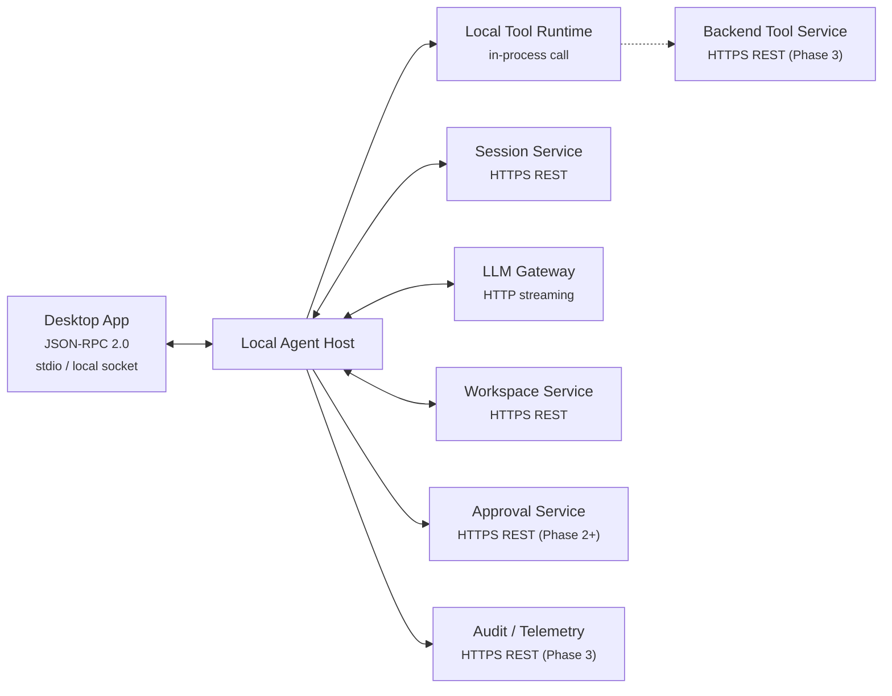
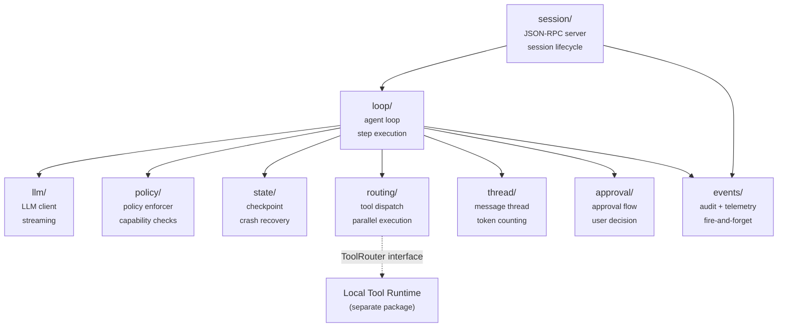
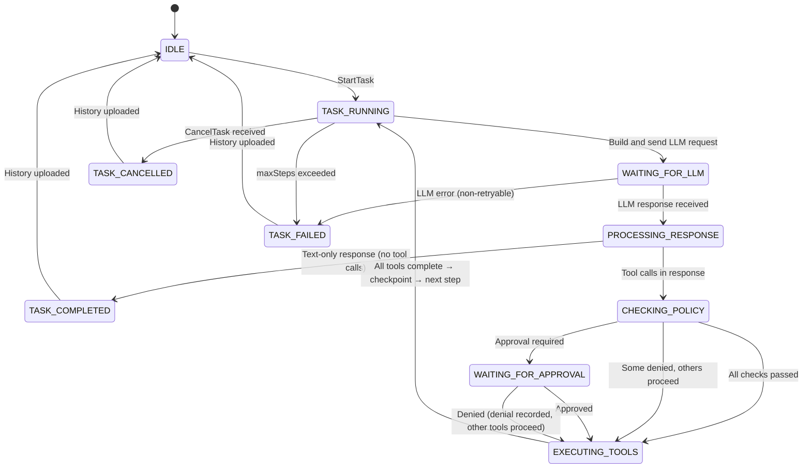
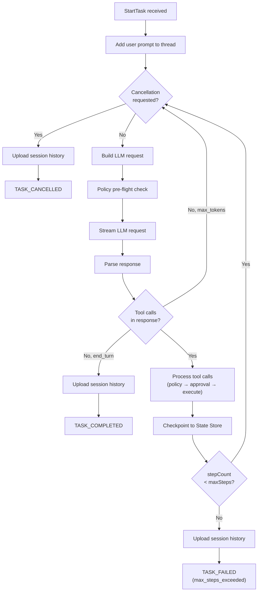
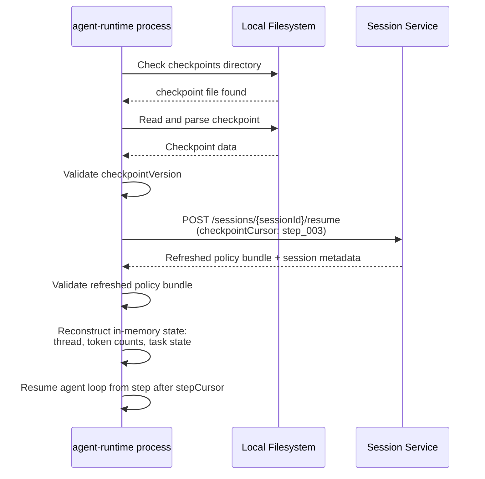

# Local Agent Host — Component Design

**Repo:** `cowork-agent-runtime` (`agent_host/` package)
**Bounded Context:** AgentExecution
**Phase:** 1 (MVP)
**Covers:** Local Agent Host, Local Policy Enforcer, Local State Store

---

The Local Agent Host is the backbone of the desktop agent system. It runs the agent loop, manages sessions, calls the LLM, routes tool calls, enforces policy, and checkpoints state for crash recovery.

This document describes the internal design of the `agent-host/` package. It covers the core agent loop, the embedded Local Policy Enforcer, and the Local State Store. For the Desktop App UI, see [desktop-app.md](desktop-app.md). For the tool execution layer, see [local-tool-runtime.md](local-tool-runtime.md).

**Prerequisites:** [architecture.md](../architecture.md) (architecture, protocol contracts), [domain-model.md](../domain-model.md) (entity hierarchy, state machines)

---

## 1. Overview

### What this component does

- Hosts the JSON-RPC 2.0 server that the Desktop App connects to
- Orchestrates the agent loop: plan → call LLM → execute tools → checkpoint → repeat
- Manages the in-memory message thread across tasks within a session
- Enforces capability and path restrictions from the policy bundle (Local Policy Enforcer)
- Checkpoints state to disk after each step for crash recovery (Local State Store)
- Routes tool calls to the Local Tool Runtime (in-process) or Backend Tool Service (Phase 3, remote)
- Uploads session history and artifacts to the Workspace Service
- Emits audit and telemetry events (fire-and-forget)

### What this component does NOT do

- Render UI — that is the Desktop App
- Execute tools — that is the Local Tool Runtime
- Store canonical history — that is the Workspace Service
- Generate policy bundles — that is the Policy Service
- Route or guard LLM requests at the network level — that is the LLM Gateway

### Key constraint

**One session per OS process.** The Desktop App spawns one `cowork-agent-runtime` process per session. The process exits when the session ends. This simplifies concurrency — there is no need for session multiplexing, session isolation, or shared memory between sessions.

### Component Context



---

## 2. Internal Module Structure

### Package layout

```
agent-host/
  session/         — JSON-RPC server, session lifecycle, session state machine
  loop/            — Agent loop orchestration, step execution, task management
  llm/             — LLM Gateway client (streaming HTTP), request construction, response parsing
  policy/          — Local Policy Enforcer (capability checks, path/command enforcement, risk assessment)
  state/           — Local State Store (checkpoint write, load, cleanup)
  routing/         — Tool routing (dispatch to Local Tool Runtime, tool-to-capability mapping)
  thread/          — Message thread management (in-memory accumulation, token counting, context window)
  approval/        — Approval request construction, Desktop App notification, decision waiting
  events/          — Telemetry and audit event emission (fire-and-forget)
```

### Module dependencies



**Dependency rules:**
- `session/` is the process entry point — it starts the JSON-RPC server and delegates task execution to `loop/`
- `loop/` orchestrates all other modules but never imports external packages directly
- `routing/` depends on a `ToolRouter` interface defined in `agent-host/` — it never imports from `tool-runtime/` directly
- `policy/` is a pure function module — no I/O, no state, only the policy bundle passed in at init
- `events/` is fire-and-forget — callers do not wait for event delivery

---

## 3. Session Lifecycle

### 3.1 JSON-RPC Server

The `session/` module hosts a JSON-RPC 2.0 server over stdio or local socket. The Desktop App is the sole client.

| Method | Direction | Purpose |
|--------|-----------|---------|
| `CreateSession` | DA → AH | Initialize a new session; handshake with Session Service |
| `StartTask` | DA → AH | Begin a new agent work cycle from a user prompt |
| `CancelTask` | DA → AH | Cooperatively cancel the running task |
| `ResumeSession` | DA → AH | Resume from a crash-recovery checkpoint |
| `GetSessionState` | DA → AH | Return current session and task status |
| `GetPatchPreview` | DA → AH | Return pending file changes for user review |
| `ApproveAction` | DA → AH | Deliver user's approval or denial decision |
| `Shutdown` | DA → AH | Clean session teardown |

`SessionEvent` notifications flow AH → DA (no reply expected). These stream live progress during task execution.

> Full payload schemas: [architecture.md, Section 6.1](../architecture.md#61-local-ipc--desktop-app--local-agent-host)

### 3.2 Session Initialization

Step-by-step algorithm for `CreateSession`:

1. Receive `CreateSession` JSON-RPC request from Desktop App
2. Call Session Service `POST /sessions` with `clientInfo`, `supportedCapabilities`, `workspaceHint`
3. Receive response: `sessionId`, `workspaceId`, `policyBundle`, `featureFlags`
4. If `compatibilityStatus` is `incompatible` → return error to Desktop App, do not proceed
5. Validate policy bundle:
   - `expiresAt` is in the future
   - `sessionId` in the bundle matches the returned `sessionId`
   - `schemaVersion` is supported by this version of the agent host
6. Initialize Local Policy Enforcer with the policy bundle
7. Initialize LLM client with `LLM_GATEWAY_ENDPOINT` and `LLM_GATEWAY_AUTH_TOKEN` (both from environment variables), and `llmPolicy` from the bundle
8. Initialize empty message thread
9. Initialize Local State Store (prepare checkpoint directory)
10. Transition session state to `SESSION_RUNNING`
11. Emit `session_started` event
12. Return session ready response to Desktop App

> Session Service API: [services/session-service.md](../services/session-service.md)

### 3.3 Session State Machine

The state machine is **two-level**: a session-level machine governs overall lifecycle, and a task-level machine governs agent loop execution within a running session.

#### Session-level states

```
SESSION_CREATED → SESSION_RUNNING → SESSION_COMPLETED / SESSION_FAILED / SESSION_CANCELLED
                  SESSION_RUNNING ↔ SESSION_PAUSED
```

| Transition | Guard | Action |
|------------|-------|--------|
| CREATED → RUNNING | Policy valid, compatibility ok | Init policy enforcer, LLM client, thread |
| RUNNING → PAUSED | Network failure or policy expiry detected | Checkpoint current state, notify Desktop App |
| PAUSED → RUNNING | ResumeSession with valid refreshed policy | Re-init policy enforcer, continue from checkpoint |
| PAUSED → CANCELLED | User cancels | Clean up, upload history |
| RUNNING → COMPLETED | Shutdown received, no active task | Upload final history, clean state store, exit |
| RUNNING → CANCELLED | Shutdown received during active task | Cancel task, upload history, clean state store, exit |
| RUNNING → FAILED | Unrecoverable error (e.g. resume fails) | Upload history if possible, exit |

#### Task-level states (within SESSION_RUNNING)



`GetSessionState` returns both levels:

```json
{
  "sessionStatus": "SESSION_RUNNING",
  "task": {
    "taskId": "task_001",
    "status": "EXECUTING_TOOLS",
    "stepCount": 3,
    "maxSteps": 40
  }
}
```

### 3.4 Session Teardown

Step-by-step algorithm for `Shutdown`:

1. If a task is running, set the cancellation flag (cooperative — see [Section 4.5](#45-cancellation-model))
2. Wait for the current step to complete (do not interrupt mid-tool-execution)
3. Upload final `session_history` artifact to Workspace Service
4. Emit `session_completed` (or `session_cancelled` if a task was cancelled) event
5. Call Session Service `POST /sessions/{sessionId}/cancel` with reason
6. Delete Local State Store checkpoint
7. Close LLM client connection
8. Close JSON-RPC server
9. Exit process

---

## 4. Agent Loop

### 4.1 Step Execution Algorithm

```
function runTask(task):
  addMessage(role: "user", content: task.prompt)
  stepCount = 0

  while stepCount < task.maxSteps:

    if cancellationRequested:
      uploadSessionHistory()
      return TASK_CANCELLED

    // --- Step begins ---
    stepId = generateStepId()
    emitEvent("step_started", { stepId })

    // 1. Build LLM request
    request = buildLLMRequest(thread, policyBundle.llmPolicy)

    // 2. Check policy pre-flight
    policyEnforcer.checkLLMCall()  // verifies LLM.Call capability + policy not expired

    // 3. Call LLM (streaming)
    emitEvent("llm_request_started", { model, estimatedInputTokens })
    response = llmClient.stream(request)
    emitEvent("llm_request_completed", { inputTokens, outputTokens, latencyMs })

    addMessage(role: "assistant", content: response)
    updateTokenBudget(response.usage)

    // 4. Check if task is complete
    if response.stopReason == "end_turn" AND response.toolCalls is empty:
      uploadSessionHistory()
      return TASK_COMPLETED

    if response.stopReason == "max_tokens" AND response.toolCalls is empty:
      // LLM was truncated, not finished — continue to get more output
      continue

    // 5. Process tool calls
    toolResults = processToolCalls(response.toolCalls, stepId)
    for each result in toolResults:
      addMessage(role: "tool", content: result)

    // 6. Checkpoint
    stateStore.checkpoint(session, thread, stepId)
    stepCount++

    // 7. Step count warning
    if stepCount == floor(task.maxSteps * 0.8):
      emitSessionEvent("step_limit_approaching", { stepCount, maxSteps })

  // maxSteps exceeded
  uploadSessionHistory()
  return TASK_FAILED(reason: "max_steps_exceeded")
```



### 4.2 Parallel Tool Execution

When the LLM returns multiple tool calls in a single response, they are executed in parallel.

```
function processToolCalls(toolCalls, stepId):
  // Phase 1: Policy checks (sequential — fast in-memory operations)
  checkedCalls = []
  for each call in toolCalls:
    policyResult = policyEnforcer.check(call)
    checkedCalls.append({ call, policyResult })

  // Phase 2: Approval gates (concurrent — each waits independently)
  // Phase 3: Execution (concurrent — approved tools run in parallel)
  results = parallelExecute(checkedCalls)

  // Results are returned in the original tool call order (stable ordering)
  return results ordered by original index
```

```mermaid
sequenceDiagram
  participant Loop as Agent Loop
  participant Policy as Policy Enforcer
  participant Approval as Approval UI
  participant Router as Tool Router

  Note over Loop: LLM returns 3 tool calls

  Loop->>Policy: Check tool_1 (ReadFile)
  Policy-->>Loop: ALLOWED
  Loop->>Policy: Check tool_2 (RunCommand)
  Policy-->>Loop: APPROVAL_REQUIRED
  Loop->>Policy: Check tool_3 (WriteFile)
  Policy-->>Loop: ALLOWED

  par Execute in parallel
    Loop->>Router: Execute tool_1 (ReadFile)
    Router-->>Loop: Result_1
  and
    Loop->>Approval: Request approval for tool_2
    Approval-->>Loop: Approved
    Loop->>Router: Execute tool_2 (RunCommand)
    Router-->>Loop: Result_2
  and
    Loop->>Router: Execute tool_3 (WriteFile)
    Router-->>Loop: Result_3
  end

  Note over Loop: Collect results in original order [1, 2, 3]
```

**Rules:**
- Policy checks run sequentially (fast, in-memory — no benefit from parallelism)
- Tool execution runs concurrently for all approved tools
- A tool waiting for approval does not block other tools that don't need approval
- Per-tool timeout applies independently (see [Section 7.4](#74-timeouts))
- If a tool fails, its error is recorded — other tools are not affected
- Results are collected in the original order regardless of completion order

### 4.3 Step Count Enforcement

- `maxSteps` is set per-task in `StartTask` via `taskOptions.maxSteps`
- Step count increments after each completed step (one LLM call + its tool executions)
- At 80% of `maxSteps`, emit a `step_limit_approaching` `SessionEvent` so the Desktop App can warn the user
- When `maxSteps` is reached, the task ends with `TASK_FAILED` and reason `max_steps_exceeded`

### 4.4 Task Completion Detection

The LLM signals task completion by returning a response with **text content only and no tool calls**.

| `stop_reason` | Tool calls | Interpretation |
|---------------|-----------|----------------|
| `end_turn` | None | Task is complete — LLM is done |
| `end_turn` | Present | Not done — execute tools, continue loop |
| `max_tokens` | None | LLM was truncated — continue loop to get more output |
| `max_tokens` | Present | Execute tools, continue loop |
| `tool_use` | Present | Execute tools, continue loop |

### 4.5 Cancellation Model

Cancellation is **cooperative** — the agent loop checks for cancellation at safe boundaries rather than interrupting mid-operation.

1. `CancelTask` JSON-RPC request sets a `cancellationRequested` flag
2. The flag is checked at the **top of each loop iteration** (before the LLM call)
3. **Mid-LLM-streaming:** the stream is aborted, partial response is discarded, message thread is not modified
4. **Mid-tool-execution:** the loop waits for the current tool(s) to complete — tools are never killed. Tools may have side effects (file writes, shell commands) and interrupting them could corrupt the workspace
5. After cancellation: checkpoint current state, upload `session_history`, transition task to `TASK_CANCELLED`
6. The session remains alive — the user can start a new task

> **Open question:** Should there be a "force cancel" with a hard timeout that kills running tools? Deferred to Phase 2 — the risk of workspace corruption outweighs the benefit in Phase 1.

### 4.6 Error Recovery

| Failure | Handling |
|---------|----------|
| Tool execution fails | `ToolResult` with `status: "failed"` added to thread — LLM sees the error and can self-correct |
| Policy denies a tool | `ToolResult` with `status: "denied"` and reason added to thread — LLM adjusts its approach |
| LLM call fails (retryable) | Retry with exponential backoff (see [Section 6.4](#64-error-handling)) |
| LLM call fails (non-retryable) | Task fails — upload history, notify Desktop App |
| Network failure to backend | Checkpoint current state, transition session to `SESSION_PAUSED`, notify Desktop App |
| Policy expired mid-task | Deny current operation, pause session, notify Desktop App to trigger `ResumeSession` |

The key principle is: **tool and policy failures go into the message thread so the LLM can self-correct.** Infrastructure failures (network, budget) are handled at the session level.

---

## 5. Message Thread Management

### 5.1 In-Memory Thread

The thread is an ordered list of `ConversationMessage` objects that accumulates across all tasks within a session. It is the single source of truth for LLM request construction during the session.

> Schema: [architecture.md, Section 6.4](../architecture.md#64-conversationmessage-schema--local-agent-host--workspace-service)

Each message carries:
- `messageId` — unique within the session
- `role` — `system`, `user`, `assistant`, `tool`
- `content` — the message text
- `tokenCount` — computed at creation time
- `taskId`, `stepId` — for tracing which task/step produced this message
- `timestamp`

### 5.2 Thread Construction for LLM Requests

On each LLM call, the `thread/` module assembles the request payload:

1. **System prompt** — static instructions for the agent persona, tool usage guidance, workspace context (project paths, OS family). Built once at session start, reused across all LLM calls.
2. **Conversation history** — all user, assistant, and tool messages accumulated so far (subject to context window management — see [Section 5.4](#54-context-window-management)).
3. **Tool definitions** — the set of tools available to the agent, derived from the policy bundle's capabilities. Only tools with granted capabilities are included. Formatted per the LLM provider's expected schema.

### 5.3 Token Counting

- Each message has a `tokenCount` computed at creation time using a local tokenizer (approximate is acceptable — exact counts come from the LLM Gateway response)
- Running totals maintained:
  - `threadTokenCount` — sum of all messages currently in the thread
  - `sessionTokensUsed` — cumulative input + output across all LLM calls in the session
- Before each LLM call: check `sessionTokensUsed + estimatedRequestTokens ≤ llmPolicy.maxSessionTokens`
- After each LLM call: update `sessionTokensUsed` with actual `inputTokens + outputTokens` from the response

### 5.4 Context Window Management

When the thread exceeds `llmPolicy.maxInputTokens`, the `thread/` module applies a truncation strategy.

**Token budget allocation:**

```
┌─────────────────────────────────────────────────────────────────┐
│                    maxInputTokens                               │
│                                                                 │
│  ┌──────────────┐  ┌──────────────┐  ┌───────────────────────┐  │
│  │ System prompt │  │    Tool      │  │  Conversation history │  │
│  │   (fixed)     │  │ definitions  │  │  (fills remaining)    │  │
│  │              │  │  (fixed)     │  │                       │  │
│  └──────────────┘  └──────────────┘  └───────────────────────┘  │
│       ~10%               ~15%               ~75%                │
└─────────────────────────────────────────────────────────────────┘
```

**Phase 1 — drop-oldest with recency window:**

1. System prompt and tool definitions are always included (never truncated)
2. Calculate remaining token budget for conversation history
3. Always include the most recent N messages (recency window — ensures the LLM has immediate context)
4. If the thread exceeds the budget after including system prompt + tools + recency window: drop the oldest messages from the middle of the thread
5. Insert a `[Earlier conversation truncated — {count} messages removed]` marker at the truncation point

**Phase 2+ — LLM-based summarization:**

Replace the dropped messages with a condensed summary generated by an LLM call. More expensive (extra LLM call, tokens from the session budget) but preserves context better.

### 5.5 Serialization

The thread uses the same `ConversationMessage[]` format for both:
- **Checkpoints** — wrapped in checkpoint metadata (see [Section 9.2](#92-checkpoint-format))
- **Session history upload** — sent to Workspace Service as a `session_history` artifact after each task

---

## 6. LLM Client

### 6.1 Streaming Connection

- Uses HTTP streaming (Server-Sent Events) to connect to the LLM Gateway
- Endpoint URL from `LLM_GATEWAY_ENDPOINT` environment variable; auth token from `LLM_GATEWAY_AUTH_TOKEN` environment variable
- One connection per LLM call — connections are not pooled (LLM calls are infrequent relative to connection setup cost)
- The LLM client has no direct awareness of the Policy Service or LLM guardrails — that is the LLM Gateway's concern

### 6.2 Request Construction

Each LLM request is assembled from:

| Field | Source |
|-------|--------|
| `model` | `llmPolicy.allowedModels[0]` (first allowed model in Phase 1) |
| `max_tokens` | `llmPolicy.maxOutputTokens` |
| `messages` | From `thread/` module (after context window truncation) |
| `tools` | From `routing/` module (`getAvailableTools()`) — filtered by granted capabilities |
| `system` | System prompt from `thread/` module |

### 6.3 Response Parsing

The streaming response is parsed incrementally:

1. **Text chunks** → forwarded to Desktop App immediately via `SessionEvent` notifications (live streaming text in the UI)
2. **Tool call chunks** → accumulated into complete tool call objects (not dispatched until the full response is received)
3. **Stop reason** → extracted: `end_turn`, `max_tokens`, `tool_use`
4. **Usage metadata** → extracted: `inputTokens`, `outputTokens`

Tool calls are dispatched only after the full response is received and the assistant message is added to the thread. This ensures the thread is in a consistent state before tool execution begins.

### 6.4 Error Handling

| Error | Strategy |
|-------|----------|
| HTTP 429 (rate limited) | Exponential backoff with jitter, max 3 retries. Use `Retry-After` header if present. |
| HTTP 400 (guardrail blocked) | Do not retry. Emit `LLM_GUARDRAIL_BLOCKED` error to Desktop App. Add a system-level note to the thread so the LLM sees it on the next attempt. |
| HTTP 500 / network timeout | Exponential backoff with jitter, max 3 retries. If exhausted, checkpoint and pause session. |
| Token budget exceeded | Pre-check fails before the call is made. Task fails with `LLM_BUDGET_EXCEEDED`. |
| Partial stream disconnection | Discard partial response, retry the full request. The thread has not been modified yet (assistant message is added only after the full response), so the retry is safe. |

### 6.5 Token Budget Tracking

- **Before each LLM call:** `sessionTokensUsed + estimatedRequestTokens ≤ llmPolicy.maxSessionTokens`. If exceeded, fail the task with `LLM_BUDGET_EXCEEDED`.
- **After each LLM call:** update `sessionTokensUsed += actual.inputTokens + actual.outputTokens` from the response.
- **Mid-session overage:** if an LLM response pushes usage over the budget (the pre-check estimated too low), complete the current step but prevent further LLM calls. The task ends on the next iteration with `LLM_BUDGET_EXCEEDED`.

---

## 7. Tool Routing

### 7.1 ToolRouter Interface

The `ToolRouter` is the sole boundary between `agent-host/` and `tool-runtime/`:

```
interface ToolRouter {
  execute(request: ToolRequest): Promise<ToolResult>
  getAvailableTools(): ToolDefinition[]
}
```

> ToolRequest and ToolResult schemas: [architecture.md, Section 6.2](../architecture.md#62-tool-schemas--local-agent-host--local-tool-runtime)

The `routing/` module in `agent-host/` calls this interface. The `tool-runtime/` package provides the implementation. No direct imports cross the package boundary.

### 7.2 Tool-to-Capability Mapping

A static mapping table translates tool names (as used by the LLM) to capability names (as defined in the policy bundle):

| Tool Name | Capability | Notes |
|-----------|-----------|-------|
| `ReadFile` | `File.Read` | |
| `WriteFile` | `File.Write` | |
| `DeleteFile` | `File.Delete` | |
| `RunCommand` | `Shell.Exec` | |
| `HttpRequest` | `Network.Http` | |
| `UploadArtifact` | `Workspace.Upload` | Handled by agent-host directly |
| *(remote tools)* | `BackendTool.Invoke` | Phase 3 — names from policy allowlist |

### 7.3 Dispatch Flow

For each tool call from the LLM response:

1. Look up `toolName` → `capability` in the mapping table
2. If tool name is unknown → return `ToolResult` with `status: "failed"`, error `TOOL_NOT_FOUND`
3. Call `policyEnforcer.check(toolCall, capability)` — see [Section 8.2](#82-capability-check-algorithm)
4. If `DENIED` → return `ToolResult` with `status: "denied"` and reason
5. If `APPROVAL_REQUIRED` → send approval request to Desktop App, wait for decision
   - Approved → proceed to step 6
   - Denied → return `ToolResult` with `status: "denied"`, reason "User denied"
6. Dispatch via `toolRouter.execute(toolRequest)` with timeout
7. Emit `tool_completed` event
8. Return `ToolResult` to the loop for addition to the message thread

### 7.4 Timeouts

| Tool category | Default timeout | Rationale |
|---------------|----------------|-----------|
| File operations (Read, Write, Delete) | 30 seconds | File I/O should be fast |
| Shell commands | 300 seconds | User commands may be long-running |
| Network requests | 60 seconds | HTTP requests with reasonable limits |
| Remote tools (Phase 3) | 120 seconds | Includes network round-trip to backend |

If a tool exceeds its timeout, the router returns a `ToolResult` with `status: "failed"` and error code `TOOL_EXECUTION_TIMEOUT`. The LLM sees this and can adjust.

### 7.5 Artifact Upload

When a `ToolResult` contains artifact data (e.g. a `file_diff` from `WriteFile` or a large `tool_output` from `RunCommand`), the agent-host uploads it to the Workspace Service before adding the result to the message thread.

```
function handleArtifacts(toolResult, sessionContext):
  if toolResult has no artifact data:
    return toolResult

  for each artifact in toolResult.artifacts:
    // Upload to Workspace Service
    response = workspaceClient.uploadArtifact({
      workspaceId:  sessionContext.workspaceId,
      sessionId:    sessionContext.sessionId,
      taskId:       sessionContext.taskId,
      stepId:       sessionContext.stepId,
      artifactType: artifact.type,          // "tool_output", "file_diff"
      artifactName: artifact.name,
      contentType:  artifact.contentType,
      contentBase64: base64Encode(artifact.data)
    })

    // Collect the URI returned by the Workspace Service
    toolResult.artifactUris.append(response.artifactUri)

  return toolResult
```

Artifact upload is **best-effort** — if the Workspace Service is unreachable, the tool result is still added to the thread (with `artifactUris` empty) and a warning is logged. The LLM sees the truncated `outputText`; the full content is lost for that artifact.

> Workspace Service upload API: [services/workspace-service.md](../services/workspace-service.md)

### 7.6 Remote Tool Routing (Phase 3)

When the tool-to-capability mapping resolves to `BackendTool.Invoke`:

1. Verify the tool name appears in `policyBundle.capabilities["BackendTool.Invoke"].allowedToolNames`
2. Dispatch via `POST /tools/{toolName}/invoke` to the Backend Tool Service
3. The response is a standard `ToolResult` — the agent loop processes it identically to local results

> Backend Tool Service API: [services/backend-tool-service.md](../services/backend-tool-service.md)

---

## 8. Local Policy Enforcer

The Local Policy Enforcer is a stateless, in-process module that evaluates capability checks against the policy bundle. It has no I/O — the policy bundle is loaded at session init and held in memory.

### 8.1 Policy Bundle Loading

On session init, the enforcer:

1. Receives the policy bundle from the session initialization flow
2. Validates it (see [Section 3.2](#32-session-initialization), step 5)
3. Indexes capabilities by name into a lookup map for O(1) access during tool calls
4. Indexes approval rules by `approvalRuleId` for O(1) access during approval construction

> Full policy bundle structure: [services/policy-service.md](../services/policy-service.md)

### 8.2 Capability Check Algorithm

Called before every tool execution:

```
function check(toolCall, capabilityName) → ALLOWED | DENIED(reason) | APPROVAL_REQUIRED(ruleId, riskLevel):

  // 1. Capability granted?
  if capabilityName not in policyBundle.capabilities:
    return DENIED("Capability not granted: " + capabilityName)

  capEntry = policyBundle.capabilities[capabilityName]

  // 2. Scope constraints
  if capabilityName in [File.Read, File.Write, File.Delete]:
    path = resolve(toolCall.arguments.path)           // resolve symlinks
    if blockedPaths is set AND matchesAny(path, capEntry.blockedPaths):
      return DENIED("Path is blocked: " + path)
    if allowedPaths is set AND NOT matchesAny(path, capEntry.allowedPaths):
      return DENIED("Path not in allowed paths: " + path)
    if maxFileSizeBytes is set AND fileSize(path) > capEntry.maxFileSizeBytes:
      return DENIED("File exceeds size limit")

  if capabilityName == Shell.Exec:
    baseCommand = extractBaseCommand(toolCall.arguments.command)
    if blockedCommands is set AND baseCommand in capEntry.blockedCommands:
      return DENIED("Command is blocked: " + baseCommand)
    if allowedCommands is set AND baseCommand NOT in capEntry.allowedCommands:
      return DENIED("Command not in allowed commands: " + baseCommand)

  if capabilityName == Network.Http:
    domain = extractDomain(toolCall.arguments.url)
    if allowedDomains is set AND domain NOT in capEntry.allowedDomains:
      return DENIED("Domain not allowed: " + domain)

  // 3. Approval required?
  if capEntry.requiresApproval:
    riskLevel = assessRisk(toolCall, capabilityName)
    return APPROVAL_REQUIRED(capEntry.approvalRuleId, riskLevel)

  return ALLOWED
```

### 8.3 Path Enforcement

- **Prefix matching:** a file path is allowed if it starts with any entry in `allowedPaths`
- **Blocklist precedence:** `blockedPaths` takes priority over `allowedPaths` — a path matching both is blocked
- **OS-aware comparison:** case-insensitive on Windows, case-sensitive on macOS
- **Symlink resolution:** always resolve symlinks to their real path before checking. This prevents bypass via a symlink from an allowed directory to a blocked directory.
- **Path normalization:** resolve `.` and `..` segments before comparison

### 8.4 Command Enforcement

- **Base command extraction:** parse the command string to extract the first token (the executable name). Example: `pytest tests/ --verbose` → base command is `pytest`
- **Allowlist matching:** the base command must appear in `allowedCommands`
- **Blocklist precedence:** `blockedCommands` takes priority

> **Open question:** The current model only inspects the base command, not arguments. `rm -rf /` and `rm temp.txt` both have base command `rm`. Argument inspection may be needed in Phase 2.

### 8.5 Risk Level Assessment

Risk level populates the `riskLevel` field on the `ApprovalRequest` shown to the user:

| Capability | Default Risk | Elevated to High When |
|-----------|-------------|----------------------|
| `File.Read` | low | — |
| `File.Write` | medium | Writing outside project directory |
| `File.Delete` | high | — |
| `Shell.Exec` | medium | Command not in allowedCommands (unknown) |
| `Network.Http` | medium | Domain not in a recognized list |
| `Workspace.Upload` | low | — |

### 8.6 Policy Expiry

- **Checked before:** each LLM call and each tool call
- **On expiry:**
  1. Deny the current operation
  2. Emit `policy_expired` `SessionEvent` to Desktop App
  3. Transition session to `SESSION_PAUSED`
  4. Desktop App can initiate `ResumeSession` to get a refreshed policy bundle from Session Service
- Policy is NOT refreshed proactively in Phase 1 (no background timer). Refresh only happens via `ResumeSession`.

### 8.7 LLM Prompt Prechecks

Called before each LLM request:

- Verify `LLM.Call` capability is granted in the policy bundle
- Verify policy is not expired
- **Phase 2+:** Apply redaction rules from the policy bundle to scrub sensitive content from outbound prompts (e.g., API keys, credentials detected in file contents)

---

## 9. Local State Store

### 9.1 Purpose

The Local State Store is a **transient crash-recovery buffer**. It is NOT canonical history storage — that is the Workspace Service. The checkpoint is deleted on clean session end. Its sole purpose is enabling recovery from desktop crashes or unexpected restarts.

> Background: [domain-model.md — Message Storage Model](../domain-model.md#message-storage-model)

### 9.2 Checkpoint Format

```json
{
  "checkpointVersion": "1.0",
  "sessionId": "sess_789",
  "workspaceId": "ws_456",
  "tenantId": "tenant_abc",
  "userId": "user_123",
  "sessionStatus": "SESSION_RUNNING",
  "task": {
    "taskId": "task_001",
    "prompt": "Refactor the API client and add tests",
    "status": "running",
    "stepCount": 3,
    "maxSteps": 40
  },
  "stepCursor": "step_003",
  "thread": [
    {
      "messageId": "msg_001",
      "role": "system",
      "content": "...",
      "tokenCount": 150,
      "timestamp": "2026-02-21T15:00:00Z"
    }
  ],
  "sessionTokensUsed": 12540,
  "policyBundleVersion": "2026-02-21.1",
  "checkpointedAt": "2026-02-21T15:10:00Z"
}
```

| Field | Purpose |
|-------|---------|
| `checkpointVersion` | Schema version for forward compatibility |
| `sessionId`, `workspaceId`, `tenantId`, `userId` | Identify the session for resume |
| `task` | Current task state (needed to reconstruct task-level state machine) |
| `stepCursor` | Last completed step ID — on resume, execution resumes from the step after this |
| `thread` | Full message thread at checkpoint time |
| `sessionTokensUsed` | Cumulative token count (needed to enforce budget on resume) |
| `policyBundleVersion` | So Session Service can detect if policy changed since the checkpoint |

### 9.3 Write Timing

- Checkpoint is written **after each completed step** — after tool results are added to the thread and before the next LLM call
- Write is **synchronous** relative to the loop — the next step does not begin until the checkpoint is flushed to disk
- Write is **atomic** — write to a temp file, then rename to the checkpoint path. This prevents corruption from partial writes if the process is killed mid-write.

### 9.4 Storage Location

```
macOS:   ~/Library/Application Support/{AppName}/agent-runtime/checkpoints/{sessionId}.json
Windows: %APPDATA%\{AppName}\agent-runtime\checkpoints\{sessionId}.json
```

Only one checkpoint file exists at a time (one session per process). The file is overwritten on each step.

### 9.5 Load-on-Restart



### 9.6 Cleanup

- **Clean session end** (Shutdown, all tasks complete): delete the checkpoint file
- **Successful resume**: old checkpoint is replaced by new checkpoints as the loop continues
- **Stale checkpoints**: if the Session Service reports the session has expired or been cancelled, delete the checkpoint and notify the Desktop App

### 9.7 Corruption Handling

If the checkpoint file is corrupt or unreadable:

1. Validate JSON structure — if parse fails, the file is corrupt
2. Validate `checkpointVersion` — if unknown, the file is from an incompatible version
3. **On corruption:** delete the file, log the error, notify the Desktop App that crash recovery failed
4. The user can start a fresh session — the Workspace Service still has the `session_history` artifact from the last completed task

---

## 10. Approval Integration

### 10.1 Request Construction

When the policy enforcer returns `APPROVAL_REQUIRED`:

1. Generate an `approvalId` (UUID)
2. Look up the `approvalRuleId` from the capability entry to get `title` and `description` from `policyBundle.approvalRules`
3. Construct an `ApprovalRequest`:

```json
{
  "approvalId": "appr_001",
  "sessionId": "sess_789",
  "taskId": "task_001",
  "stepId": "step_003",
  "title": "Local command execution",
  "actionSummary": "Run: pytest tests/ --verbose",
  "riskLevel": "medium",
  "details": {
    "toolName": "Shell.Exec",
    "command": "pytest tests/ --verbose",
    "cwd": "/Users/suman/projects/demo"
  }
}
```

> ApprovalRequest schema: [services/approval-service.md](../services/approval-service.md)

### 10.2 Desktop App Notification

Send the `ApprovalRequest` as a JSON-RPC `SessionEvent` notification:

```json
{
  "jsonrpc": "2.0",
  "method": "SessionEvent",
  "params": {
    "eventType": "approval_requested",
    "sessionId": "sess_789",
    "taskId": "task_001",
    "payload": { "approvalId": "appr_001", "title": "...", "actionSummary": "...", "riskLevel": "medium", "details": { ... } }
  }
}
```

The Desktop App renders the Local Approval UI. The agent loop suspends that particular tool call but other parallel tool calls (not requiring approval) can continue.

### 10.3 Waiting for Decision

- The loop waits for an `ApproveAction` JSON-RPC request from the Desktop App
- `ApproveAction` carries: `approvalId`, `decision` ("approved" or "denied"), optional `reason`
- **Timeout:** if no response within 5 minutes (configurable), treat as denied and add denial to thread
- On timeout, also emit a `SessionEvent` of type `approval_timeout` so the Desktop App knows the agent moved on

### 10.4 Persisting to Approval Service

After receiving the decision:

1. Send `POST /approvals` to the Approval Service with the full decision record
2. This is **fire-and-forget with retry** — tool execution is not blocked on backend persistence
3. **Phase 1:** Approval persistence is skipped (Approval Service does not exist yet). The decision is only in-memory and in the checkpoint.

---

## 11. Error Handling Strategy

Consolidated reference for all error categories:

| Category | Error | Handling |
|----------|-------|----------|
| **LLM** | Rate limited (429) | Exponential backoff with jitter, max 3 retries |
| **LLM** | Guardrail blocked (400) | Do not retry. Report `LLM_GUARDRAIL_BLOCKED` to Desktop App |
| **LLM** | Server error (500) | Exponential backoff, max 3 retries |
| **LLM** | Network timeout | Exponential backoff, max 3 retries. If exhausted: checkpoint + pause session |
| **LLM** | Budget exceeded | Fail task with `LLM_BUDGET_EXCEEDED` |
| **LLM** | Partial stream failure | Discard partial response, retry full request (thread is unmodified) |
| **Tool** | Execution failed | Add `ToolResult(status: "failed")` to thread — LLM self-corrects |
| **Tool** | Timeout | Add timeout error to thread — LLM self-corrects |
| **Tool** | Not found | Add `TOOL_NOT_FOUND` error to thread — LLM adjusts |
| **Policy** | Capability denied | Add `ToolResult(status: "denied")` to thread — LLM adjusts |
| **Policy** | Policy expired | Deny operation. Pause session. Notify Desktop App to refresh. |
| **Approval** | User denied | Add denial to thread — LLM adjusts |
| **Approval** | Timeout (5 min) | Treat as denied |
| **Network** | Session Service unreachable | Retry then fail session creation |
| **Network** | Workspace Service unreachable | Retry upload. On persistent failure: warn Desktop App, session continues |
| **Network** | Audit / Telemetry unreachable | Silently retry. Never blocks the loop. |
| **State Store** | Checkpoint write failure | Log warning, continue loop. Next checkpoint will try again. |
| **State Store** | Checkpoint read failure | Delete corrupt file, notify Desktop App, start fresh session |

---

## 12. Telemetry and Audit Events

The `events/` module provides a fire-and-forget event emitter. Events are emitted asynchronously — network failures in event delivery never halt the agent loop.

| Event | When Emitted | Key Payload Fields |
|-------|-------------|-------------------|
| `session_started` | After successful session init | `executionEnvironment` |
| `session_completed` | On clean session end | `taskCount`, `totalTokens`, `durationMs` |
| `session_failed` | On session failure | `reason` |
| `step_started` | Before each LLM call | `stepId`, `stepCount` |
| `step_completed` | After all tool results collected and checkpoint written | `stepId`, `stepCount` |
| `step_limit_approaching` | When `stepCount` reaches 80% of `maxSteps` | `stepCount`, `maxSteps` |
| `text_chunk` | As each text chunk arrives from the LLM stream | `text` (the chunk content) |
| `llm_request_started` | Before sending to LLM Gateway | `model`, `estimatedInputTokens` |
| `llm_request_completed` | After full LLM response received | `model`, `inputTokens`, `outputTokens`, `latencyMs` |
| `tool_requested` | Before dispatching a tool call | `toolName`, `capability` |
| `tool_completed` | After tool result received | `toolName`, `status`, `latencyMs` |
| `approval_requested` | When approval is needed | `approvalId`, `riskLevel` |
| `approval_resolved` | After user responds | `approvalId`, `decision`, `latencyMs` |
| `policy_expired` | When policy bundle expiry is detected | — |

All events carry the full ID chain: `workspaceId`, `sessionId`, `taskId`, `stepId`.

> Event envelope schema: [architecture.md, Section 6.3](../architecture.md#63-event-envelope--any-component--audit-service--telemetry-service)

**Phase 1–2:** Events are logged locally (structured JSON to stdout/file).
**Phase 3:** Events are routed to Audit Service (`POST /audit/events`) and Telemetry Service (`POST /telemetry/events`).

---

## 13. Open Questions

| Question | Context | Recommendation |
|----------|---------|----------------|
| Force cancellation of long-running tools | A shell command could block cancellation indefinitely | Defer to Phase 2 — add a configurable hard timeout that kills the tool process |
| Context window summarization | Drop-oldest loses context; LLM summarization costs tokens | Phase 1: drop-oldest. Phase 2: evaluate LLM summarization cost vs. benefit |
| Shell command argument inspection | `rm -rf /` and `rm temp.txt` both match base command `rm` | Current model is sufficient for Phase 1 (allowlisted commands are trusted). Phase 2: consider argument patterns |
| Multi-model selection strategy | `llmPolicy.allowedModels` can list multiple models | Phase 1: always use first model. Phase 2: selection based on task complexity or user preference |
| Approval timeout behavior | 5 min timeout → deny. Should it pause the session instead? | Keep deny as default — the LLM can adjust. Add configurable timeout in policy bundle later |
| Checkpoint file size for long sessions | Very long sessions → large thread → large checkpoint | Monitor in Phase 1. If problematic, add a size limit and fall back to checkpoint-without-thread (lose crash recovery for thread, keep task state) |
| `GetPatchPreview` method design | Listed in JSON-RPC methods but not fully specified | Defer detailed design until file tracking is implemented in Local Tool Runtime |
