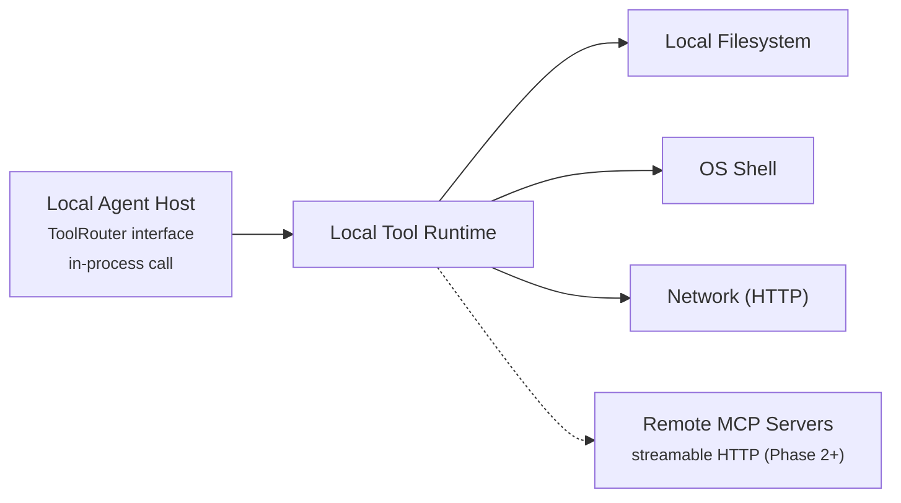
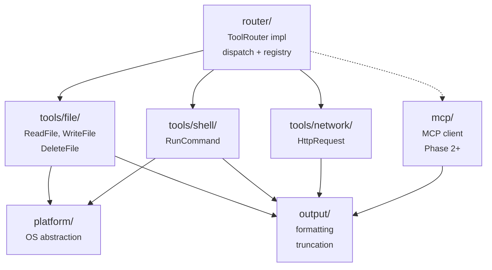
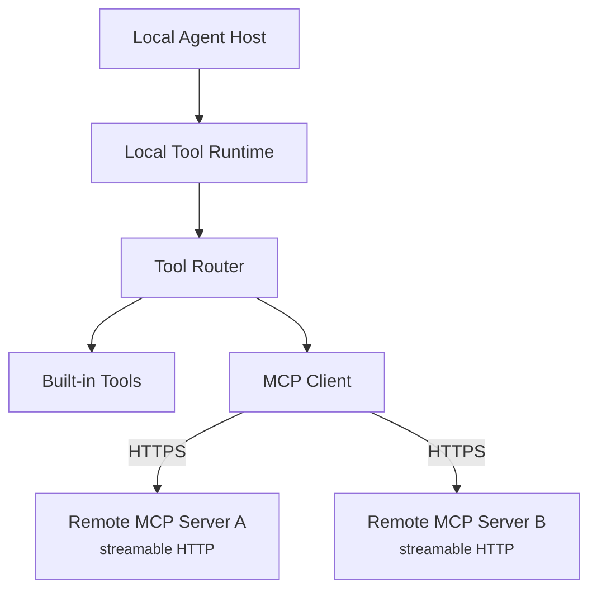

# Local Tool Runtime — Component Design

**Repo:** `agent-runtime` (`tool-runtime/` package)
**Bounded Context:** ToolExecution
**Phase:** 1 (MVP); MCP client in Phase 2+

---

The Local Tool Runtime executes all tool calls on the desktop — file operations, shell commands, and network requests. It implements the `ToolRouter` interface consumed by the Local Agent Host and is the single execution boundary between the agent loop and the local operating system.

This document describes the internal design of the `tool-runtime/` package. For the agent loop that drives tool execution, see [local-agent-host.md](local-agent-host.md). For the Desktop App UI, see [desktop-app.md](desktop-app.md).

**Prerequisites:** [architecture.md](../architecture.md) (protocol contracts, capability model), [local-agent-host.md](local-agent-host.md) (ToolRouter interface, tool-to-capability mapping)

---

## 1. Overview

### What this component does

- Implements the `ToolRouter` interface that the Local Agent Host calls
- Executes built-in tools: file read/write/delete, shell commands, HTTP requests
- Manages platform-specific differences between macOS and Windows
- Validates tool inputs and sanitizes outputs before returning to the agent loop
- Produces artifacts for upload to the Workspace Service (via the Local Agent Host)
- Connects to remote MCP servers over streamable HTTP and translates their tool manifests to the internal contract (Phase 2+)

### What this component does NOT do

- Decide whether a tool is allowed — that is the Local Policy Enforcer (checked before the call reaches this component)
- Request user approval — that is the Local Agent Host's approval integration
- Call the LLM — that is the Local Agent Host's LLM client
- Upload artifacts directly — it returns artifact data to the Local Agent Host, which uploads to the Workspace Service

### Key constraint

**No direct imports across the package boundary.** The `tool-runtime/` package exposes the `ToolRouter` interface implementation. The `agent-host/` package consumes it. Neither imports the other's internals.

### Component Context



---

## 2. Internal Module Structure

### Package layout

```
tool-runtime/
  router/         — ToolRouter implementation, tool registry, dispatch
  tools/
    file/         — ReadFile, WriteFile, DeleteFile implementations
    shell/        — RunCommand implementation
    network/      — HttpRequest implementation
  platform/       — OS abstraction layer (path handling, shell resolution, encoding)
  mcp/            — MCP client: discovery, connection, lifecycle, manifest translation (Phase 2+)
  output/         — Output formatting, truncation, artifact extraction
```

### Module dependencies



**Dependency rules:**
- `router/` is the entry point — it receives `ToolRequest` objects and dispatches to the correct tool module
- Each `tools/*` module is self-contained — it depends only on `platform/` and `output/`, never on other tool modules
- `platform/` has no dependencies on tool modules — it provides OS primitives
- `mcp/` is loaded only when MCP is enabled (Phase 2+)

---

## 3. ToolRouter Implementation

### Interface

The `ToolRouter` interface is defined in the `agent-host/` package. The `tool-runtime/` package provides the implementation:

```
interface ToolRouter {
  execute(request: ToolRequest): Promise<ToolResult>
  getAvailableTools(): ToolDefinition[]
}
```

> ToolRequest / ToolResult schemas: [architecture.md, Section 6.2](../architecture.md#62-tool-schemas--local-agent-host--local-tool-runtime)

### Tool Registry

On startup, the router builds a registry of available tools:

```
registry = {
  "ReadFile":    FileReadTool,
  "WriteFile":   FileWriteTool,
  "DeleteFile":  FileDeleteTool,
  "RunCommand":  ShellExecTool,
  "HttpRequest": NetworkHttpTool,
}
```

Phase 2+: MCP tools are added to the registry dynamically when remote MCP servers are discovered and connected, and their manifests translated.

### Dispatch Flow

```
function execute(request: ToolRequest) -> ToolResult:
  tool = registry[request.toolName]
  if tool is null:
    return ToolResult(status: "failed", error: { code: "TOOL_NOT_FOUND", message: "Unknown tool: " + request.toolName })

  // Validate input schema
  validationError = tool.validateInput(request.arguments)
  if validationError:
    return ToolResult(status: "failed", error: { code: "INVALID_REQUEST", message: validationError })

  // Execute
  rawOutput = tool.execute(request.arguments)

  // Format output
  result = formatOutput(rawOutput, request)
  return result
```

### getAvailableTools

Returns `ToolDefinition[]` — the set of tool descriptions sent to the LLM. Each definition includes:

```json
{
  "toolName": "ReadFile",
  "description": "Read the contents of a file at the given path",
  "inputSchema": {
    "type": "object",
    "required": ["path"],
    "properties": {
      "path": { "type": "string", "description": "Absolute file path to read" }
    }
  }
}
```

The agent-host's `routing/` module filters this list to only include tools whose capabilities are granted in the policy bundle.

---

## 4. Built-in Tools

### 4.1 ReadFile

**Capability:** `File.Read`

**Arguments:**

| Argument | Type | Required | Description |
|----------|------|----------|-------------|
| `path` | string | yes | Absolute file path to read |
| `offset` | integer | no | Line number to start reading from (1-based). Default: 1 |
| `limit` | integer | no | Maximum number of lines to return. Default: all |
| `encoding` | string | no | File encoding. Default: `utf-8` |

**Behavior:**
1. Resolve the path (normalize, resolve symlinks via `platform/`)
2. Check that the file exists — if not, return error `FILE_NOT_FOUND`
3. Check file size against `maxFileSizeBytes` (from policy scope, passed in ToolRequest) — if too large, return error `FILE_TOO_LARGE`
4. Read file contents with the specified encoding
5. Apply `offset` and `limit` if provided
6. Return contents as `outputText`

**Output:** file contents as text. Binary files return a descriptive message ("Binary file, {size} bytes") rather than raw content.

**Platform notes:**
- Path separator normalization handled by `platform/`
- Encoding detection: if `utf-8` fails, try the OS default encoding, then fall back to latin-1

---

### 4.2 WriteFile

**Capability:** `File.Write`

**Arguments:**

| Argument | Type | Required | Description |
|----------|------|----------|-------------|
| `path` | string | yes | Absolute file path to write |
| `content` | string | yes | File content to write |
| `createDirectories` | boolean | no | Create parent directories if they don't exist. Default: `true` |

**Behavior:**
1. Resolve the path
2. If `createDirectories` is true and parent directories don't exist, create them
3. Write content to the file (atomic: write to temp file, then rename)
4. Return confirmation with bytes written

**Output:** `"Wrote {bytes} bytes to {path}"`

**Artifact production:** After a write, the tool produces a `file_diff` artifact containing the unified diff between the previous content and the new content. This is returned in the `ToolResult.artifactUris` field for the Local Agent Host to upload to the Workspace Service.

---

### 4.3 DeleteFile

**Capability:** `File.Delete`

**Arguments:**

| Argument | Type | Required | Description |
|----------|------|----------|-------------|
| `path` | string | yes | Absolute file path to delete |

**Behavior:**
1. Resolve the path
2. Check that the file exists — if not, return error `FILE_NOT_FOUND`
3. Delete the file
4. Return confirmation

**Output:** `"Deleted {path}"`

**Constraint:** Directories cannot be deleted with this tool — only individual files. This prevents accidental recursive deletion.

---

### 4.4 RunCommand

**Capability:** `Shell.Exec`

**Arguments:**

| Argument | Type | Required | Description |
|----------|------|----------|-------------|
| `command` | string | yes | Shell command to execute |
| `cwd` | string | no | Working directory. Default: workspace root |
| `timeout` | integer | no | Timeout in seconds. Default: 300 |
| `stdin` | string | no | Standard input to pipe to the command |

**Behavior:**
1. Resolve `cwd` path
2. Spawn a child process via the platform shell (see [Section 6](#6-platform-adapters))
3. Pipe `stdin` if provided
4. Capture stdout and stderr separately
5. Wait for the process to exit or timeout
6. On timeout: kill the process tree, return error `TOOL_EXECUTION_TIMEOUT`
7. Return exit code, stdout, and stderr

**Output format:**

```
Exit code: 0
--- stdout ---
{stdout content}
--- stderr ---
{stderr content}
```

**Output truncation:** If combined stdout + stderr exceeds `maxOutputBytes` (from policy scope, default 100KB), truncate with a `[Output truncated — {total} bytes, showing first {limit} bytes]` marker.

**Artifact production:** If stdout exceeds 10KB, the full output is packaged as a `tool_output` artifact and referenced via `artifactUris`. The `outputText` contains the truncated version.

---

### 4.5 HttpRequest

**Capability:** `Network.Http`

**Arguments:**

| Argument | Type | Required | Description |
|----------|------|----------|-------------|
| `url` | string | yes | Request URL |
| `method` | string | no | HTTP method. Default: `GET` |
| `headers` | object | no | Request headers |
| `body` | string | no | Request body |
| `timeout` | integer | no | Timeout in seconds. Default: 30 |

**Behavior:**
1. Parse and validate the URL
2. Make the HTTP request with the specified method, headers, and body
3. Capture response status, headers, and body
4. On timeout: abort, return error `TOOL_EXECUTION_TIMEOUT`
5. Return response summary

**Output format:**

```
HTTP {statusCode} {statusText}
Content-Type: {contentType}
Content-Length: {contentLength}

{response body}
```

**Output truncation:** Response body truncated at `maxOutputBytes` (default 100KB).

**Security:**
- Only HTTP and HTTPS schemes are allowed — no `file://`, `ftp://`, etc.
- Redirect following is limited to 5 hops
- Response body size is capped (even before truncation) at 10MB — larger responses are aborted

---

## 5. Tool Definition Schema

Each tool exposes a `ToolDefinition` that describes itself to the LLM. These are collected via `getAvailableTools()` and included in LLM requests.

```json
{
  "$id": "ToolDefinition",
  "type": "object",
  "required": ["toolName", "description", "inputSchema"],
  "properties": {
    "toolName":    { "type": "string" },
    "description": { "type": "string" },
    "inputSchema": { "$ref": "JSONSchema" }
  }
}
```

Full definitions for each built-in tool:

| Tool | Description (sent to LLM) |
|------|--------------------------|
| `ReadFile` | Read the contents of a file at the given path |
| `WriteFile` | Create or overwrite a file with the given content |
| `DeleteFile` | Delete a file at the given path |
| `RunCommand` | Execute a shell command and return stdout, stderr, and exit code |
| `HttpRequest` | Make an HTTP request and return the response |

---

## 6. Platform Adapters

The `platform/` module abstracts OS-specific behavior so tool implementations remain cross-platform.

### 6.1 Path Handling

| Concern | macOS | Windows |
|---------|-------|---------|
| Separator | `/` | `\` (accept `/` as input, normalize to `\`) |
| Case sensitivity | Case-sensitive | Case-insensitive |
| Max path length | 1024 characters | 260 characters (or 32,767 with long path prefix) |
| Home directory | `$HOME` (`/Users/{name}`) | `%USERPROFILE%` (`C:\Users\{name}`) |
| Symlink resolution | `realpath()` | `GetFinalPathNameByHandle()` |

**Path normalization function:**
1. Expand `~` to home directory
2. Resolve `.` and `..` segments
3. Resolve symlinks to real path
4. Normalize separators to OS convention
5. Validate length

### 6.2 Shell Resolution

| Concern | macOS | Windows |
|---------|-------|---------|
| Default shell | `/bin/zsh` (or `$SHELL`) | `cmd.exe` |
| Command execution | `spawn("/bin/zsh", ["-c", command])` | `spawn("cmd.exe", ["/c", command])` |
| Environment | Inherits user environment | Inherits user environment |
| Process tree kill | `kill(-pid, SIGTERM)` → `SIGKILL` after 5s | `taskkill /T /F /PID {pid}` |
| Line endings | `\n` | `\r\n` (normalize to `\n` in output) |

### 6.3 Encoding

- Default encoding: `utf-8` on both platforms
- Fallback encoding: `utf-8` → OS default (`macRoman` on macOS, `windows-1252` on Windows) → `latin-1`
- BOM (byte order mark) handling: strip UTF-8 BOM if present

---

## 7. Output Formatting

The `output/` module standardizes how tool results are formatted before returning to the agent loop.

### 7.1 Text Truncation

When tool output exceeds `maxOutputBytes`:

1. Keep the first `maxOutputBytes * 0.8` bytes (head)
2. Keep the last `maxOutputBytes * 0.2` bytes (tail)
3. Insert a marker between them: `\n[... truncated {omitted} bytes ...]\n`

This preserves both the beginning (often contains key output) and the end (often contains summaries or exit status).

### 7.2 Artifact Extraction

Some tools produce output large enough to warrant artifact storage:

| Condition | Action |
|-----------|--------|
| Shell command stdout > 10KB | Package full output as `tool_output` artifact |
| File diff > 10KB | Package full diff as `file_diff` artifact |
| HTTP response body > 10KB | Package full response as `tool_output` artifact |

When an artifact is extracted:
1. The full output is stored in the artifact data (returned in `ToolResult` for the agent-host to upload)
2. The `outputText` in the `ToolResult` contains the truncated version (what the LLM sees)
3. The `artifactUris` field references the artifact (filled in by the agent-host after upload)

### 7.3 Error Formatting

Tool errors are returned as `ToolResult` with `status: "failed"`:

```json
{
  "toolName": "RunCommand",
  "status": "failed",
  "error": {
    "code": "TOOL_EXECUTION_TIMEOUT",
    "message": "Command timed out after 300 seconds"
  }
}
```

Standard error codes:

| Code | Meaning |
|------|---------|
| `TOOL_NOT_FOUND` | Unknown tool name |
| `INVALID_REQUEST` | Input validation failed |
| `FILE_NOT_FOUND` | File does not exist |
| `FILE_TOO_LARGE` | File exceeds `maxFileSizeBytes` |
| `PERMISSION_DENIED` | OS-level permission error |
| `TOOL_EXECUTION_FAILED` | Tool ran but produced an error |
| `TOOL_EXECUTION_TIMEOUT` | Tool exceeded its timeout |

---

## 8. Input Validation

Each tool validates its input arguments before execution. Validation happens inside the tool runtime — it is a defense-in-depth layer separate from the policy enforcer's capability checks.

### 8.1 Path Validation

All file tools validate paths:

1. **Must be absolute** — reject relative paths to prevent ambiguity
2. **Must be within expected boundaries** — reject paths containing `..` after normalization that escape the workspace (defense in depth; policy enforcer also checks this)
3. **Symlink resolution** — resolve before any file operation
4. **No null bytes** — reject paths containing `\0` (prevents null byte injection)
5. **Length limits** — reject paths exceeding OS limits

### 8.2 Command Validation

The `RunCommand` tool validates:

1. **Non-empty** — reject empty command strings
2. **No null bytes** — reject commands containing `\0`
3. **Timeout bounds** — `timeout` must be between 1 and 600 seconds

### 8.3 URL Validation

The `HttpRequest` tool validates:

1. **Scheme** — only `http` and `https` allowed
2. **No local addresses** — reject `localhost`, `127.0.0.1`, `::1`, `169.254.*`, `10.*`, `172.16-31.*`, `192.168.*` to prevent SSRF against local services
3. **Valid format** — must parse as a valid URL

---

## 9. MCP Client (Phase 2+)

> **Status:** Phase 2+. This section describes the planned design for MCP (Model Context Protocol) client support. It is not implemented in Phase 1.

In Phase 2+, the Local Tool Runtime acts as an **MCP client** that discovers and connects to remote MCP servers over streamable HTTP. MCP servers are external services that provide additional tools extending the agent's capabilities beyond the built-in set. MCP servers do **not** run locally on the desktop — they are remote endpoints.

### 9.1 Architecture



MCP servers are **never invoked directly by the agent loop** — all tool calls go through the standard ToolRouter → policy check → approval gate → execute path. MCP tools are indistinguishable from built-in tools from the agent loop's perspective.

### 9.2 MCP Server Lifecycle

```
1. Discovery
   - Read MCP server configuration from workspace config or policy bundle
   - Each entry specifies: server name, endpoint URL, authentication credentials

2. Connection
   - Establish streamable HTTP connection to each MCP server endpoint
   - Perform MCP capability negotiation (initialize)
   - Verify server identity via TLS

3. Manifest Translation
   - Fetch tool manifests from each MCP server (tools/list) over HTTP
   - Translate each MCP tool definition to the internal ToolDefinition schema
   - Register translated tools in the tool registry with a namespace prefix: "{serverName}/{toolName}"
   - Map each MCP tool to the appropriate capability for policy enforcement

4. Execution
   - When the router dispatches to an MCP tool, the MCP client:
     a. Forwards the ToolRequest arguments to the MCP server (tools/call) over HTTP
     b. Receives the MCP response
     c. Translates the response to a ToolResult
     d. Validates the response against the expected output schema

5. Disconnection
   - On session end, close all HTTP connections to MCP servers
```

### 9.3 Security Boundaries

| Concern | Mitigation |
|---------|-----------|
| MCP server exfiltrates data | Capability checks happen before dispatch — MCP servers only receive calls for tools allowed by the policy bundle |
| Malicious tool manifest | Schema validation at manifest ingress — reject tools with invalid schemas |
| Malicious tool output | Schema validation at result egress — reject results that don't match expected types |
| MCP server hangs | Per-tool timeout applies to MCP tools identically to built-in tools |
| MCP server unavailable | Detect connection failure, mark all tools from that server as unavailable, notify agent loop |
| Man-in-the-middle | TLS required for all MCP connections — reject non-HTTPS endpoints |
| Unauthorized access | Endpoint authentication required — credentials from policy bundle or workspace config |
| Response size abuse | Response body size capped at 10MB — larger responses are aborted |

### 9.4 Policy Integration

MCP tools require explicit allowlisting in the policy bundle:

- The policy bundle's capability entries can include MCP tool names in their scope
- MCP tools not listed in the policy bundle are never registered in the tool registry
- The `approvalRules` in the policy bundle can specify approval requirements for individual MCP tools

### 9.5 Manifest Translation

MCP tool manifests are translated to `ToolDefinition`:

| MCP field | ToolDefinition field |
|-----------|---------------------|
| `name` | `toolName` (prefixed with server name: `"serverA/searchDocs"`) |
| `description` | `description` |
| `inputSchema` | `inputSchema` (JSON Schema — passed through) |

MCP tool results are translated to `ToolResult`:

| MCP field | ToolResult field |
|-----------|-----------------|
| `content[].text` | `outputText` (concatenated) |
| `content[].type == "image"` | Packaged as artifact |
| `isError` | `status: "failed"` if true |

---

## 10. Testability

### Unit Testing

Each tool module is independently testable:

| Module | Test approach |
|--------|--------------|
| `tools/file/` | Use a temp directory as the workspace root; create, read, write, delete files |
| `tools/shell/` | Execute simple commands (`echo`, `cat`); verify exit codes and output capture |
| `tools/network/` | Use a local HTTP server (e.g. test fixture) or mock the HTTP client |
| `router/` | Mock individual tool modules; verify dispatch, error handling, and registry |
| `platform/` | Test path normalization, shell resolution, encoding detection per platform |
| `output/` | Test truncation, artifact extraction, error formatting with known inputs |
| `mcp/` | Mock MCP server HTTP endpoint; test manifest translation, call forwarding, error handling |

### Integration Testing

- End-to-end: send `ToolRequest` through the real `ToolRouter`, verify `ToolResult`
- Platform matrix: run tests on both macOS and Windows to verify platform adapter behavior
- MCP integration (Phase 2+): run a test MCP server over HTTP, verify full lifecycle

---

## 11. Open Questions

| Question | Context | Recommendation |
|----------|---------|----------------|
| File watching for patch preview | `GetPatchPreview` in the agent-host needs to know what files were modified. Should the tool runtime track all file writes? | Phase 1: track writes in a simple in-memory list per session. Phase 2: consider filesystem watch. |
| Streaming tool output | Long-running shell commands produce output incrementally. Should the tool runtime stream output to the agent-host? | Phase 1: wait for completion, return full output. Phase 2: stream output chunks via callback. |
| Tool result caching | If the LLM calls `ReadFile` on the same file twice, should we cache? | No caching in Phase 1 — files may change between calls. Revisit if profiling shows it matters. |
| MCP server authentication | How does the MCP client authenticate to remote MCP servers? Token-based, mTLS, or OAuth? | Phase 2: token-based auth (credentials in policy bundle or workspace config). Phase 3: evaluate mTLS for high-security deployments. |
| MCP server discovery | How are remote MCP server endpoints discovered? | Phase 2: explicit endpoint URLs in policy bundle or workspace config. Phase 3: consider a service registry. |
| MCP connection resilience | How should the client handle transient HTTP failures to MCP servers? | Retry with exponential backoff for transient errors (5xx, timeouts). Mark server unavailable after sustained failures. Reconnect on next tool call attempt. |
| Binary file handling | Should `ReadFile` support returning base64-encoded binary content? | Phase 1: return descriptive message for binary files. Phase 2: support base64 for image files (useful for multimodal LLMs). |
| Shell environment isolation | Should `RunCommand` inherit the full user environment, or a sanitized subset? | Phase 1: inherit full environment. Phase 2: evaluate sanitization for security-sensitive deployments. |
