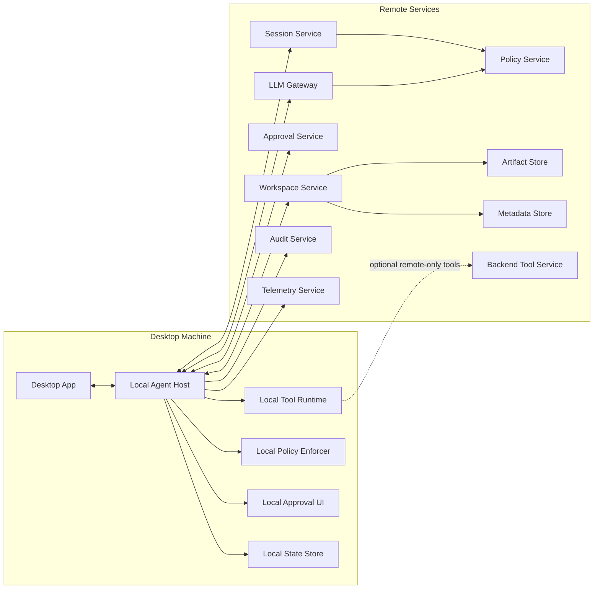
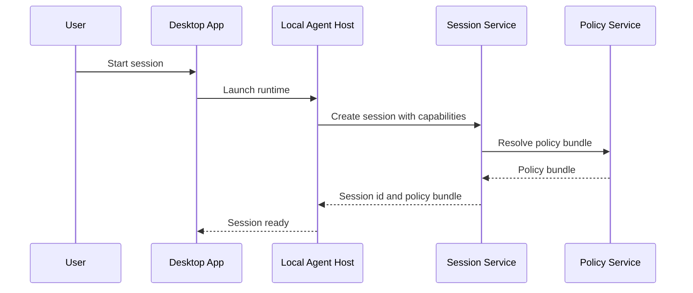
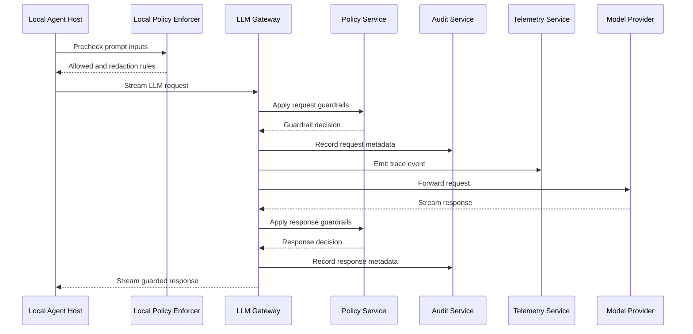
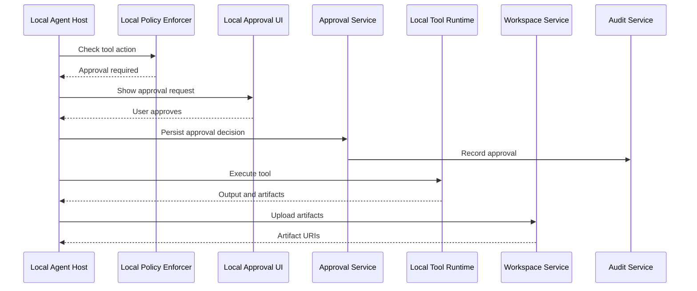
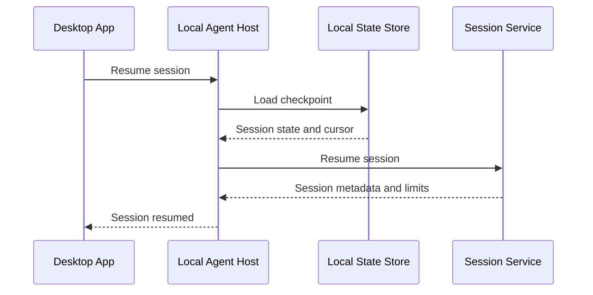
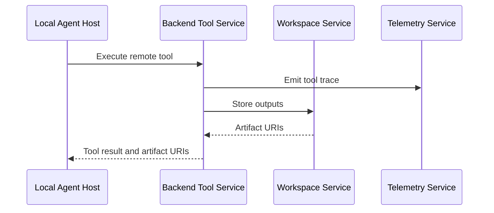
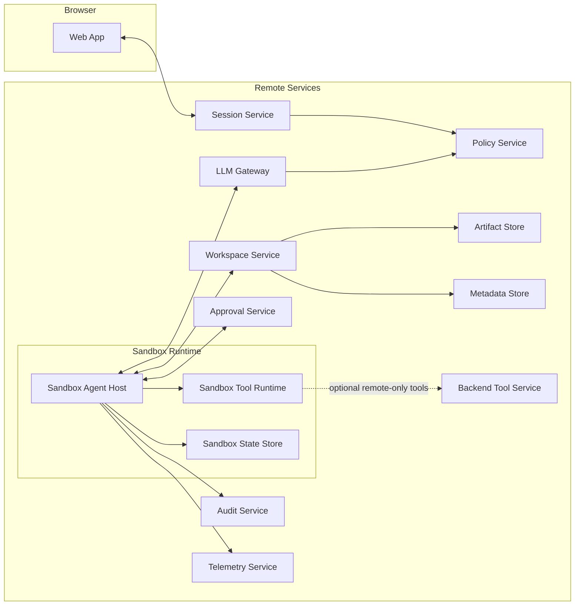

# Local First Agent System Design for Desktop

## Introduction

This design describes a desktop-first agent system for Windows and macOS that combines a **local agent runtime** with **centralized governance services**.

The core idea is simple:

- run the **Agent Loop locally** for fast file and tool interactions
- route all **LLM calls through a backend LLM Gateway** for consistent guardrails and policy enforcement
- keep **policy, approvals, workspace artifacts, audit, and telemetry** as centralized services

This gives the user a responsive local experience while preserving enterprise-grade control and observability.

### High level summary

The system is split into two major parts:

1. **Desktop runtime on the client machine**

   - **Desktop App** provides the user interface
   - **Local Agent Host** runs the agent loop and orchestrates steps
   - **Local Tool Runtime** executes tools such as file edits, shell commands, and git operations
   - **Local Policy Enforcer** applies local capability and path restrictions
   - **Local Approval UI** handles user confirmation for risky actions
   - **Local State Store** supports checkpointing and session resume

2. **Remote governance and platform services**

   - **Session Service** creates and resumes sessions and performs compatibility checks
   - **Policy Service** generates policy bundles and approval rules
   - **LLM Gateway** enforces LLM guardrails and routes model requests
   - **Approval Service** persists approval decisions
   - **Workspace Service** stores artifacts and session history using **Artifact Store** and **Metadata Store**
   - **Audit Service** and **Telemetry Service** provide centralized traceability and operations visibility

### Why this design exists

This design intentionally balances two competing needs:

- **Local-first productivity**

  - direct file access
  - local tool execution
  - low latency interactions

- **Centralized enterprise controls**

  - guardrails on all LLM traffic
  - consistent policy and capability enforcement
  - auditability and telemetry
  - approval persistence and governance

Instead of forcing the full agent runtime into the backend, the design keeps the agent loop local for desktop UX and uses backend services where central consistency matters most.

### Key design elements to understand first

Before reading the detailed sections, these are the most important building blocks:

#### 1) Agent Loop location

The **Agent Loop** runs in **Local Agent Host** on the desktop machine. This is the main orchestration engine for planning, step execution, tool routing, and retries.

#### 2) LLM governance path

All LLM requests and responses go through **LLM Gateway**. This is the central enforcement point for:

- request guardrails
- response guardrails
- token budgets
- model routing
- LLM audit metadata

> **Implementation note:** The LLM Gateway is an **existing external service** — it will not be implemented as part of this project. The Local Agent Host integrates with it via a **configurable endpoint URL and configurable auth token**. Both are supplied at session init through the policy bundle returned by the Session Service (or via local configuration for development). No `backend-llm-gateway` repo needs to be built.

#### 3) Capability based security

The system uses a **policy bundle** issued by **Policy Service** at session start. Capabilities define what the local agent is allowed to do, such as:

- file read and write
- shell execution
- network access
- git actions
- remote tool invocation

The policy is enforced locally by **Local Policy Enforcer** and centrally by relevant backend services.

#### 4) Transport model

For the desktop-first version, the design avoids unnecessary real-time complexity:

- **Desktop App to Local Agent Host** uses local JSON-RPC over stdio or local socket
- **Local Agent Host to backend services** uses HTTPS REST
- **Local Agent Host to LLM Gateway** uses HTTP streaming

WebSocket is optional and only needed later for server-initiated push scenarios.

#### 5) Shared runtime contract for future web support

Even though this document is desktop-first, the protocol and state model are designed so the same logical agent runtime can later run in a backend sandbox for web.

That is why the design standardizes:

- event names
- tool schemas
- capability names
- error model
- checkpoint and artifact patterns

### How to read this document

A good reading order is:

1. **Deployment model and component names**
2. **Domain model** — workspace, session, task, step hierarchy
3. **Bounded contexts**
4. **Architecture and sequence diagrams**
5. **Capability model and policy bundle**
6. **Protocol contracts and schemas**
7. **Repo mapping for implementation planning**
8. **Service design docs** — detailed API and data model for each service

---

## Scope

This document defines a desktop-first system design for a Windows and macOS app similar to Claude Code.

Core goals:

- Agent loop runs on the client
- Tool execution runs on the client
- LLM calls route through a backend LLM Gateway for centralized guardrails
- Policy, approvals, workspace, audit, and telemetry are centralized services
- Consistent bounded contexts and component naming
- Web adaptation is included as a separate section at the end

---

## 1) Deployment Model

### Desktop Mode

The desktop app runs a local runtime process that hosts the agent.

- **Agent Loop** runs in **Local Agent Host**
- **Tool calls** run in **Local Tool Runtime**
- **LLM calls** go to **LLM Gateway**
- **Policy** is centrally defined by **Policy Service** and enforced by **Local Policy Enforcer** plus **LLM Gateway**
- **Workspace artifacts** are stored via **Workspace Service**
- **Approvals**, **Audit**, and **Telemetry** are centralized

### Transport model for v1

Because the agent loop is local, WebSocket is not required for the core design.

- **Desktop App ↔ Local Agent Host**: JSON-RPC over stdio or local socket
- **Local Agent Host ↔ Remote Services**: HTTPS REST
- **Local Agent Host ↔ LLM Gateway**: HTTP streaming for model responses

WebSocket is optional later for server-initiated push use cases only.

---

## 2) Consistent Component Names

### Desktop Components

- **Desktop App**
- **Local Agent Host**
- **Local Tool Runtime**
- **Local Policy Enforcer**
- **Local Approval UI**
- **Local State Store**

### Remote Services

- **Session Service**
- **LLM Gateway**
- **Policy Service**
- **Approval Service**
- **Workspace Service**
- **Artifact Store**
- **Metadata Store**
- **Audit Service**
- **Telemetry Service**
- **Backend Tool Service** (optional for remote-only tools)

### Web Adaptation Components

- **Sandbox Agent Host**
- **Sandbox Tool Runtime**
- **Sandbox State Store**

---

## 2a) Domain Model: Workspace, Session, Task, Step

This section defines the core domain entities and their relationships. Understanding this hierarchy is essential before reading the component and sequence sections.

> See also: [domain-model.md](domain-model.md) — the standalone authoritative reference for all domain concepts.

### The Hierarchy

```
Workspace  (always present — auto-created for every session)
  └── Session  (one or more per workspace, over time)
        └── Task  (one or more per session)
              └── Step  (one or more per task)
                    └── Tool calls, LLM calls, Approvals, Artifacts
```

### Workspace

A workspace is a **backend namespace** that scopes a session's history and artifacts. Every session has a workspace — it is always auto-created by the Session Service, never explicitly created by the user.

**What a workspace is NOT:**
- It is not a copy or mirror of the project directory
- It does not store project source files — those stay on the client machine (for desktop) or in the cloud sandbox (for web)

**What a workspace stores:**
- Session history snapshots (`session_history` artifacts) — the full conversation thread, uploaded after each task
- Agent-produced artifacts: tool outputs, generated files, diffs explicitly created by the agent

**Workspace is mandatory for all sessions.** History always goes to the backend so that the Desktop App and the future web client have identical storage behaviour — the Desktop App never relies on the Local State Store for history browsing.

| Session type | Workspace | workspaceScope |
|---|---|---|
| Project session (user working in a specific directory) | Auto-resolved from `workspaceHint` (local path) — reused across sessions | `local` |
| General chat (no project directory) | Auto-created fresh for each session — single-use | `general` |
| Web session (Phase 3+) | Auto-created or resolved | `cloud` |

**workspaceScope** defines the reuse policy and where source files live:

| Value | Source files | Reuse policy |
|---|---|---|
| `local` | Live on the client machine. No project files uploaded to the backend. | Reused across many sessions — one workspace per project, accumulates history over time. |
| `general` | May exist, scoped to this session only. | Single-use — a new workspace is created for each general chat session. Not shared across sessions. |
| `cloud` | Live in a cloud sandbox in the backend. | TBD (Phase 3+). |

The key distinction between `local` and `general` is **reuse policy**, not the presence of files. A `general` workspace can hold files and context for that conversation, but when the user starts a new general chat they get a fresh workspace — nothing carries over from a previous general chat.

This is distinct from `executionEnvironment` on the session. `workspaceScope` describes the **workspace reuse and file policy**; `executionEnvironment` describes **where the agent runs**.

**Workspace lifecycle:**
- `local` workspaces: created once per project, reused across all future sessions on that project — long-lived, accumulates history and artifacts over time
- `general` workspaces: created fresh for each general chat session — single-use, contains only the history and artifacts for that one session
- `cloud` workspaces: lifecycle TBD (Phase 3+)
- **Deletion**: a user can explicitly delete a workspace from the Desktop App; all artifacts and session history under it are permanently removed
- **Auto-purge**: workspaces inactive for 90 days are automatically purged (implementation deferred to a later phase)

### Session

A session is the **governance container** for one continuous working period. It is also what the user sees as a **conversation** in the Desktop App UI.

- Created when the user opens the Desktop App and begins working
- Holds the policy bundle, LLM Gateway endpoint and token, token budgets, approval rules, feature flags, and `executionEnvironment` — all scoped to this working period
- Runs the agent loop state machine and owns the in-memory message thread
- One session = one conversation (from the user's perspective). Multiple tasks within a session are multiple turns of the same conversation
- Always has a `workspaceId` — auto-assigned by the Session Service for every session regardless of type
- Supports checkpointing and resume across desktop restarts (crash recovery only — the Local State Store is transient and cleared after a clean session end)
- Ends when the user closes the session, the policy bundle expires, or the session is explicitly cancelled
- Time-scoped: its lifecycle is about *who you are, what you are allowed to do, and where you are running* for this working period

**executionEnvironment** is a session-level field that indicates where the agent is running:

| Value | Meaning |
|-------|---------|
| `desktop` | Agent runs locally via Desktop App and Local Agent Host |
| `cloud_sandbox` | Agent runs in a backend sandbox (future web extension) |

This is distinct from `workspaceScope` on the workspace. `executionEnvironment` describes where the **agent** runs; `workspaceScope` describes where the **source files** live.

**Terminology: session vs conversation**

Internally the system uses the term **session** for this entity. In the Desktop App UI the user sees it labelled as a **conversation**. These are the same thing — different vocabulary for different audiences. The design doc uses "session" throughout; UI copy uses "conversation".

### Task

A task is a **single agent work cycle** triggered by one user prompt.

- Created when the user sends a message (via the `StartTask` JSON-RPC call)
- Has its own options: `maxSteps`, `allowNetwork`, `approvalMode`
- Can be cancelled independently without ending the session — the user can cancel mid-task and send a new prompt without re-authenticating or re-fetching the policy bundle
- One session can contain many tasks (multi-turn conversation)
- Work-scoped: its lifecycle is about *what you asked for right now*
- When a task completes, the full session message thread is snapshotted and uploaded to the Workspace Service as a `session_history` artifact — this applies to all sessions since every session has a workspace

**Why session and task are kept separate:**

| Concern | Session | Task |
|---------|---------|------|
| Policy and auth | ✓ | — |
| LLM endpoint and token | ✓ | — |
| executionEnvironment | ✓ | — |
| Message thread ownership | ✓ | — |
| Checkpointing and resume | ✓ | — |
| Token budget tracking | ✓ (across all tasks) | — |
| User prompt and intent | — | ✓ |
| Step count limit | — | ✓ |
| Cancellable independently | — | ✓ |

### Step

A step is one **iteration of the agent loop** inside a task.

- Consists of one LLM call followed by zero or more tool calls based on the model's response
- Identified by a `stepId` scoped to its task
- Tool calls, approvals, and artifacts generated within a step are all tagged with `sessionId`, `taskId`, and `stepId`

### ID Relationships

Every event, tool call, artifact, and audit record is tagged with the full chain of IDs:

```
workspaceId → sessionId → taskId → stepId
```

All four IDs are always present. Every session has a workspace, so `workspaceId` is never null.

**Session resume — two distinct scenarios:**

- **Crash recovery** (session did not end cleanly): the Local State Store checkpoint still exists. The Local Agent Host loads the checkpoint, reconstructs the in-memory message thread, and calls the Session Service to re-validate policy. Execution continues from the checkpoint cursor.

- **Continue a past conversation** (session ended cleanly, user wants to pick up): the Local State Store has been cleared. The user starts a new session. The Desktop App fetches the previous `session_history` artifact from the Workspace Service and bootstraps the new session's message thread from it.

---

## 3) Bounded Contexts

### 3.1 Agent Execution Context

**Purpose:** Run the agent loop for the session.

**Owned Components**

- Local Agent Host
- Local State Store

**Responsibilities**

- Session state machine
- Planning and step execution
- LLM request construction
- Tool routing decisions
- Retry behavior
- Checkpointing (including full message thread)
- Event generation
- In-memory message thread management across all tasks in a session
- Per-step checkpoint write to Local State Store (crash recovery only — transient)
- Local State Store checkpoint deletion on clean session end
- Session history snapshot upload to Workspace Service after each task completes (all sessions)

**Does Not Own**

- Central policy definitions
- Long-term artifact storage
- Audit persistence
- User identity management

### 3.2 Tool Execution Context

**Purpose:** Execute tools safely and consistently.

**Owned Components**

- Local Tool Runtime
- Backend Tool Service (optional)

**Responsibilities**

- Local filesystem actions
- Local process execution
- Tool output capture
- Tool schema validation
- Capability checks integration
- MCP server lifecycle management (Phase 2+)
- MCP tool discovery and registration (Phase 2+)

**Does Not Own**

- Agent planning
- LLM invocation
- Approval decisions
- Policy authoring

**Tool Architecture: Hybrid Built-in + MCP**

The Local Tool Runtime uses a hybrid approach:

- **Core tools are built-in** — file, shell, and git tools are implemented directly inside the Local Tool Runtime. They run in-process (or as tight subprocesses), have direct integration with the Local Policy Enforcer for capability checks, and are always available regardless of external dependencies.

- **MCP is supported as an extension point (Phase 2+)** — the Local Tool Runtime also acts as an MCP host. It can discover, spawn, and manage external MCP servers, translate their tool manifests into the internal `ToolRequest`/`ToolResult` contract, and route calls to them. This allows enterprises and users to plug in custom or third-party tools without modifying the agent codebase.

- **Policy enforcement wraps all tool calls uniformly** — whether a tool is built-in or MCP-backed, the capability check and approval gate happen at the routing layer inside the Local Tool Runtime before any execution occurs. MCP servers are never called directly by the agent loop.

- **Skills are deferred** — formal skills (named, multi-step, stateful tool sequences) are not introduced in Phase 1 or 2. The LLM and system prompt handle task decomposition. Skills will be revisited once recurring tool sequences are well understood from usage patterns.

### 3.3 Policy and Guardrails Context

**Purpose:** Enforce governance for tool actions and LLM traffic.

**Owned Components**

- Policy Service
- Local Policy Enforcer
- LLM Gateway (for LLM request and response guardrails)

**Responsibilities**

- Policy bundle generation
- Policy bundles with expiry
- Capability restrictions
- Path restrictions
- Command restrictions
- Approval requirements
- LLM prompt and response guardrails
- Budget and quota rules

**Does Not Own**

- UI rendering
- Agent planning
- Artifact storage

### 3.4 Session Coordination Context

**Purpose:** Establish sessions and maintain lifecycle metadata.

**Owned Components**

- Session Service

**Responsibilities**

- Create and resume sessions
- Version compatibility checks
- Capability handshake
- Session metadata
- Session status transitions

**Does Not Own**

- Agent execution
- Tool execution
- LLM provider communication

### 3.5 Workspace and Artifacts Context

**Purpose:** Persist and serve artifacts and session history.

**Owned Components**

- Workspace Service
- Artifact Store
- Metadata Store

**Responsibilities**

- Workspace manifests
- Artifact upload and retrieval
- Session history artifact storage and retrieval (`session_history` artifact type)
- Step output references

**Does Not Own**

- Policy decisions
- LLM calls
- Agent logic

### 3.6 Approval Context

**Purpose:** Capture and persist human approvals for risky actions.

**Owned Components**

- Approval Service
- Local Approval UI

**Responsibilities**

- Approval request lifecycle
- User decision capture
- Approval decision persistence
- Approval audit trail

**Does Not Own**

- Tool execution engine
- Agent planning logic

### 3.7 Observability and Audit Context

**Purpose:** Central telemetry and audit.

**Owned Components**

- Telemetry Service
- Audit Service

**Responsibilities**

- Structured event ingest
- Traces and metrics
- Security audit records
- Session event history (if retained)

**Does Not Own**

- Agent execution
- Tool execution
- Policy decisions

---

## 4) Core Design Principles

### 4.1 Local First Execution

The desktop experience should remain local-first for:

- file operations
- tool execution
- step control
- approval presentation

### 4.2 Centralized LLM Governance

All model traffic flows through **LLM Gateway** for:

- guardrails
- audit
- token accounting
- model routing

> **Implementation note:** The LLM Gateway is a **reused external service**, not built by this project. Integration is via a **configurable base URL and configurable auth token**. These values are injected at runtime — through the policy bundle for managed deployments, or through a local config file for development. The `backend-llm-gateway` repo is removed from scope.

### 4.3 Shared Runtime Contract

Define one runtime contract reusable later for web:

- same event names
- same tool schemas
- same checkpoint format
- same state machine

### 4.4 Capability Based Security

Capabilities include examples such as:

- `File.Read`
- `File.Write`
- `File.Delete`
- `Shell.Exec`
- `Network.Http`
- `Git.Commit`
- `Git.Push`
- `Workspace.Upload`
- `BackendTool.Invoke`
- `LLM.Call`

Capabilities are constrained by user, tenant, session, path scope, and approval state.

---

## 5) Desktop Architecture Diagram



---

## 6) Session Handshake and Policy Bundle

At session start, **Local Agent Host** performs a handshake with **Session Service**.

### Handshake request

- OS type and version
- Desktop App version
- Local Agent Host version
- supported tool list
- supported capabilities
- workspace hint (local project path, if any)

### Handshake response

- session id
- workspace id (always present — auto-created or resolved by Session Service)
- compatibility status
- policy bundle
- LLM Gateway endpoint (configurable — points to an existing external LLM Gateway)
- LLM Gateway auth token (configurable — injected at session init, not hardcoded)
- token and budget limits
- approval rules
- feature flags

This ensures the local loop receives centrally governed policy before work starts.

> See [services/session-service.md](services/session-service.md) for the full Session Service API, request/response schemas, and session resume flow.

---

## 7) Agent Loop State Machine

Owned by **Local Agent Host**.

States:

- `SESSION_CREATED`
- `SESSION_RUNNING`
- `WAITING_FOR_LLM`
- `WAITING_FOR_APPROVAL`
- `WAITING_FOR_TOOL`
- `SESSION_PAUSED`
- `SESSION_COMPLETED`
- `SESSION_FAILED`
- `SESSION_CANCELLED`

---

## 8) Sequence Diagrams

### 8.1 Desktop Session Start and Policy Handshake



### 8.2 Local Agent Loop Calling LLM Gateway



### 8.3 Local Tool Call With Approval



### 8.4 Session Resume After Desktop Restart



### 8.5 Optional Remote Only Tool Call



---

## 8a) Conversation Message Thread and Storage

### Overview

The conversation message thread follows a **backend-primary approach**:

- **During an active session** — the Local Agent Host holds the full message thread in memory and checkpoints it to the **Local State Store** after each completed step. This is purely for crash recovery — the Local State Store is transient and is cleared after a clean session end.
- **On each task completion** — the full session message thread so far is snapshotted and uploaded to the **Workspace Service** as a `session_history` artifact, overwriting the previous snapshot. This applies to all sessions.
- **History is always fetched from the backend** — the Desktop App reads session history from the Workspace Service, never from the Local State Store.

### Storage Responsibility Summary

| Scope | Storage | When written | Purpose |
|-------|---------|-------------|---------|
| Active session (in-flight) | Memory in Local Agent Host | Continuously | LLM request construction |
| Per-step crash recovery | Local State Store (checkpoint) | After each step completes | Crash recovery only — transient, deleted on clean session end |
| Per-task history | Workspace Service (`session_history` artifact) | After each task completes | Canonical history store, used for browsing and continuation |

The Local State Store is never used for history browsing. It is a crash recovery buffer only.

### Message Schema

```json
{
  "$id": "ConversationMessage",
  "type": "object",
  "required": ["messageId", "sessionId", "role", "content", "timestamp"],
  "properties": {
    "messageId": { "type": "string" },
    "sessionId": { "type": "string" },
    "taskId":    { "type": "string" },
    "stepId":    { "type": "string" },
    "role": {
      "type": "string",
      "enum": ["system", "user", "assistant", "tool"]
    },
    "content":    { "type": "string" },
    "tokenCount": { "type": "integer" },
    "timestamp":  { "type": "string", "format": "date-time" }
  },
  "additionalProperties": false
}
```

---

## 9) Capability Model

Capabilities are issued by **Policy Service** in a policy bundle and enforced by **Local Policy Enforcer** and **Local Tool Runtime**.

### Capability Table

| Capability           | Description              | Typical Scope                     | Approval Required | Enforced By                               |
| -------------------- | ------------------------ | --------------------------------- | ----------------- | ----------------------------------------- |
| `File.Read`          | Read file contents       | Allowed path prefixes             | Usually no        | Local Policy Enforcer, Local Tool Runtime |
| `File.Write`         | Create or modify files   | Allowed path prefixes             | Sometimes         | Local Policy Enforcer, Local Tool Runtime |
| `File.Delete`        | Delete files             | Allowed path prefixes             | Usually yes       | Local Policy Enforcer, Local Tool Runtime |
| `Shell.Exec`         | Run local commands       | Command allowlist and cwd paths   | Often yes         | Local Policy Enforcer, Local Tool Runtime |
| `Network.Http`       | Outbound HTTP requests   | Domain allowlist                  | Sometimes         | Local Policy Enforcer, Local Tool Runtime |
| `Git.Status`         | Read repo status         | Repo path                         | Usually no        | Local Policy Enforcer, Local Tool Runtime |
| `Git.Diff`           | Read repo diff           | Repo path                         | Usually no        | Local Policy Enforcer, Local Tool Runtime |
| `Git.Commit`         | Create commits           | Repo path and branch policy       | Usually yes       | Local Policy Enforcer, Local Tool Runtime |
| `Git.Push`           | Push commits             | Repo path and remote allowlist    | Yes               | Local Policy Enforcer, Local Tool Runtime |
| `Workspace.Upload`   | Upload artifacts         | Workspace id and size limits      | Usually no        | Local Agent Host                          |
| `BackendTool.Invoke` | Invoke remote-only tools | Tool names                        | Sometimes         | Local Agent Host, Policy Service          |
| `LLM.Call`           | Call LLM Gateway         | Model allowlist and token budgets | No                | LLM Gateway, Policy Service               |

### Scope Fields

Capability entries can include any of these scope constraints:

- `allowedPaths` / `blockedPaths` — for file capabilities
- `allowedCommands` / `blockedCommands` — for Shell.Exec
- `allowedDomains` — for Network.Http
- `maxFileSizeBytes` / `maxOutputBytes` — size limits
- `requiresApproval` — boolean flag
- `approvalRuleId` — reference to an approval rule in the bundle

> See [services/policy-service.md](services/policy-service.md) for the full policy bundle structure, LLM policy fields, and capability scope reference.

---

## 10) Policy Bundle

The **Policy Service** returns a policy bundle during session handshake. It is returned over the authenticated HTTPS session — no cryptographic signing is applied. Transit integrity is guaranteed by TLS.

The bundle contains:
- `policyBundleVersion` and `schemaVersion` — versioning for compatibility checks
- `tenantId`, `userId`, `sessionId` — scoping identifiers
- `expiresAt` — bundles are short-lived; the client must not use an expired bundle
- `capabilities` — list of capability grants with scope constraints
- `llmPolicy` — allowed models, token limits
- `approvalRules` — approval rule definitions referenced by capabilities

### Client-side Validation

**Local Agent Host** must validate before starting the session:

- `expiresAt` is in the future
- `sessionId` in the bundle matches the active session
- `schemaVersion` is supported by this version of the Local Agent Host

If validation fails, the session must not start.

> See [services/policy-service.md](services/policy-service.md) for the full policy bundle JSON example and all field definitions.

---

## 11) Local IPC Contract

Use **JSON-RPC 2.0** between **Desktop App** and **Local Agent Host** over stdio or local socket.

### JSON-RPC Methods

- `CreateSession`
- `StartTask`
- `CancelTask`
- `ResumeSession`
- `GetSessionState`
- `GetPatchPreview`
- `ApproveAction`
- `Shutdown`
- Notification: `SessionEvent`

### JSON-RPC Example: CreateSession Request

```json
{
  "jsonrpc": "2.0",
  "id": "req_create_01",
  "method": "CreateSession",
  "params": {
    "userId": "user_123",
    "tenantId": "tenant_abc",
    "executionEnvironment": "desktop",
    "workspaceHint": {
      "localPaths": ["/Users/suman/projects/demo"]
    },
    "clientInfo": {
      "desktopAppVersion": "1.0.0",
      "localAgentHostVersion": "1.0.0",
      "osFamily": "macOS",
      "osVersion": "14.6"
    },
    "supportedCapabilities": ["File.Read", "File.Write", "Shell.Exec", "Git.Status", "Git.Diff", "Git.Commit", "Workspace.Upload", "LLM.Call"],
    "supportedTools": ["ReadFile", "WriteFile", "RunCommand", "GitStatus", "GitDiff", "GitCommit"]
  }
}
```

### JSON-RPC Example: StartTask Request

```json
{
  "jsonrpc": "2.0",
  "id": "req_start_01",
  "method": "StartTask",
  "params": {
    "sessionId": "sess_789",
    "taskId": "task_001",
    "prompt": "Refactor the API client and add tests",
    "taskOptions": {
      "maxSteps": 40,
      "allowNetwork": true,
      "approvalMode": "on_risky_actions"
    }
  }
}
```

### JSON-RPC Example: SessionEvent Notification

```json
{
  "jsonrpc": "2.0",
  "method": "SessionEvent",
  "params": {
    "eventId": "evt_010",
    "sessionId": "sess_789",
    "taskId": "task_001",
    "eventType": "step_started",
    "timestamp": "2026-02-21T15:04:22Z",
    "payload": {
      "stepId": "step_003",
      "stepKind": "tool_call",
      "toolName": "RunCommand"
    }
  }
}
```

---

## 12) JSON Schemas for Key Messages

### 12.1 Session Event Schema

```json
{
  "$id": "SessionEvent",
  "type": "object",
  "required": ["eventId", "sessionId", "eventType", "timestamp", "payload"],
  "properties": {
    "eventId":   { "type": "string" },
    "sessionId": { "type": "string" },
    "taskId":    { "type": "string" },
    "eventType": {
      "type": "string",
      "enum": [
        "session_created", "session_started", "step_started",
        "llm_request_started", "llm_request_completed",
        "tool_requested", "tool_completed",
        "approval_requested", "approval_resolved",
        "session_completed", "session_failed"
      ]
    },
    "timestamp": { "type": "string", "format": "date-time" },
    "payload":   { "type": "object" }
  },
  "additionalProperties": false
}
```

### 12.2 Tool Request Schema

```json
{
  "$id": "ToolRequest",
  "type": "object",
  "required": ["toolName", "arguments", "sessionId", "taskId", "stepId"],
  "properties": {
    "toolName":   { "type": "string" },
    "arguments":  { "type": "object" },
    "sessionId":  { "type": "string" },
    "taskId":     { "type": "string" },
    "stepId":     { "type": "string" },
    "capability": { "type": "string" }
  },
  "additionalProperties": false
}
```

### 12.3 Tool Result Schema

```json
{
  "$id": "ToolResult",
  "type": "object",
  "required": ["toolName", "sessionId", "taskId", "stepId", "status"],
  "properties": {
    "toolName":  { "type": "string" },
    "sessionId": { "type": "string" },
    "taskId":    { "type": "string" },
    "stepId":    { "type": "string" },
    "status": {
      "type": "string",
      "enum": ["succeeded", "failed", "denied"]
    },
    "outputText":   { "type": "string" },
    "artifactUris": { "type": "array", "items": { "type": "string" } },
    "error": {
      "type": "object",
      "properties": {
        "code":    { "type": "string" },
        "message": { "type": "string" }
      },
      "required": ["code", "message"],
      "additionalProperties": false
    }
  },
  "additionalProperties": false
}
```

---

## 13) Event Envelope Standard for Telemetry and Audit

Use one envelope shape across services.

```json
{
  "eventId": "evt_123",
  "eventType": "tool_completed",
  "timestamp": "2026-02-21T15:09:00Z",
  "tenantId": "tenant_abc",
  "userId": "user_123",
  "workspaceId": "ws_456",
  "sessionId": "sess_789",
  "taskId": "task_001",
  "component": "LocalAgentHost",
  "boundedContext": "AgentExecution",
  "severity": "info",
  "payload": {}
}
```

### Allowed component values

`DesktopApp`, `LocalAgentHost`, `LocalToolRuntime`, `LocalPolicyEnforcer`, `LocalApprovalUI`, `SessionService`, `LLMGateway`, `PolicyService`, `ApprovalService`, `WorkspaceService`, `AuditService`, `TelemetryService`, `BackendToolService`

### Allowed boundedContext values

`AgentExecution`, `ToolExecution`, `PolicyGuardrails`, `SessionCoordination`, `WorkspaceArtifacts`, `Approval`, `ObservabilityAudit`

---

## 14) Error Model

Define a consistent error shape across local IPC and backend APIs.

### Error Shape

```json
{
  "code": "CAPABILITY_DENIED",
  "message": "Shell.Exec is not allowed for this session",
  "retryable": false,
  "details": {
    "capability": "Shell.Exec",
    "sessionId": "sess_789"
  }
}
```

### Recommended error codes

- `INVALID_REQUEST`
- `UNAUTHORIZED`
- `SESSION_NOT_FOUND`
- `SESSION_EXPIRED`
- `POLICY_BUNDLE_INVALID`
- `POLICY_EXPIRED`
- `CAPABILITY_DENIED`
- `APPROVAL_REQUIRED`
- `APPROVAL_DENIED`
- `TOOL_NOT_FOUND`
- `TOOL_EXECUTION_FAILED`
- `LLM_GUARDRAIL_BLOCKED`
- `LLM_BUDGET_EXCEEDED`
- `WORKSPACE_UPLOAD_FAILED`
- `RATE_LIMITED`
- `INTERNAL_ERROR`

---

## 15) Service Design Docs

Detailed API contracts, data models, and implementation notes for each service are in individual service design docs:

| Service | Phase | Doc |
|---------|-------|-----|
| Session Service | 1 (MVP) | [services/session-service.md](services/session-service.md) |
| Policy Service | 1 (MVP) | [services/policy-service.md](services/policy-service.md) |
| Workspace Service | 1 (MVP) | [services/workspace-service.md](services/workspace-service.md) |
| Approval Service | 2 | [services/approval-service.md](services/approval-service.md) |
| Audit Service | 3 (future) | [services/audit-service.md](services/audit-service.md) |
| Telemetry Service | 3 (future) | [services/telemetry-service.md](services/telemetry-service.md) |
| Backend Tool Service | 3 (optional) | [services/backend-tool-service.md](services/backend-tool-service.md) |

---

## 16) Security Model

### Local Controls

Enforced by **Local Policy Enforcer** and **Local Tool Runtime**

- path allowlists
- command restrictions
- capability checks
- approval gating
- prompt input redaction
- source provenance tagging

### Central LLM Controls

Enforced by **LLM Gateway** and **Policy Service**

- prompt guardrails
- response guardrails
- model allowlists
- token budgets
- rate limits
- audit metadata

### Policy Distribution

- policy bundle fetched at session start over authenticated HTTPS
- bundle integrity guaranteed by TLS — no additional signing applied
- Local Agent Host validates expiry and session id match before use

---

## 17) Observability and Audit

### Standard Event Names

- `session_created`
- `session_started`
- `step_started`
- `llm_request_started`
- `llm_request_completed`
- `tool_requested`
- `tool_completed`
- `approval_requested`
- `approval_resolved`
- `session_completed`
- `session_failed`

### Trace Boundaries

Align spans to bounded contexts:

- Agent Execution
- Tool Execution
- Policy and Guardrails
- LLM Gateway
- Workspace and Artifacts
- Approval
- Session Coordination

### Audit Records

At minimum:

- approvals
- high-risk tool invocations
- LLM request and response metadata
- policy decisions
- session state transitions

> See [services/audit-service.md](services/audit-service.md) and [services/telemetry-service.md](services/telemetry-service.md) for detailed event schemas and API contracts.

---

## 18) Gaps and Risk Areas

### 18.1 Local Loop Durability

Risk:

- crash or sleep interrupts long tasks

Mitigation:

- Local State Store checkpoints
- idempotent tool contracts
- session resume support

### 18.2 Version Skew

Risk:

- local runtime and backend policy mismatch

Mitigation:

- compatibility checks in Session Service
- policy schema versioning
- feature flags

### 18.3 Cross Platform Differences

Risk:

- Windows and macOS tool behavior diverges

Mitigation:

- per-platform adapters in Local Tool Runtime
- strict tool schemas
- capability discovery during handshake

### 18.4 Prompt Injection From Local Content

Risk:

- malicious repo content influences the agent

Mitigation:

- provenance tagging in Local Policy Enforcer
- redaction rules
- LLM Gateway guardrails
- approval for risky actions

### 18.5 Overusing WebSocket Too Early

Risk:

- complexity without need

Mitigation:

- start with REST and HTTP streaming
- add WebSocket only for server push use cases

### 18.6 MCP Server Trust and Security

Risk:

- each MCP server is a new trust boundary; a malicious or buggy server can exfiltrate data, execute arbitrary commands, or inject content into the agent context
- MCP servers spawned from third-party packages widen the supply chain attack surface

Mitigation:

- capability checks and approval gates happen at the Local Tool Runtime routing layer before any MCP server is called — MCP servers are never invoked directly by the agent loop
- MCP servers must be explicitly allowlisted in the policy bundle before the Local Tool Runtime will spawn or connect to them
- MCP server processes run with restricted OS permissions (sandboxed where the platform supports it)
- tool schemas from MCP servers are validated against expected contracts before being registered with the agent

### 18.7 MCP Tool Schema Mismatch

Risk:

- MCP server tool schemas may not align with the internal `ToolRequest`/`ToolResult` contract, causing translation errors or silent data loss

Mitigation:

- the Local Tool Runtime owns a translation layer that maps MCP tool manifests and results to the internal contract
- schema validation is applied at both ingress (MCP manifest registration) and egress (result mapping) so mismatches fail fast and loudly

---

## 19) Implementation Phasing for Desktop

### Phase 1

- Desktop App
- Local Agent Host
- Local Tool Runtime with built-in file, shell, and git tools
- Session Service
- LLM Gateway (external — integration only)
- Policy Service
- Workspace Service

### Phase 2

- Local Approval UI
- Approval Service
- Local State Store checkpoints and resume
- compatibility handshake
- MCP host support in Local Tool Runtime — discovery, spawning, and lifecycle management of external MCP servers
- MCP server allowlist in policy bundle
- translation layer between MCP tool manifests and internal ToolRequest/ToolResult contract

### Phase 3

- Audit Service
- Telemetry Service
- remote-only tool support via Backend Tool Service (optional)
- stronger guardrails
- richer telemetry
- policy revocation and optional server push
- MCP server sandboxing and tighter trust controls

### Phase 4

- scale hardening
- quotas and budgets
- performance tuning
- packaging and auto-update hardening for Windows and macOS
- skills layer — formalize recurring tool sequences as named skills once usage patterns are well understood

---

## 20) Web Extension Section

This section is intentionally separate from the desktop-first design.

### Web Mode Adaptation

Because the browser cannot safely run the same local tool model, run the same logical agent runtime in a backend sandbox.

Changes from desktop:

- **Local Agent Host** becomes **Sandbox Agent Host**
- **Local Tool Runtime** becomes **Sandbox Tool Runtime**
- **Local State Store** becomes **Sandbox State Store**
- Approval UI remains in the web UI
- LLM calls still go through **LLM Gateway**
- Policy still comes from **Policy Service**

### Web Mode Architecture Diagram



### Why the same design still works

Desktop and web share:

- state machine
- event names
- tool schemas
- policy model
- workspace model

Only the runtime location changes.

---

## 21) Optional Future WebSocket Addendum

WebSocket is optional and not needed for v1 desktop.

If added later, use it only for server push cases:

- remote admin stop
- live observer mode
- policy revocation
- multi-device approval

Reuse the same `SessionEvent` schema for WebSocket messages.

---

## 22) Protocol Package Guidance for Implementation

To keep generated code and hand-written code aligned, maintain a shared `protocol` package with:

- `session_event.schema.json`
- `tool_request.schema.json`
- `tool_result.schema.json`
- `approval_request.schema.json`
- `error.schema.json`
- `jsonrpc_methods.md`
- `event_names.md`
- `capabilities.md`

This prevents drift across Desktop App, Local Agent Host, Local Tool Runtime, and backend services.

---

## 23) Component to Repo Mapping

This section maps bounded contexts and components to repositories so coding agents can work in clear boundaries with minimal cross-repo ambiguity.

### 23.1 Repo Layout Overview

Recommended repositories:

- `desktop-app`
- `local-agent-host`
- `local-tool-runtime`
- `backend-session-service`
- `backend-policy-service`
- `backend-approval-service`
- `backend-workspace-service`
- `backend-audit-service`
- `backend-telemetry-service`
- `backend-tool-service` (optional)
- `protocol-contracts`
- `shared-sdk` (optional but recommended)
- `infra-platform`
- `docs-architecture`

If you prefer fewer repos, the backend services can be grouped into one monorepo while keeping the same folder boundaries.

Note: `backend-llm-gateway` is not listed — the LLM Gateway is an external service; no repo needs to be built.

### 23.2 Repo to Bounded Context Mapping

| Repo                        | Primary Bounded Context    | Owned Components                                        |
| --------------------------- | -------------------------- | ------------------------------------------------------- |
| `desktop-app`               | AgentExecution UI surface  | Desktop App, Local Approval UI presentation shell       |
| `local-agent-host`          | AgentExecution             | Local Agent Host, Local State Store                     |
| `local-tool-runtime`        | ToolExecution              | Local Tool Runtime, platform adapters                   |
| `backend-session-service`   | SessionCoordination        | Session Service                                         |
| `backend-policy-service`    | PolicyGuardrails           | Policy Service                                          |
| `backend-approval-service`  | Approval                   | Approval Service                                        |
| `backend-workspace-service` | WorkspaceArtifacts         | Workspace Service, storage adapters                     |
| `backend-audit-service`     | ObservabilityAudit         | Audit Service                                           |
| `backend-telemetry-service` | ObservabilityAudit         | Telemetry Service                                       |
| `backend-tool-service`      | ToolExecution              | Backend Tool Service                                    |
| `protocol-contracts`        | Shared contract layer      | Schemas, event names, JSON-RPC method contracts         |
| `shared-sdk`                | Shared integration code    | Generated clients, auth helpers, event envelope helpers |
| `infra-platform`            | Deployment and operations  | IaC, CI CD, secrets wiring, runtime infra               |
| `docs-architecture`         | Architecture documentation | Design docs, ADRs, diagrams, runbooks                   |

### 23.3 Desktop Repo Responsibilities

#### `desktop-app`

- Desktop UI screens, session launch and stop UI, approval dialogs, patch preview UI
- JSON-RPC client to Local Agent Host
- Local process lifecycle management for Local Agent Host

#### `local-agent-host`

- Agent loop state machine and planning
- Session checkpointing in Local State Store
- Calls to Session Service, LLM Gateway, Approval Service, Workspace Service
- Event generation and local JSON-RPC server
- Uploads `session_history` to Workspace Service after each task

#### `local-tool-runtime`

- Built-in file, shell, git, and network tools
- MCP server lifecycle management, tool discovery, and translation layer (Phase 2+)
- Unified routing layer — capability checks and approval gates before dispatching to built-in tools or MCP servers
- OS-specific adapters for macOS and Windows

### 23.4 Backend Repo Responsibilities

Each backend service repo has a detailed design doc in [services/](services/):

| Repo | Detail doc |
|------|------------|
| `backend-session-service` | [services/session-service.md](services/session-service.md) |
| `backend-policy-service` | [services/policy-service.md](services/policy-service.md) |
| `backend-workspace-service` | [services/workspace-service.md](services/workspace-service.md) |
| `backend-approval-service` | [services/approval-service.md](services/approval-service.md) |
| `backend-audit-service` | [services/audit-service.md](services/audit-service.md) |
| `backend-telemetry-service` | [services/telemetry-service.md](services/telemetry-service.md) |
| `backend-tool-service` | [services/backend-tool-service.md](services/backend-tool-service.md) |

### 23.5 Dependency Rules Between Repos

#### Allowed dependencies

- `desktop-app` → `protocol-contracts`, `shared-sdk`
- `local-agent-host` → `protocol-contracts`, `shared-sdk`
- `local-tool-runtime` → `protocol-contracts`
- `backend-*` services → `protocol-contracts`, `shared-sdk`
- `shared-sdk` → `protocol-contracts`
- `infra-platform` → all repos (for deployment only)
- `docs-architecture` → all repos (for documentation only)

#### Prohibited dependencies

- `desktop-app` must not import from `local-agent-host` or `local-tool-runtime` directly — communication is via JSON-RPC only
- `local-agent-host` must not import from `local-tool-runtime` directly — communication is via the tool routing interface
- backend services must not import from each other directly — communication is via HTTP APIs only
- `protocol-contracts` must not import from any service repo
