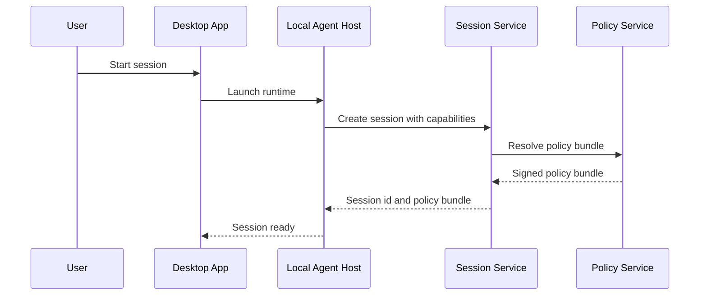
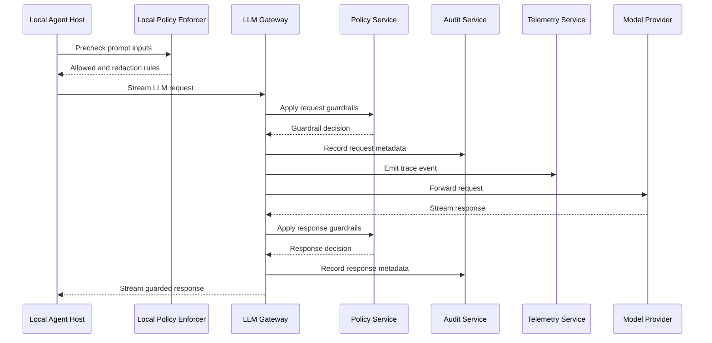
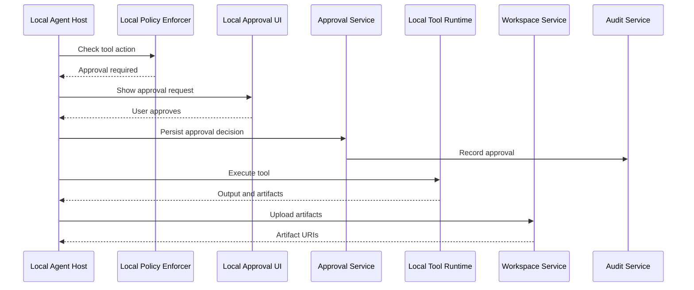
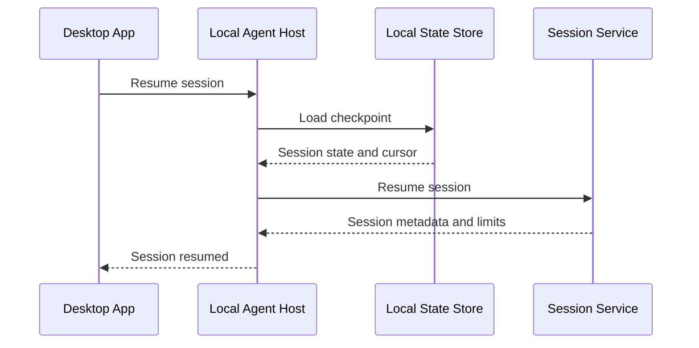
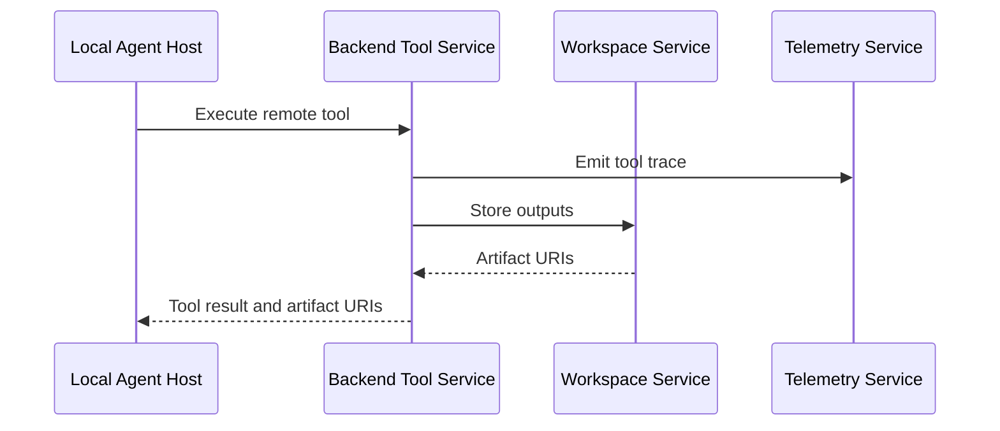
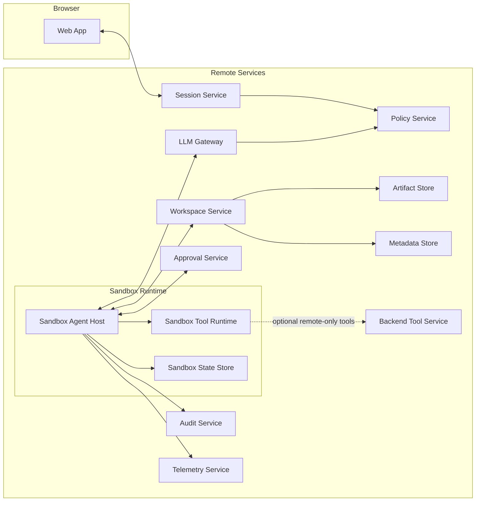
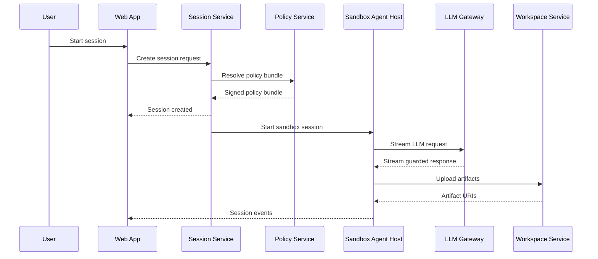

# Local First Agent System Design for Desktop

## Scope

This document defines a desktop-first system design for a Windows and macOS app similar to Claude Code.

Core goals:
- Agent loop runs on the client
- Tool execution runs on the client
- LLM calls route through a backend LLM Gateway for centralized guardrails
- Policy, approvals, workspace, audit, and telemetry are centralized services
- Consistent bounded contexts and component naming
- Web adaptation is included as a separate section at the end

---

## 1) Deployment Model

### Desktop Mode

The desktop app runs a local runtime process that hosts the agent.

- **Agent Loop** runs in **Local Agent Host**
- **Tool calls** run in **Local Tool Runtime**
- **LLM calls** go to **LLM Gateway**
- **Policy** is centrally defined by **Policy Service** and enforced by **Local Policy Enforcer** plus **LLM Gateway**
- **Workspace artifacts** are stored via **Workspace Service**
- **Approvals**, **Audit**, and **Telemetry** are centralized

### Transport model for v1

Because the agent loop is local, WebSocket is not required for the core design.

- **Desktop App ↔ Local Agent Host**: JSON-RPC over stdio or local socket
- **Local Agent Host ↔ Remote Services**: HTTPS REST
- **Local Agent Host ↔ LLM Gateway**: HTTP streaming for model responses

WebSocket is optional later for server-initiated push use cases only.

---

## 2) Consistent Component Names

### Desktop Components
- **Desktop App**
- **Local Agent Host**
- **Local Tool Runtime**
- **Local Policy Enforcer**
- **Local Approval UI**
- **Local State Store**

### Remote Services
- **Session Service**
- **LLM Gateway**
- **Policy Service**
- **Approval Service**
- **Workspace Service**
- **Artifact Store**
- **Metadata Store**
- **Audit Service**
- **Telemetry Service**
- **Backend Tool Service** (optional for remote-only tools)

### Web Adaptation Components
- **Sandbox Agent Host**
- **Sandbox Tool Runtime**
- **Sandbox State Store**

---

## 3) Bounded Contexts

### 3.1 Agent Execution Context
**Purpose:** Run the agent loop for the session.

**Owned Components**
- Local Agent Host
- Local State Store

**Responsibilities**
- Session state machine
- Planning and step execution
- LLM request construction
- Tool routing decisions
- Retry behavior
- Checkpointing
- Event generation

**Does Not Own**
- Central policy definitions
- Long-term artifact storage
- Audit persistence
- User identity management

### 3.2 Tool Execution Context
**Purpose:** Execute tools safely and consistently.

**Owned Components**
- Local Tool Runtime
- Backend Tool Service (optional)

**Responsibilities**
- Local filesystem actions
- Local process execution
- Tool output capture
- Tool schema validation
- Capability checks integration

**Does Not Own**
- Agent planning
- LLM invocation
- Approval decisions
- Policy authoring

### 3.3 Policy and Guardrails Context
**Purpose:** Enforce governance for tool actions and LLM traffic.

**Owned Components**
- Policy Service
- Local Policy Enforcer
- LLM Gateway (for LLM request and response guardrails)

**Responsibilities**
- Policy bundle generation
- Signed policy bundles
- Capability restrictions
- Path restrictions
- Command restrictions
- Approval requirements
- LLM prompt and response guardrails
- Budget and quota rules

**Does Not Own**
- UI rendering
- Agent planning
- Artifact storage

### 3.4 Session Coordination Context
**Purpose:** Establish sessions and maintain lifecycle metadata.

**Owned Components**
- Session Service

**Responsibilities**
- Create and resume sessions
- Version compatibility checks
- Capability handshake
- Session metadata
- Session status transitions
- Event replay cursors (optional)

**Does Not Own**
- Agent execution
- Tool execution
- LLM provider communication

### 3.5 Workspace and Artifacts Context
**Purpose:** Persist and serve artifacts and checkpoints.

**Owned Components**
- Workspace Service
- Artifact Store
- Metadata Store

**Responsibilities**
- Workspace manifests
- Artifact upload and retrieval
- Checkpoint references
- Patch and diff artifact storage
- Step output references

**Does Not Own**
- Policy decisions
- LLM calls
- Agent logic

### 3.6 Approval Context
**Purpose:** Capture and persist human approvals for risky actions.

**Owned Components**
- Approval Service
- Local Approval UI

**Responsibilities**
- Approval request lifecycle
- User decision capture
- Approval decision persistence
- Approval audit trail

**Does Not Own**
- Tool execution engine
- Agent planning logic

### 3.7 Observability and Audit Context
**Purpose:** Central telemetry and audit.

**Owned Components**
- Telemetry Service
- Audit Service

**Responsibilities**
- Structured event ingest
- Traces and metrics
- Security audit records
- Session event history (if retained)

**Does Not Own**
- Agent execution
- Tool execution
- Policy decisions

---

## 4) Core Design Principles

### 4.1 Local First Execution
The desktop experience should remain local-first for:
- file operations
- tool execution
- step control
- approval presentation

### 4.2 Centralized LLM Governance
All model traffic flows through **LLM Gateway** for:
- guardrails
- audit
- token accounting
- model routing

### 4.3 Shared Runtime Contract
Define one runtime contract reusable later for web:
- same event names
- same tool schemas
- same checkpoint format
- same state machine

### 4.4 Capability Based Security
Capabilities include examples such as:
- `File.Read`
- `File.Write`
- `File.Delete`
- `Shell.Exec`
- `Network.Http`
- `Git.Commit`
- `Git.Push`
- `Workspace.Upload`
- `BackendTool.Invoke`
- `LLM.Call`

Capabilities are constrained by user, tenant, session, path scope, and approval state.

---

## 5) Desktop Architecture Diagram

```mermaid
flowchart LR
  subgraph Desktop["Desktop Machine"]
    DesktopApp["Desktop App"]
    LocalAgentHost["Local Agent Host"]
    LocalToolRuntime["Local Tool Runtime"]
    LocalPolicyEnforcer["Local Policy Enforcer"]
    LocalApprovalUI["Local Approval UI"]
    LocalStateStore["Local State Store"]

    DesktopApp <--> LocalAgentHost
    LocalAgentHost --> LocalToolRuntime
    LocalAgentHost --> LocalPolicyEnforcer
    LocalAgentHost --> LocalApprovalUI
    LocalAgentHost --> LocalStateStore
  end

  subgraph Remote["Remote Services"]
    SessionService["Session Service"]
    LLMGateway["LLM Gateway"]
    PolicyService["Policy Service"]
    ApprovalService["Approval Service"]
    WorkspaceService["Workspace Service"]
    ArtifactStore["Artifact Store"]
    MetadataStore["Metadata Store"]
    AuditService["Audit Service"]
    TelemetryService["Telemetry Service"]
    BackendToolService["Backend Tool Service"]

    SessionService --> PolicyService
    WorkspaceService --> ArtifactStore
    WorkspaceService --> MetadataStore
    LLMGateway --> PolicyService
  end

  LocalAgentHost <--> SessionService
  LocalAgentHost <--> LLMGateway
  LocalAgentHost <--> ApprovalService
  LocalAgentHost <--> WorkspaceService
  LocalAgentHost --> AuditService
  LocalAgentHost --> TelemetryService

  LocalToolRuntime -. "optional remote-only tools" .-> BackendToolService
```



---

## 6) Session Handshake and Policy Bundle

At session start, **Local Agent Host** performs a handshake with **Session Service**.

### Handshake request
- OS type and version
- Desktop App version
- Local Agent Host version
- supported tool list
- supported capabilities
- cached policy bundle version (optional)

### Handshake response
- session id
- compatibility status
- signed policy bundle
- LLM Gateway endpoint
- token and budget limits
- approval rules
- feature flags

This ensures the local loop receives centrally governed policy before work starts.

---

## 7) Agent Loop State Machine

Owned by **Local Agent Host**.

States:
- `SESSION_CREATED`
- `SESSION_RUNNING`
- `WAITING_FOR_LLM`
- `WAITING_FOR_APPROVAL`
- `WAITING_FOR_TOOL`
- `SESSION_PAUSED`
- `SESSION_COMPLETED`
- `SESSION_FAILED`
- `SESSION_CANCELLED`

---

## 8) Sequence Diagrams

### 8.1 Desktop Session Start and Policy Handshake



### 8.2 Local Agent Loop Calling LLM Gateway



### 8.3 Local Tool Call With Approval



### 8.4 Session Resume After Desktop Restart



### 8.5 Optional Remote Only Tool Call



---

## 9) Capability Model

Capabilities are issued by **Policy Service** in a signed policy bundle and enforced by **Local Policy Enforcer** and **Local Tool Runtime**.

### Capability Table

| Capability | Description | Typical Scope | Approval Required | Enforced By |
|---|---|---|---|---|
| `File.Read` | Read file contents | Allowed path prefixes | Usually no | Local Policy Enforcer, Local Tool Runtime |
| `File.Write` | Create or modify files | Allowed path prefixes | Sometimes | Local Policy Enforcer, Local Tool Runtime |
| `File.Delete` | Delete files | Allowed path prefixes | Usually yes | Local Policy Enforcer, Local Tool Runtime |
| `Shell.Exec` | Run local commands | Command allowlist and cwd paths | Often yes | Local Policy Enforcer, Local Tool Runtime |
| `Network.Http` | Outbound HTTP requests | Domain allowlist | Sometimes | Local Policy Enforcer, Local Tool Runtime |
| `Git.Status` | Read repo status | Repo path | Usually no | Local Policy Enforcer, Local Tool Runtime |
| `Git.Diff` | Read repo diff | Repo path | Usually no | Local Policy Enforcer, Local Tool Runtime |
| `Git.Commit` | Create commits | Repo path and branch policy | Usually yes | Local Policy Enforcer, Local Tool Runtime |
| `Git.Push` | Push commits | Repo path and remote allowlist | Yes | Local Policy Enforcer, Local Tool Runtime |
| `Workspace.Upload` | Upload artifacts | Workspace id and size limits | Usually no | Local Agent Host |
| `BackendTool.Invoke` | Invoke remote-only tools | Tool names | Sometimes | Local Agent Host, Policy Service |
| `LLM.Call` | Call LLM Gateway | Model allowlist and token budgets | No | LLM Gateway, Policy Service |

### Scope Examples
Scope fields can include:
- `allowedPaths`
- `blockedPaths`
- `allowedCommands`
- `blockedCommands`
- `allowedDomains`
- `maxFileSizeBytes`
- `maxOutputBytes`
- `requiresApproval`
- `approvalRuleId`

---

## 10) Signed Policy Bundle

The **Policy Service** returns a signed policy bundle during session handshake.

### Example Policy Bundle

```json
{
  "policyBundleVersion": "2026-02-21.1",
  "schemaVersion": "1.0",
  "tenantId": "tenant_abc",
  "userId": "user_123",
  "sessionId": "sess_789",
  "expiresAt": "2026-02-21T18:30:00Z",
  "capabilities": [
    {
      "name": "File.Read",
      "allowedPaths": [
        "/Users/suman/projects/demo",
        "C:\\Users\\Suman\\projects\\demo"
      ],
      "requiresApproval": false
    },
    {
      "name": "Shell.Exec",
      "allowedCommands": ["git", "python", "npm", "pytest"],
      "requiresApproval": true,
      "approvalRuleId": "approval_shell_exec"
    }
  ],
  "llmPolicy": {
    "allowedModels": ["gpt-5.2-coder", "gpt-5.2-mini"],
    "maxInputTokens": 64000,
    "maxOutputTokens": 4000,
    "maxSessionTokens": 250000
  },
  "approvalRules": [
    {
      "approvalRuleId": "approval_shell_exec",
      "title": "Local command execution",
      "description": "User approval required for shell commands"
    }
  ],
  "signature": {
    "alg": "Ed25519",
    "keyId": "policy-key-01",
    "value": "base64-signature"
  }
}
```

### Validation Rules
**Local Agent Host** must validate:
- signature
- expiry
- session id match
- schema version compatibility

If validation fails, the session must not start.

---

## 11) Local IPC Contract

Use **JSON-RPC 2.0** between **Desktop App** and **Local Agent Host** over stdio or local socket.

### JSON-RPC Methods
- `CreateSession`
- `StartTask`
- `CancelTask`
- `ResumeSession`
- `GetSessionState`
- `GetPatchPreview`
- `ApproveAction`
- `Shutdown`
- Notification: `SessionEvent`

### JSON-RPC Example: CreateSession Request

```json
{
  "jsonrpc": "2.0",
  "id": "req_create_01",
  "method": "CreateSession",
  "params": {
    "userId": "user_123",
    "tenantId": "tenant_abc",
    "workspaceHint": {
      "localPaths": [
        "/Users/suman/projects/demo"
      ]
    },
    "clientInfo": {
      "desktopAppVersion": "1.0.0",
      "localAgentHostVersion": "1.0.0",
      "osFamily": "macOS",
      "osVersion": "14.6"
    },
    "supportedCapabilities": [
      "File.Read",
      "File.Write",
      "Shell.Exec",
      "Git.Status",
      "Git.Diff",
      "Git.Commit",
      "Workspace.Upload",
      "LLM.Call"
    ],
    "supportedTools": [
      "ReadFile",
      "WriteFile",
      "RunCommand",
      "GitStatus",
      "GitDiff",
      "GitCommit"
    ]
  }
}
```

### JSON-RPC Example: StartTask Request

```json
{
  "jsonrpc": "2.0",
  "id": "req_start_01",
  "method": "StartTask",
  "params": {
    "sessionId": "sess_789",
    "taskId": "task_001",
    "prompt": "Refactor the API client and add tests",
    "taskOptions": {
      "maxSteps": 40,
      "allowNetwork": true,
      "approvalMode": "on_risky_actions"
    }
  }
}
```

### JSON-RPC Example: SessionEvent Notification

```json
{
  "jsonrpc": "2.0",
  "method": "SessionEvent",
  "params": {
    "eventId": "evt_010",
    "sessionId": "sess_789",
    "taskId": "task_001",
    "eventType": "step_started",
    "timestamp": "2026-02-21T15:04:22Z",
    "payload": {
      "stepId": "step_003",
      "stepKind": "tool_call",
      "toolName": "RunCommand"
    }
  }
}
```

---

## 12) Backend API Payload Examples

### 12.1 Session Service Create Session
`POST /sessions`

```json
{
  "tenantId": "tenant_abc",
  "userId": "user_123",
  "clientInfo": {
    "desktopAppVersion": "1.0.0",
    "localAgentHostVersion": "1.0.0",
    "osFamily": "macOS",
    "osVersion": "14.6"
  },
  "supportedCapabilities": [
    "File.Read",
    "File.Write",
    "Shell.Exec",
    "Git.Status",
    "Git.Diff",
    "Git.Commit",
    "Workspace.Upload",
    "LLM.Call"
  ],
  "supportedTools": [
    "ReadFile",
    "WriteFile",
    "RunCommand",
    "GitStatus",
    "GitDiff",
    "GitCommit"
  ],
  "workspaceHint": {
    "localPaths": ["/Users/suman/projects/demo"]
  }
}
```

### 12.2 LLM Gateway Stream Request
`POST /llm/stream`

```json
{
  "sessionId": "sess_789",
  "taskId": "task_001",
  "stepId": "step_004",
  "model": "gpt-5.2-coder",
  "messages": [
    {
      "role": "system",
      "content": "You are a coding assistant."
    },
    {
      "role": "user",
      "content": "Refactor the HTTP client and add tests."
    }
  ],
  "contextMetadata": {
    "sourceProvenance": [
      {
        "sourceType": "local_file",
        "path": "/Users/suman/projects/demo/client.py",
        "trustLevel": "local_project"
      }
    ],
    "redactionApplied": true
  },
  "stream": true
}
```

### 12.3 Approval Service Persist Decision
`POST /approvals/{approvalId}/decision`

```json
{
  "sessionId": "sess_789",
  "taskId": "task_001",
  "decision": "approved",
  "userId": "user_123",
  "reason": "Command is expected for test run",
  "clientTimestamp": "2026-02-21T15:08:10Z"
}
```

### 12.4 Workspace Service Upload Artifact
`POST /workspaces/{workspaceId}/artifacts`

```json
{
  "sessionId": "sess_789",
  "taskId": "task_001",
  "artifactType": "tool_output",
  "artifactName": "pytest_output.txt",
  "contentType": "text/plain",
  "contentBase64": "cHl0ZXN0IG91dHB1dA==",
  "metadata": {
    "toolName": "RunCommand",
    "stepId": "step_006"
  }
}
```

---

## 13) JSON Schemas for Key Messages

### 13.1 Session Event Schema

```json
{
  "$id": "SessionEvent",
  "type": "object",
  "required": ["eventId", "sessionId", "eventType", "timestamp", "payload"],
  "properties": {
    "eventId": { "type": "string" },
    "sessionId": { "type": "string" },
    "taskId": { "type": "string" },
    "eventType": {
      "type": "string",
      "enum": [
        "session_created",
        "session_started",
        "step_started",
        "llm_request_started",
        "llm_request_completed",
        "tool_requested",
        "tool_completed",
        "approval_requested",
        "approval_resolved",
        "session_completed",
        "session_failed"
      ]
    },
    "timestamp": { "type": "string", "format": "date-time" },
    "payload": { "type": "object" }
  },
  "additionalProperties": false
}
```

### 13.2 Tool Request Schema

```json
{
  "$id": "ToolRequest",
  "type": "object",
  "required": ["toolName", "arguments", "sessionId", "taskId", "stepId"],
  "properties": {
    "toolName": { "type": "string" },
    "arguments": { "type": "object" },
    "sessionId": { "type": "string" },
    "taskId": { "type": "string" },
    "stepId": { "type": "string" },
    "capability": { "type": "string" }
  },
  "additionalProperties": false
}
```

### 13.3 Tool Result Schema

```json
{
  "$id": "ToolResult",
  "type": "object",
  "required": ["toolName", "sessionId", "taskId", "stepId", "status"],
  "properties": {
    "toolName": { "type": "string" },
    "sessionId": { "type": "string" },
    "taskId": { "type": "string" },
    "stepId": { "type": "string" },
    "status": {
      "type": "string",
      "enum": ["succeeded", "failed", "denied"]
    },
    "outputText": { "type": "string" },
    "artifactUris": {
      "type": "array",
      "items": { "type": "string" }
    },
    "error": {
      "type": "object",
      "properties": {
        "code": { "type": "string" },
        "message": { "type": "string" }
      },
      "required": ["code", "message"],
      "additionalProperties": false
    }
  },
  "additionalProperties": false
}
```

### 13.4 Approval Request Schema

```json
{
  "$id": "ApprovalRequest",
  "type": "object",
  "required": ["approvalId", "sessionId", "taskId", "title", "actionSummary"],
  "properties": {
    "approvalId": { "type": "string" },
    "sessionId": { "type": "string" },
    "taskId": { "type": "string" },
    "title": { "type": "string" },
    "actionSummary": { "type": "string" },
    "riskLevel": {
      "type": "string",
      "enum": ["low", "medium", "high"]
    },
    "details": { "type": "object" }
  },
  "additionalProperties": false
}
```

---

## 14) Event Envelope Standard for Telemetry and Audit

Use one envelope shape across services.

```json
{
  "eventId": "evt_123",
  "eventType": "tool_completed",
  "timestamp": "2026-02-21T15:09:00Z",
  "tenantId": "tenant_abc",
  "userId": "user_123",
  "sessionId": "sess_789",
  "taskId": "task_001",
  "component": "LocalAgentHost",
  "boundedContext": "AgentExecution",
  "severity": "info",
  "payload": {}
}
```

### Allowed component values
- `DesktopApp`
- `LocalAgentHost`
- `LocalToolRuntime`
- `LocalPolicyEnforcer`
- `LocalApprovalUI`
- `SessionService`
- `LLMGateway`
- `PolicyService`
- `ApprovalService`
- `WorkspaceService`
- `AuditService`
- `TelemetryService`
- `BackendToolService`

### Allowed boundedContext values
- `AgentExecution`
- `ToolExecution`
- `PolicyGuardrails`
- `SessionCoordination`
- `WorkspaceArtifacts`
- `Approval`
- `ObservabilityAudit`

---

## 15) Error Model

Define a consistent error shape across local IPC and backend APIs.

### Error Shape

```json
{
  "code": "CAPABILITY_DENIED",
  "message": "Shell.Exec is not allowed for this session",
  "retryable": false,
  "details": {
    "capability": "Shell.Exec",
    "sessionId": "sess_789"
  }
}
```

### Recommended error codes
- `INVALID_REQUEST`
- `UNAUTHORIZED`
- `SESSION_NOT_FOUND`
- `SESSION_EXPIRED`
- `POLICY_BUNDLE_INVALID`
- `POLICY_EXPIRED`
- `CAPABILITY_DENIED`
- `APPROVAL_REQUIRED`
- `APPROVAL_DENIED`
- `TOOL_NOT_FOUND`
- `TOOL_EXECUTION_FAILED`
- `LLM_GUARDRAIL_BLOCKED`
- `LLM_BUDGET_EXCEEDED`
- `WORKSPACE_UPLOAD_FAILED`
- `RATE_LIMITED`
- `INTERNAL_ERROR`

---

## 16) Interfaces and APIs Summary

### Local IPC
JSON-RPC 2.0 over stdio or local socket

### Remote APIs
- **Session Service**
  - `POST /sessions`
  - `POST /sessions/{sessionId}/resume`
  - `POST /sessions/{sessionId}/cancel`
  - `GET /sessions/{sessionId}`
- **LLM Gateway**
  - `POST /llm/stream`
  - `POST /llm/embed` (optional)
  - `POST /llm/moderate` (optional)
- **Approval Service**
  - `POST /approvals`
  - `POST /approvals/{approvalId}/decision`
  - `GET /approvals/{approvalId}`
- **Workspace Service**
  - `POST /workspaces`
  - `POST /workspaces/{workspaceId}/artifacts`
  - `POST /workspaces/{workspaceId}/checkpoints`
  - `GET /workspaces/{workspaceId}/artifacts/{artifactId}`
- **Audit and Telemetry**
  - `POST /audit/events`
  - `POST /telemetry/events`
  - `POST /telemetry/traces`

---

## 17) Security Model

### Local Controls
Enforced by **Local Policy Enforcer** and **Local Tool Runtime**
- path allowlists
- command restrictions
- capability checks
- approval gating
- prompt input redaction
- source provenance tagging

### Central LLM Controls
Enforced by **LLM Gateway** and **Policy Service**
- prompt guardrails
- response guardrails
- model allowlists
- token budgets
- rate limits
- audit metadata

### Policy Distribution
- policy bundle fetched at session start
- policy bundle signed by Policy Service
- Local Agent Host validates signature before use

---

## 18) Observability and Audit

### Standard Event Names
- `session_created`
- `session_started`
- `step_started`
- `llm_request_started`
- `llm_request_completed`
- `tool_requested`
- `tool_completed`
- `approval_requested`
- `approval_resolved`
- `session_completed`
- `session_failed`

### Trace Boundaries
Align spans to bounded contexts:
- Agent Execution
- Tool Execution
- Policy and Guardrails
- LLM Gateway
- Workspace and Artifacts
- Approval
- Session Coordination

### Audit Records
At minimum:
- approvals
- high-risk tool invocations
- LLM request and response metadata
- policy decisions
- session state transitions

---

## 19) Gaps and Risk Areas

### 19.1 Local Loop Durability
Risk:
- crash or sleep interrupts long tasks

Mitigation:
- Local State Store checkpoints
- idempotent tool contracts
- session resume support

### 19.2 Version Skew
Risk:
- local runtime and backend policy mismatch

Mitigation:
- compatibility checks in Session Service
- policy schema versioning
- feature flags

### 19.3 Cross Platform Differences
Risk:
- Windows and macOS tool behavior diverges

Mitigation:
- per-platform adapters in Local Tool Runtime
- strict tool schemas
- capability discovery during handshake

### 19.4 Prompt Injection From Local Content
Risk:
- malicious repo content influences the agent

Mitigation:
- provenance tagging in Local Policy Enforcer
- redaction rules
- LLM Gateway guardrails
- approval for risky actions

### 19.5 Overusing WebSocket Too Early
Risk:
- complexity without need

Mitigation:
- start with REST and HTTP streaming
- add WebSocket only for server push use cases

---

## 20) Implementation Phasing for Desktop

### Phase 1
- Desktop App
- Local Agent Host
- Local Tool Runtime
- Session Service
- LLM Gateway
- Policy Service
- Workspace Service
- basic Audit Service
- basic Telemetry Service

### Phase 2
- Local Approval UI
- Approval Service
- Local State Store checkpoints and resume
- signed policy bundles
- compatibility handshake

### Phase 3
- remote-only tool support via Backend Tool Service
- stronger guardrails
- richer telemetry
- policy revocation and optional server push

### Phase 4
- scale hardening
- quotas and budgets
- performance tuning
- packaging and auto-update hardening for Windows and macOS

---

## 21) Web Extension Section

This section is intentionally separate from the desktop-first design.

### Web Mode Adaptation
Because the browser cannot safely run the same local tool model, run the same logical agent runtime in a backend sandbox.

Changes from desktop:
- **Local Agent Host** becomes **Sandbox Agent Host**
- **Local Tool Runtime** becomes **Sandbox Tool Runtime**
- **Local State Store** becomes **Sandbox State Store**
- Approval UI remains in the web UI
- LLM calls still go through **LLM Gateway**
- Policy still comes from **Policy Service**

### Web Mode Architecture Diagram



### Web Mode Sequence Diagram



### Why the same design still works
Desktop and web share:
- state machine
- event names
- tool schemas
- policy model
- workspace model

Only the runtime location changes.

---

## 22) Optional Future WebSocket Addendum

WebSocket is optional and not needed for v1 desktop.

If added later, use it only for server push cases:
- remote admin stop
- live observer mode
- policy revocation
- multi-device approval

Reuse the same `SessionEvent` schema for WebSocket messages.

---

## 23) Protocol Package Guidance for Implementation

To keep generated code and hand-written code aligned, maintain a shared `protocol` package with:
- `session_event.schema.json`
- `tool_request.schema.json`
- `tool_result.schema.json`
- `approval_request.schema.json`
- `error.schema.json`
- `jsonrpc_methods.md`
- `event_names.md`
- `capabilities.md`

This prevents drift across Desktop App, Local Agent Host, Local Tool Runtime, and backend services.

---

## 24) Component to Repo Mapping

This section maps bounded contexts and components to repositories so coding agents can work in clear boundaries with minimal cross-repo ambiguity.

### 24.1 Repo Layout Overview

Recommended repositories:
- `desktop-app`
- `local-agent-host`
- `local-tool-runtime`
- `backend-session-service`
- `backend-llm-gateway`
- `backend-policy-service`
- `backend-approval-service`
- `backend-workspace-service`
- `backend-audit-service`
- `backend-telemetry-service`
- `backend-tool-service` (optional)
- `protocol-contracts`
- `shared-sdk` (optional but recommended)
- `infra-platform`
- `docs-architecture`

If you prefer fewer repos, the backend services can be grouped into one monorepo while keeping the same folder boundaries.

### 24.2 Repo to Bounded Context Mapping

| Repo | Primary Bounded Context | Owned Components |
|---|---|---|
| `desktop-app` | AgentExecution UI surface | Desktop App, Local Approval UI presentation shell |
| `local-agent-host` | AgentExecution | Local Agent Host, Local State Store |
| `local-tool-runtime` | ToolExecution | Local Tool Runtime, platform adapters |
| `backend-session-service` | SessionCoordination | Session Service |
| `backend-llm-gateway` | PolicyGuardrails | LLM Gateway |
| `backend-policy-service` | PolicyGuardrails | Policy Service |
| `backend-approval-service` | Approval | Approval Service |
| `backend-workspace-service` | WorkspaceArtifacts | Workspace Service, storage adapters |
| `backend-audit-service` | ObservabilityAudit | Audit Service |
| `backend-telemetry-service` | ObservabilityAudit | Telemetry Service |
| `backend-tool-service` | ToolExecution | Backend Tool Service |
| `protocol-contracts` | Shared contract layer | Schemas, event names, JSON-RPC method contracts |
| `shared-sdk` | Shared integration code | Generated clients, auth helpers, event envelope helpers |
| `infra-platform` | Deployment and operations | IaC, CI CD, secrets wiring, runtime infra |
| `docs-architecture` | Architecture documentation | Design docs, ADRs, diagrams, runbooks |

### 24.3 Detailed Repo Responsibilities

#### `desktop-app`
**Purpose**
- User-facing desktop application shell for macOS and Windows

**Owns**
- Desktop UI screens
- Session launch and stop UI
- Approval dialogs and patch preview UI
- JSON-RPC client to Local Agent Host
- Local process lifecycle management for Local Agent Host

**Does Not Own**
- Agent loop logic
- Tool execution implementation
- Policy evaluation logic

**Suggested folders**
- `src/ui`
- `src/ipc`
- `src/session`
- `src/approvals`
- `src/patch-preview`
- `src/platform`

#### `local-agent-host`
**Purpose**
- Local runtime process that hosts the agent loop

**Owns**
- Agent loop state machine
- Planning and step orchestration
- Session checkpointing in Local State Store
- Calls to Session Service, LLM Gateway, Approval Service, Workspace Service
- Event generation and local JSON-RPC server

**Does Not Own**
- Desktop UI rendering
- Tool execution internals
- Central policy authoring

**Suggested folders**
- `agent_loop`
- `ipc_server`
- `session_client`
- `llm_gateway_client`
- `workspace_client`
- `approval_client`
- `policy_bundle`
- `state_store`
- `events`

#### `local-tool-runtime`
**Purpose**
- Local tool execution engine with per-platform adapters

**Owns**
- File tools
- Shell command tools
- Git tools
- Network tool wrappers
- Tool schema validation
- OS-specific command and path handling

**Does Not Own**
- Agent loop orchestration
- Approval persistence
- LLM calls

**Suggested folders**
- `tools/file`
- `tools/shell`
- `tools/git`
- `tools/network`
- `platform/macos`
- `platform/windows`
- `policy_hooks`
- `tool_schemas`

#### `backend-session-service`
**Purpose**
- Session creation, resume, compatibility checks, and metadata

**Owns**
- Session APIs
- Capability handshake processing
- Version compatibility policy
- Session metadata persistence
- Session status transitions

**Does Not Own**
- LLM request processing
- Tool execution
- Artifact storage internals

#### `backend-llm-gateway`
**Purpose**
- Centralized model access and guardrail enforcement point

**Owns**
- LLM streaming endpoints
- Request and response guardrail invocation
- Model routing
- Token and budget checks
- LLM request audit metadata emission

**Does Not Own**
- Session creation
- Tool execution
- Policy authoring rules source

#### `backend-policy-service`
**Purpose**
- Policy authoring, policy resolution, and signed policy bundles

**Owns**
- Policy bundle generation
- Capability policy definitions
- Approval rule definitions
- Signature generation and key rotation integration
- LLM guardrail policy configuration

**Does Not Own**
- LLM provider connectivity
- Tool execution
- Workspace storage

#### `backend-approval-service`
**Purpose**
- Approval decision persistence and retrieval

**Owns**
- Approval record APIs
- Approval lifecycle state
- Audit hooks for decisions

**Does Not Own**
- Approval UI rendering
- Tool execution
- Agent loop state machine

#### `backend-workspace-service`
**Purpose**
- Artifact and checkpoint metadata plus storage access APIs

**Owns**
- Workspace manifests
- Artifact upload and retrieval APIs
- Checkpoint references
- Metadata store and artifact store adapters

**Does Not Own**
- Agent planning
- Policy decisions
- Audit decisions

#### `backend-audit-service`
**Purpose**
- Immutable or append-only audit events for security and compliance

**Owns**
- Audit event ingest APIs
- Audit storage model
- Query interfaces for audit review

**Does Not Own**
- Tracing and metrics aggregation
- Agent execution logic

#### `backend-telemetry-service`
**Purpose**
- Telemetry ingest and trace processing

**Owns**
- Telemetry event APIs
- Trace ingestion
- Metrics aggregation pipeline integration

**Does Not Own**
- Security audit retention policies
- Business workflow orchestration

#### `backend-tool-service` (optional)
**Purpose**
- Remote-only tools for capabilities not available or not allowed locally

**Owns**
- Tool workers and APIs for remote tools
- Workspace output integration
- Telemetry and audit hooks for remote tools

**Does Not Own**
- Local tool execution
- Session handshake
- LLM governance

#### `protocol-contracts`
**Purpose**
- Single source of truth for protocol definitions and schemas

**Owns**
- JSON schemas
- JSON-RPC method contracts
- Event names and envelope spec
- Error code catalog
- Capability names and field definitions

**Does Not Own**
- Runtime business logic
- UI code
- Service deployment code

#### `shared-sdk` (optional but recommended)
**Purpose**
- Reusable client libraries generated or hand-written from `protocol-contracts`

**Owns**
- Session Service client
- LLM Gateway client
- Approval Service client
- Workspace Service client
- Event envelope helpers
- Error parsing and retry helpers

**Does Not Own**
- Service implementations
- Policy rules

#### `infra-platform`
**Purpose**
- Infrastructure, deployment, and operations automation

**Owns**
- Terraform or equivalent IaC
- CI CD templates
- secrets and key management integration
- environment configs
- observability infrastructure wiring

**Does Not Own**
- Product business logic
- protocol definitions

#### `docs-architecture`
**Purpose**
- Architecture source of truth and ADRs

**Owns**
- This design doc
- ADRs
- runbooks
- threat models
- operational playbooks

### 24.4 Dependency Rules Between Repos

Use these rules to prevent tight coupling.

#### Allowed dependencies
- `desktop-app` -> `protocol-contracts`, `shared-sdk`
- `local-agent-host` -> `protocol-contracts`, `shared-sdk`
- `local-tool-runtime` -> `protocol-contracts`
- backend services -> `protocol-contracts`, `shared-sdk`
- `shared-sdk` -> `protocol-contracts`
- `docs-architecture` -> no code dependency

#### Not allowed
- `desktop-app` must not import backend service implementation code
- `local-tool-runtime` must not import `desktop-app`
- backend services must not import `desktop-app` or `local-agent-host`
- `protocol-contracts` must not depend on any implementation repo

### 24.5 Monorepo Alternative

If your team prefers a monorepo, keep the same boundaries as top-level folders:
- `apps/desktop-app`
- `apps/local-agent-host`
- `apps/local-tool-runtime`
- `services/session-service`
- `services/llm-gateway`
- `services/policy-service`
- `services/approval-service`
- `services/workspace-service`
- `services/audit-service`
- `services/telemetry-service`
- `services/backend-tool-service`
- `packages/protocol-contracts`
- `packages/shared-sdk`
- `infra`
- `docs`

The key requirement is boundary discipline, not repo count.

### 24.6 Coding Agent Friendly Work Allocation

This mapping is optimized for parallel coding agent work.

#### Wave 1
- `protocol-contracts`
- `backend-session-service`
- `backend-policy-service`
- `backend-llm-gateway`
- `local-agent-host` skeleton
- `desktop-app` JSON-RPC client shell

#### Wave 2
- `local-tool-runtime`
- `backend-workspace-service`
- `backend-approval-service`
- `backend-audit-service`
- `backend-telemetry-service`

#### Wave 3
- `desktop-app` UX flows
- `local-agent-host` checkpoint and resume
- `shared-sdk`
- `backend-tool-service` optional remote tools

### 24.7 Definition of Done for Repo Boundaries

A repo boundary is healthy when:
- imports only flow through allowed dependency directions
- all external communication uses `protocol-contracts` schemas
- each repo has its own tests and lint rules
- no component naming drift exists from this design doc
- API surface is documented in the repo README
- observability emits `component` and `boundedContext` fields consistently

