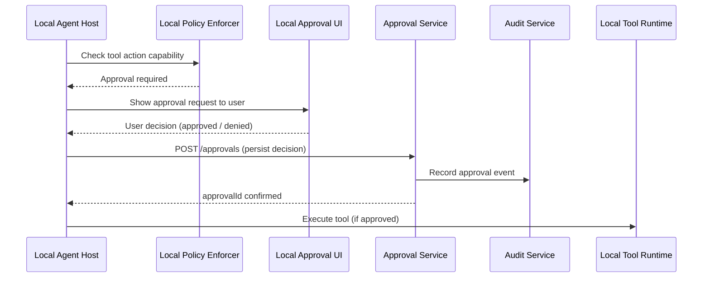

# Approval Service — Detailed Design

**Phase:** 2
**Repo:** `cowork-approval-service`
**Bounded Context:** Approval

---

## Purpose

The Approval Service persists user approval decisions for risky agent actions. It provides a durable audit trail of what the user approved, when, and why — separate from the in-memory approval flow handled by the Local Approval UI on the desktop.

---

## Responsibilities

- Persist approval decisions (approved / denied) with full context
- Store approval audit trail for compliance
- Provide retrieval of approval records per session or task

---

## What the Approval Service Does NOT Do

- It does not render the approval UI — that is the Local Approval UI on the desktop
- It does not decide whether approval is required — that is the Local Policy Enforcer
- It does not block or gate tool execution — that happens locally in the agent loop
- It is a persistence service only — the approval decision is made on the desktop, then recorded here

---

## Relationships

| Called by | Purpose |
|-----------|---------|
| Local Agent Host | Persist approval decision after user responds in Local Approval UI |
| Audit Service | Approval Service notifies Audit Service of each decision |

---

## Approval Flow



---

## Data Model

### Approval Request

Sent to the Local Approval UI for display. Not stored in the Approval Service directly — the service only stores the decision.

```json
{
  "approvalId": "appr_001",
  "sessionId": "sess_789",
  "taskId": "task_001",
  "stepId": "step_003",
  "title": "Local command execution",
  "actionSummary": "Run: pytest tests/ --verbose",
  "riskLevel": "medium",
  "details": {
    "toolName": "Shell.Exec",
    "command": "pytest tests/ --verbose",
    "cwd": "/Users/suman/projects/demo"
  }
}
```

### Approval Decision Record

What gets persisted to the Approval Service:

```json
{
  "approvalId": "appr_001",
  "sessionId": "sess_789",
  "taskId": "task_001",
  "stepId": "step_003",
  "userId": "user_123",
  "tenantId": "tenant_abc",
  "workspaceId": "ws_456",
  "decision": "approved",
  "reason": "Command is expected for test run",
  "actionSummary": "Run: pytest tests/ --verbose",
  "riskLevel": "medium",
  "clientTimestamp": "2026-02-21T15:08:10Z",
  "serverTimestamp": "2026-02-21T15:08:11Z"
}
```

---

## API Endpoints

### POST /approvals — Persist Approval Decision

Called by the Local Agent Host immediately after the user responds in the Local Approval UI.

**Request:**
```json
{
  "approvalId": "appr_001",
  "sessionId": "sess_789",
  "taskId": "task_001",
  "stepId": "step_003",
  "userId": "user_123",
  "tenantId": "tenant_abc",
  "workspaceId": "ws_456",
  "decision": "approved",
  "reason": "Command is expected for test run",
  "actionSummary": "Run: pytest tests/ --verbose",
  "riskLevel": "medium",
  "clientTimestamp": "2026-02-21T15:08:10Z"
}
```

**Response:** `201 Created`
```json
{
  "approvalId": "appr_001",
  "serverTimestamp": "2026-02-21T15:08:11Z"
}
```

---

### GET /approvals/{approvalId} — Retrieve Approval Record

Used for audit review.

**Response:** Full approval decision record as shown above.

---

### GET /approvals?sessionId={sessionId} — List Approvals for Session

Used for audit review and compliance reporting.

**Response:**
```json
{
  "approvals": [
    {
      "approvalId": "appr_001",
      "decision": "approved",
      "actionSummary": "Run: pytest tests/ --verbose",
      "clientTimestamp": "2026-02-21T15:08:10Z"
    }
  ]
}
```

---

## Approval Schema (JSON Schema)

```json
{
  "$id": "ApprovalRequest",
  "type": "object",
  "required": ["approvalId", "sessionId", "taskId", "title", "actionSummary"],
  "properties": {
    "approvalId":    { "type": "string" },
    "sessionId":     { "type": "string" },
    "taskId":        { "type": "string" },
    "stepId":        { "type": "string" },
    "title":         { "type": "string" },
    "actionSummary": { "type": "string" },
    "riskLevel": {
      "type": "string",
      "enum": ["low", "medium", "high"]
    },
    "details": { "type": "object" }
  },
  "additionalProperties": false
}
```

---

## Risk Levels

| Level | Examples |
|-------|---------|
| `low` | File.Read, Workspace.Upload |
| `medium` | File.Write, Shell.Exec with known commands, Network.Http |
| `high` | File.Delete, Shell.Exec with unknown commands |

Risk level is set by the Local Policy Enforcer based on the capability and action, not by the user.

---

## Data Store

**Database:** DynamoDB table `{env}-approvals`

### Key schema

| Key | Value |
|-----|-------|
| Partition key | `approvalId` (String) |

### Global Secondary Indexes

| GSI | Partition key | Sort key | Use |
|-----|--------------|----------|-----|
| `sessionId-index` | `sessionId` | `clientTimestamp` | List all approval decisions for a session, sorted by time |

### Stored attributes

`approvalId`, `sessionId`, `taskId`, `stepId`, `userId`, `tenantId`, `workspaceId`, `decision`, `reason`, `actionSummary`, `riskLevel`, `clientTimestamp`, `serverTimestamp`, `createdAt`

Approval records are never updated or deleted — the store is effectively append-only per `approvalId`.

### Testing

| Tier | Infrastructure |
|------|---------------|
| Unit tests | `InMemoryApprovalRepository` — no infrastructure needed |
| Service tests | DynamoDB Local: `docker run -p 8000:8000 amazon/dynamodb-local` |
| Integration tests | LocalStack: `docker run -p 4566:4566 localstack/localstack` |

---

## Implementation Notes

- `approvalId` is generated by the Local Agent Host before showing the UI, then passed to the Approval Service with the decision
- The Local Agent Host must not call the Approval Service before the user has responded — the service only receives final decisions
- If the network is unavailable when the Local Agent Host tries to persist the decision, it should retry with backoff. Tool execution is not blocked on the persistence succeeding — the decision is already made locally.
