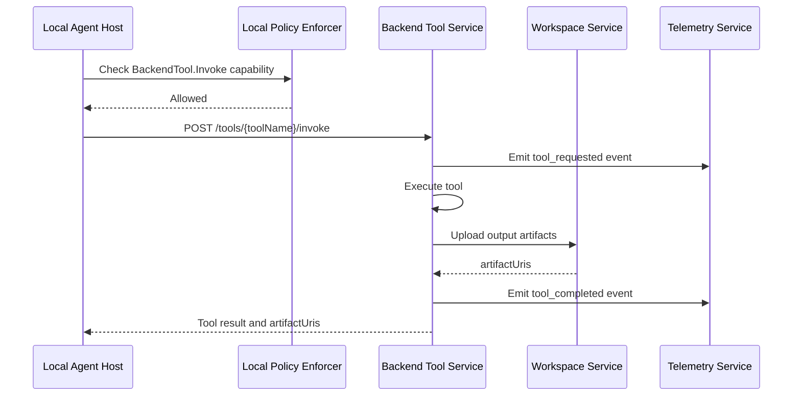

# Backend Tool Service — Detailed Design

> **Status: Future Implementation**
> The Backend Tool Service is optional and planned for Phase 3. It is not required for Phase 1 or Phase 2. All tool execution in Phase 1 and Phase 2 happens locally via the Local Tool Runtime.

**Phase:** 3 (optional)
**Repo:** `backend-tools`
**Bounded Context:** ToolExecution

---

## Purpose

The Backend Tool Service provides remote-only tool execution for capabilities that cannot or should not run locally on the desktop. It complements the Local Tool Runtime rather than replacing it — local tools remain local, and only tools that require backend infrastructure (e.g. cloud database access, remote build systems, secure vault operations) run here.

---

## Responsibilities

- Execute remote-only tools on behalf of the Local Agent Host
- Store tool outputs as artifacts in the Workspace Service
- Emit telemetry and audit events for remote tool invocations
- Enforce capability checks for `BackendTool.Invoke` capability

---

## What the Backend Tool Service Does NOT Do

- It does not replace the Local Tool Runtime — file, shell, and network tools continue to run locally
- It does not execute tools on behalf of the LLM directly — the Local Agent Host routes tool calls; the Backend Tool Service is one possible destination
- It does not manage the agent loop — it is a stateless execution service called by the Local Agent Host

---

## Relationships

| Called by | Purpose |
|-----------|---------|
| Local Agent Host | Execute remote-only tools when `BackendTool.Invoke` capability is granted |

| Calls | Purpose |
|-------|---------|
| Workspace Service | Upload tool output artifacts |
| Telemetry Service | Emit tool execution traces |
| Audit Service | Record high-risk remote tool invocations |

---

## When to Use Remote Tools

A tool runs in the Backend Tool Service instead of Local Tool Runtime when:

- The tool requires cloud infrastructure not available on the client machine (e.g. cloud database queries, remote build systems)
- The tool requires elevated permissions that should not be granted to the local desktop process (e.g. production secrets access via a vault)
- The tool produces large outputs that should go directly to the Workspace Service without routing through the desktop
- The tenant policy explicitly requires certain tool categories to execute in a backend sandbox rather than locally

The capability `BackendTool.Invoke` in the policy bundle specifies which remote tool names the session is allowed to invoke.

---

## Tool Invocation Flow



---

## API Endpoints

### POST /tools/{toolName}/invoke — Invoke Remote Tool

Called by the Local Agent Host when the LLM requests a tool that maps to a remote-only backend tool.

**Request:**
```json
{
  "sessionId": "sess_789",
  "taskId": "task_001",
  "stepId": "step_004",
  "workspaceId": "ws_456",
  "toolName": "CloudDbQuery",
  "arguments": {
    "query": "SELECT COUNT(*) FROM orders WHERE status = 'pending'",
    "connectionName": "prod-readonly"
  }
}
```

**Response:** `200 OK`
```json
{
  "toolName": "CloudDbQuery",
  "sessionId": "sess_789",
  "taskId": "task_001",
  "stepId": "step_004",
  "status": "succeeded",
  "outputText": "Row count: 142",
  "artifactUris": [
    "workspaces/ws_456/artifacts/art_789"
  ]
}
```

**Error response:**
```json
{
  "toolName": "CloudDbQuery",
  "sessionId": "sess_789",
  "taskId": "task_001",
  "stepId": "step_004",
  "status": "failed",
  "error": {
    "code": "TOOL_EXECUTION_FAILED",
    "message": "Database connection timeout"
  }
}
```

---

### GET /tools — List Available Remote Tools

Returns the list of remote tools available for the current tenant configuration.

**Response:**
```json
{
  "tools": [
    {
      "toolName": "CloudDbQuery",
      "description": "Execute read-only queries against configured cloud databases",
      "inputSchema": { "$ref": "CloudDbQueryInput" },
      "requiresCapability": "BackendTool.Invoke"
    }
  ]
}
```

---

## Tool Result Schema

Remote tool results use the same `ToolResult` schema as local tools:

```json
{
  "$id": "ToolResult",
  "type": "object",
  "required": ["toolName", "sessionId", "taskId", "stepId", "status"],
  "properties": {
    "toolName":    { "type": "string" },
    "sessionId":   { "type": "string" },
    "taskId":      { "type": "string" },
    "stepId":      { "type": "string" },
    "status": {
      "type": "string",
      "enum": ["succeeded", "failed", "denied"]
    },
    "outputText":  { "type": "string" },
    "artifactUris": {
      "type": "array",
      "items": { "type": "string" }
    },
    "error": {
      "type": "object",
      "properties": {
        "code":    { "type": "string" },
        "message": { "type": "string" }
      },
      "required": ["code", "message"],
      "additionalProperties": false
    }
  },
  "additionalProperties": false
}
```

Using the same `ToolResult` schema as the Local Tool Runtime means the Local Agent Host processes results from both local and remote tools identically.

---

## Data Store

The Backend Tool Service is **stateless** — it does not own a database. All session context is passed per-request by the Local Agent Host.

Tool configurations (e.g. database connection strings, API keys for remote tools) are tenant-scoped and injected at runtime via environment variables or a secrets manager (e.g. AWS Secrets Manager). They are never stored in a service-owned database.

Large tool outputs are written directly to the Workspace Service's S3 bucket — the Backend Tool Service holds no artifact state of its own.

---

## Implementation Notes

- The Backend Tool Service is stateless — it does not maintain session state. All session context is passed per-request.
- Each tool implementation is responsible for uploading its own large outputs to the Workspace Service. The tool result carries `artifactUris` rather than embedding large payloads in the response body.
- Tool implementations must be tenant-aware — tool configurations (e.g. database connection strings) are scoped per tenant and never cross tenant boundaries.
- The `BackendTool.Invoke` capability in the policy bundle specifies an allowlist of tool names. The Backend Tool Service must verify that the requested `toolName` appears in the session's capability grant before executing.
