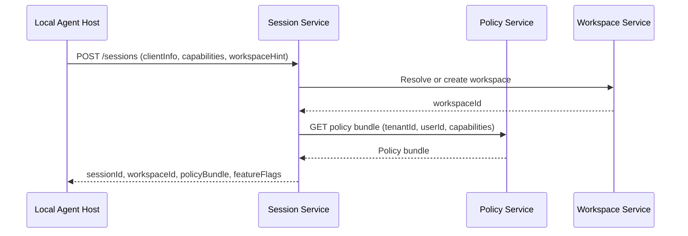
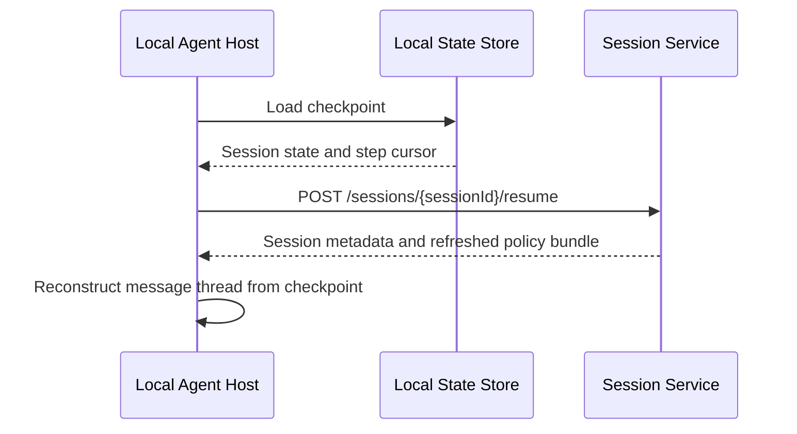

# Session Service — Detailed Design

**Phase:** 1 (MVP)
**Repo:** `cowork-session-service`
**Bounded Context:** SessionCoordination

---

## Purpose

The Session Service is the entry point for every agent session. It establishes sessions, performs compatibility checks, resolves workspaces, fetches policy from the Policy Service, and returns everything the Local Agent Host needs to begin work.

---

## Responsibilities

- Create and resume sessions
- Version and capability compatibility checks between client and backend
- Workspace resolution — create or retrieve the workspace for this session based on `workspaceHint`
- Fetch policy bundle from Policy Service and return it to the client
- Track session metadata and status transitions
- Session cancellation

---

## Relationships

| Calls | Purpose |
|-------|---------|
| Policy Service | Fetch policy bundle for the session |
| Workspace Service | Create or resolve workspace from `workspaceHint` |

| Called by | Purpose |
|-----------|---------|
| Local Agent Host | Create session, resume session, cancel session |
| Desktop App | Query session status |

---

## API Endpoints

### POST /sessions — Create Session

Called by the Local Agent Host at startup to establish a new session.

**Request:**
```json
{
  "tenantId": "tenant_abc",
  "userId": "user_123",
  "executionEnvironment": "desktop",
  "workspaceHint": {
    "localPaths": ["/Users/suman/projects/demo"]
  },
  "clientInfo": {
    "desktopAppVersion": "1.0.0",
    "localAgentHostVersion": "1.0.0",
    "osFamily": "macOS",
    "osVersion": "14.6"
  },
  "supportedCapabilities": [
    "File.Read",
    "File.Write",
    "Shell.Exec",
    "Network.Http",
    "Workspace.Upload",
    "LLM.Call"
  ]
}
```

**Response:**
```json
{
  "sessionId": "sess_789",
  "workspaceId": "ws_456",
  "compatibilityStatus": "compatible",
  "policyBundle": { ... },
  "featureFlags": {
    "approvalUiEnabled": true,
    "mcpEnabled": false
  }
}
```

> **LLM Gateway configuration** (endpoint and auth token) is not included in the response. The agent-runtime reads both from local environment variables (`LLM_GATEWAY_ENDPOINT`, `LLM_GATEWAY_AUTH_TOKEN`). This avoids sending credentials in API responses. LLM Gateway configuration will be revisited in a later phase.

**Workspace resolution logic:**
- If `workspaceHint.localPaths` is provided → resolve or create a `local`-scoped workspace matching that path
- If no `workspaceHint` → create a new `general`-scoped workspace for this session only

---

### POST /sessions/{sessionId}/resume — Resume Session

Called by the Local Agent Host after a desktop restart when a checkpoint exists in the Local State Store.

**Request:**
```json
{
  "sessionId": "sess_789",
  "checkpointCursor": "step_004"
}
```

**Response:**
```json
{
  "sessionId": "sess_789",
  "workspaceId": "ws_456",
  "compatibilityStatus": "compatible",
  "policyBundle": { ... }
}
```

---

### POST /sessions/{sessionId}/cancel — Cancel Session

**Request:**
```json
{
  "reason": "user_requested"
}
```

**Response:** `204 No Content`

---

### GET /sessions/{sessionId} — Get Session Metadata

**Response:**
```json
{
  "sessionId": "sess_789",
  "workspaceId": "ws_456",
  "tenantId": "tenant_abc",
  "userId": "user_123",
  "executionEnvironment": "desktop",
  "status": "SESSION_RUNNING",
  "createdAt": "2026-02-21T14:00:00Z",
  "expiresAt": "2026-02-21T18:30:00Z"
}
```

---

## Session Handshake Flow



---

## Session Resume Flow



---

## Session Metadata Model

| Field | Type | Description |
|-------|------|-------------|
| `sessionId` | string | Unique session identifier |
| `workspaceId` | string | Always present — resolved or created at session start |
| `tenantId` | string | Tenant |
| `userId` | string | User |
| `executionEnvironment` | enum | `desktop` or `cloud_sandbox` |
| `status` | enum | `SESSION_CREATED`, `SESSION_RUNNING`, `SESSION_PAUSED`, `SESSION_COMPLETED`, `SESSION_FAILED`, `SESSION_CANCELLED` |
| `createdAt` | datetime | Session creation time |
| `expiresAt` | datetime | Policy bundle expiry — session must not continue past this |

---

## Data Store

**Database:** DynamoDB table `{env}-sessions`

### Key schema

| Key | Value |
|-----|-------|
| Partition key | `sessionId` (String) |
| TTL attribute | `ttl` (Number, Unix epoch) — set from `expiresAt`; DynamoDB auto-deletes expired sessions |

### Global Secondary Indexes

| GSI | Partition key | Sort key | Use |
|-----|--------------|----------|-----|
| `tenantId-userId-index` | `tenantId` | `createdAt` | List sessions for a user within a tenant, sorted by creation time |

### Stored attributes

`sessionId`, `tenantId`, `userId`, `workspaceId`, `executionEnvironment`, `status`, `createdAt`, `expiresAt`, `ttl`, `clientInfo`

### Testing

| Tier | Infrastructure |
|------|---------------|
| Unit tests | `InMemorySessionRepository` — no infrastructure needed |
| Service tests | DynamoDB Local: `docker run -p 8000:8000 amazon/dynamodb-local` |
| Integration tests | LocalStack: `docker run -p 4566:4566 localstack/localstack` |

Set `AWS_ENDPOINT_URL=http://localhost:8000` (DynamoDB Local) or `http://localhost:4566` (LocalStack) to point the service at a local emulator. The same repository code runs in all environments.

---

## Compatibility Check

During handshake the Session Service validates:
- `localAgentHostVersion` is within the supported version range
- `desktopAppVersion` is within the supported version range
- Requested capabilities are a subset of what the tenant policy allows

If incompatible, returns `compatibilityStatus: "incompatible"` with a reason. The Local Agent Host must not proceed.

---

## Policy Bundle Validation (client-side)

After receiving the policy bundle, the Local Agent Host must verify:
- `expiresAt` is in the future
- `sessionId` in the bundle matches the returned `sessionId`
- `schemaVersion` is supported by this version of the Local Agent Host

If any check fails, the session must not start.
